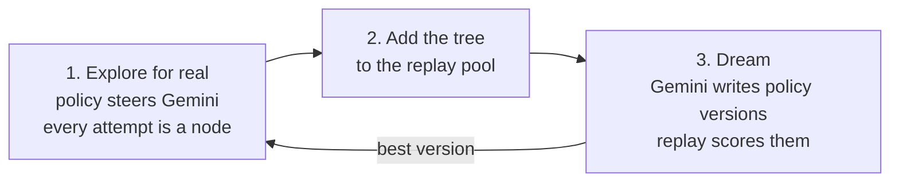

# Dream-RSI Explorer


> **Blog post:** [How Dream-RSI lets an AI agent improve how it searches](https://aimlcompanion.ai/blog/dream-rsi-recursive-self-improvement-explained-2026). Read it first for the big picture, what the paper claims, and where the idea breaks down.

Search loops like FunSearch and AlphaEvolve keep the model fixed and let it
propose, score and build on ideas. Something still has to decide **where to
search next**, and that rule is usually hand-written and never learns.
[Dream-RSI (Zheng et al., 2026)](https://arxiv.org/html/2609.14858v1) makes that
rule learn by **replaying recorded searches instead of paying for new ones**.

The paper ships no code. This project implements the loop with the live Gemini
API, on one of the paper's own benchmarks, packing 26 circles in a square.

<details>
<summary><strong>New to the terms?</strong></summary>

- **Discovery agent.** Gemini, proposing where to put 26 circles in a square.
- **Evaluator.** Code that scores a layout, the sum of the radii.
- **Discovery tree.** The record of one search. Each node is one attempt, linked to the attempt it grew from.
- **Exploration policy.** Decides which attempts to build on, how many to run in parallel, and when to stop.
- **Replay.** Walking a recorded tree with a new policy. Picking a node returns what was recorded there, with no Gemini call.
- **Dreaming.** Gemini writes new policy versions, replay scores them, and the best one runs next.

</details>

---

## Run it on your laptop

About 10 minutes from zero. The project uses [uv](https://docs.astral.sh/uv/) to install Python and every package for you, so there is no virtual environment to create or activate by hand. A full comparison costs roughly $0.20 at Gemini's list price.

### 1. What you need

| | How to check |
|---|---|
| Git | `git --version` |
| uv | `uv --version` (install it in step 2 if this fails) |
| A Gemini API key | Create one free at [Google AI Studio](https://aistudio.google.com/apikey) |

You don't need to install Python yourself. uv downloads a suitable version (3.10 or newer) if your machine doesn't have one.

### 2. Install uv

**Windows (PowerShell)**

```powershell
powershell -ExecutionPolicy ByPass -c "irm https://astral.sh/uv/install.ps1 | iex"
```

**macOS and Linux**

```bash
curl -LsSf https://astral.sh/uv/install.sh | sh
```

Then **close the terminal and open a new one**, so it can find the `uv` command, and check with `uv --version`.

### 3. Get the code and install

```bash
git clone https://github.com/genieincodebottle/aiml-companion.git
cd aiml-companion/projects/agentic-ai/dream-rsi-explorer
uv sync
```

No Git? On the [repository page](https://github.com/genieincodebottle/aiml-companion), choose **Code**, then **Download ZIP**, unzip it, and open a terminal in the `projects/agentic-ai/dream-rsi-explorer` folder before running `uv sync`.

`uv sync` creates a `.venv` folder in the project and installs the exact package versions pinned in `uv.lock`. Every command below runs from this `dream-rsi-explorer` folder and starts with `uv run`, which uses that environment automatically.

### 4. Add your API key

Create a file named `.env` in the `dream-rsi-explorer` folder with one line.

```
GEMINI_API_KEY=paste-your-key-here
```

**Windows (PowerShell)**

```powershell
Set-Content -Path .env -Value "GEMINI_API_KEY=paste-your-key-here"
```

**macOS and Linux**

```bash
echo "GEMINI_API_KEY=paste-your-key-here" > .env
```

`.env` is already in `.gitignore`, so your key is never committed.

### 5. Check the setup

```bash
uv run pytest
```

You should see `34 passed`. The tests use a fake Gemini client, so this step makes no API calls and costs nothing.

### 6. Run it

```bash
uv run python run.py explore     # one search, 24 Gemini calls, under a minute, about $0.03
uv run python run.py compare     # the full Dream-RSI loop, about 175 to 280 calls, 2 to 5 minutes
```

`compare` prints the most calls it could make before it starts, and the real token usage when it ends.

---

## Reading the output

A policy prints as a short label.

```
w2 a2 r1 p6 stop+0 s6 R6
```

| Part | Meaning |
|---|---|
| `w2` | continue from the 2 best leaves each round |
| `a2` | 2 parallel attempts from each of those leaves |
| `r1` | 1 fresh start from scratch each round |
| `p6` | after 6 rounds with no improvement, the search counts as stalled |
| `stop+0` | when stalled, stop (or `widen`, `restart`), with a boost of 0 |
| `s6` | stop after 6 stalled rounds in a row |
| `R6` | at most 6 rounds |

`compare` ends with a fresh check, real searches on seeds neither side saw during the loop.

```
              policy                              best   calls    value
hand-written  w2 a2 r1 p6 stop+0 s6 R6          2.5033    24.0   2.4153 +/- 0.0033
dream final   w1 a1 r1 p1 stop+0 s1 R3          2.4868     3.7   2.4752 +/- 0.0082
```

- **best** is the best sum of radii found. The best known for 26 circles is about 2.635.
- **calls** is Gemini calls per search.
- **value** is what dreaming optimises, `best - 0.004 * calls + 0.002 * calls per round`. Higher is better.

In this run the learned policy used about 6.5 times fewer calls for a slightly lower best score, and won on value. Gemini's first layout was already close to the best it would find, and replay showed that. Full output and caveats are in [`docs/results.md`](docs/results.md).

---

## If something goes wrong

| You see | Fix |
|---|---|
| `uv` is not recognised | Close the terminal and open a new one after installing uv. If it still fails, run the install command from step 2 again |
| `No GEMINI_API_KEY found` | The `.env` file is missing or in the wrong folder. It must sit next to `run.py` |
| `429` or `RESOURCE_EXHAUSTED` | You hit a rate limit, common on the free tier. Add `--workers 2` to slow down |
| `404` or model not found | The default model isn't available to your key. Pass another one, for example `--model gemini-flash-latest` |
| `No module named ...` | You ran `python` directly. Start the command with `uv run`, or run `uv sync` again |
| Nothing prints for a while | Gemini calls take a few seconds each. Progress lines appear after every round |

Every command accepts `--help`, for example `uv run python run.py compare --help`. Options work before or after the command name.

---

## How the code maps to the paper



| Stage | File | What to look at |
|---|---|---|
| Explore | [`src/explore.py`](src/explore.py) | Attempts in a round run in parallel, and join the tree in a fixed order |
| Replay | [`src/replay.py`](src/replay.py) | Picking a node returns its next **recorded** child, or nothing. Replay never calls Gemini |
| Dream | [`src/develop.py`](src/develop.py) | Version 0 is the current policy, so dreaming never picks something that scores worse on replay |
| Loop | [`src/loop.py`](src/loop.py) | The baseline runs the same loop and skips dreaming. Both arms share one round-0 search |

The replay score and the action space follow the paper. Each round the policy
picks from the root (start fresh) and the current leaves, with a number of
parallel attempts for each.

```
V = best score found - beta1 * attempts revealed + beta2 * attempts / rounds
```

### Where this differs from the paper

| Paper | This project | Why |
|---|---|---|
| An LLM rewrites executable policy code | Gemini edits an eight-knob policy spec, clamped to bounds | The project never runs code a model wrote |
| LLM coding agents on engineering tasks | 26-circle packing, one of the paper's maths benchmarks | Exact scoring in microseconds, cheap to run |
| The model writes whole solutions | Gemini proposes centres, code fits the radii | Asked for full layouts, Gemini got 1 in 6 valid. Centres only, 6 in 6 |
| Many rounds, many tasks | 3 rounds, 3 fresh seeds per policy by default | Keeps a run to a few minutes and well under a dollar |

---

## Project layout

```
run.py              CLI: explore, compare
src/task.py         circle packing evaluator and radius fitting
src/tree.py         discovery tree, saved as JSON
src/policy.py       policy spec, bounds and the decide() function
src/agents.py       Gemini discovery agent
src/explore.py      stage 1, online exploration
src/replay.py       replay simulator and replay score
src/develop.py      stage 3, Gemini policy-development agent
src/loop.py         Dream-RSI, the fixed baseline, and the fresh check
src/gemini.py       Gemini client, key loading, token counts
tests/              34 tests with a fake Gemini client
docs/results.md     measured live results
pyproject.toml      dependencies, installed by uv sync
uv.lock             exact pinned versions
```

## Reference

Zheng et al., 2026. [Dream-RSI: Recursive Self-Improvement through Evolving Worlds](https://arxiv.org/html/2609.14858v1). arXiv:2609.14858.

## License

MIT
