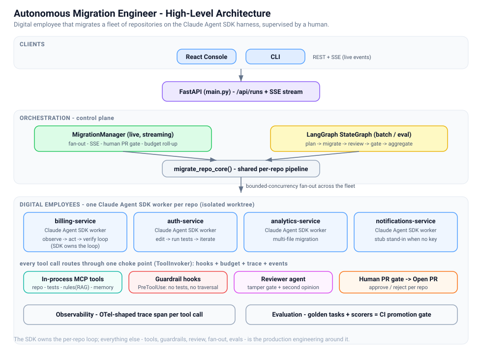
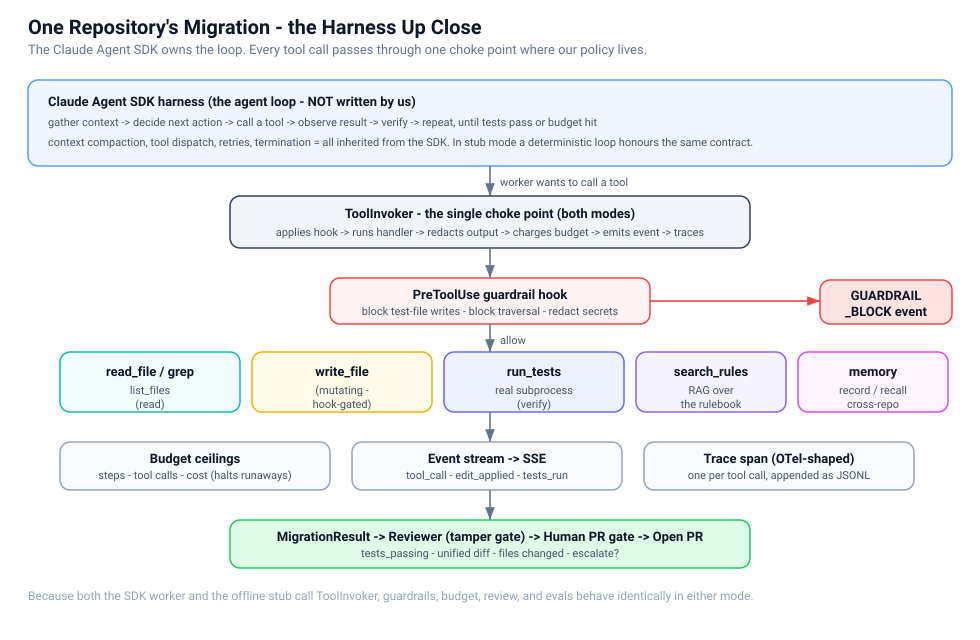

# Architecture

The Autonomous Migration Engineer is a **digital employee that upgrades codebases at
fleet scale**. It exists to make one architectural argument concrete:

> Do not hand-roll the agent loop. Inherit the **Claude Agent SDK** harness and spend
> your engineering budget where reliability actually comes from - **tools, guardrails,
> review, orchestration, and evals**.

This is the deliberate mirror image of the sibling `incident-commander` project, which
hand-rolls its loop to teach "loop engineering". Here, the loop is the SDK's job.

---

## Three execution modes (the same contract)

Everything runs through one contract - the same tools, guardrail hooks, budget, and
event stream - regardless of which worker executes:

| Mode | When | Worker | The loop is run by |
|------|------|--------|--------------------|
| `live-sdk` | `ANTHROPIC_API_KEY` set + `claude-agent-sdk` installed | `SdkMigrator` | the real Claude Agent SDK |
| `live-gemini` | `GEMINI_API_KEY` / `GOOGLE_API_KEY` set + `google-genai` installed | `GeminiMigrator` | a Gemini 2.5 function-calling loop |
| `stub` | otherwise (and in CI/tests) | `StubMigrator` | a deterministic scripted loop |

The stub is **not a mock**: it drives the identical tools, hooks, budget, review,
approval gate, and events. That is what lets the whole system - fan-out, guardrails,
evals - run offline with zero credentials, while remaining a faithful stand-in for the
live behaviour. The seam is one function: `harness/worker.py::build_worker`.

---

## High-level (system view)



A React console (or the CLI) drives a FastAPI backend over REST + an SSE stream. The
backend's `MigrationManager` fans out across a fleet of repositories with bounded
concurrency. Each repository is migrated by a worker running on the Claude Agent SDK
harness; a reviewer agent then critiques the diff, and a human approves each PR before
it is "opened". The same pipeline is also expressed declaratively as a LangGraph
`StateGraph` for batch / eval runs.

```
 React console / CLI
        |  REST + SSE
        v
 FastAPI  ->  MigrationManager (live, streaming)      LangGraph StateGraph (batch)
                 |  fan-out (bounded concurrency)          plan->migrate->review->gate->aggregate
                 v                                          |
        +--------+--------+--------+                        | (both call the same core)
        v        v        v        v                        v
     repo A   repo B   repo C   repo D   <-- each: migrate_repo_core()
        |
        v  per repo:
   MIGRATE (Claude Agent SDK worker loop)
        |    tools via in-process MCP: repo / tests / rules(RAG) / memory
        |    guardrail PreToolUse hooks + per-repo budget ceilings
        v
   REVIEW (reviewer agent: tamper gate + second opinion)
        v
   [HUMAN PR GATE]  --reject--> escalate
        v approve
   OPEN PR
```

## Low-level (one repo's harness)



Inside a single repository migration, the Claude Agent SDK owns the observe -> act ->
verify loop. Everything around it is ours and passes through one choke point, the
`ToolInvoker`, so guardrails, budget, tracing, and events apply identically in all
three modes:

```
   Claude Agent SDK harness (the loop)
        |  wants to call a tool
        v
   ToolInvoker  --->  [PreToolUse hook]  --allow?--> handler --> [redact output]
        |                    |  block                     |
        |                    v                            v
        |             GUARDRAIL_BLOCK event         charge budget (steps/tools/cost)
        |                                                 |
        +--------------------> emit TOOL_CALL / EDIT_APPLIED / TESTS_RUN ---> SSE
                                                          |
                                                          v
                                            OpenTelemetry-shaped trace span
```

Tools exposed to the worker:

| Tool | Kind | Purpose |
|------|------|---------|
| `search_migration_rules` | RAG | retrieve the migration guidance from the rulebook |
| `list_files` / `read_file` / `grep` | read | explore the repository |
| `write_file` | mutating | apply an edit (hook-gated: no tests, no traversal) |
| `run_tests` | verify | run the repo's real tests in a subprocess |
| `record_memory` / `recall_memory` | memory | cross-repo gotchas, reused across the fleet |

---

## Where each concern lives

| Concern | Owner | File(s) |
|---------|-------|---------|
| Agent loop | **Claude Agent SDK** (not us) | `harness/sdk_agent.py` |
| Gemini live loop | us (Gemini function calling) | `harness/gemini_agent.py` |
| Offline stand-in loop | us | `harness/stub_agent.py` |
| Worker selection seam (SDK > Gemini > stub) | us | `harness/worker.py` |
| Harness contract | us | `harness/base.py` |
| Tools / in-process MCP | us | `tools/*`, `tools/registry.py` |
| Guardrail hooks (PreToolUse) | us | `guardrails/hooks.py` |
| Budget ceilings | us | `harness/base.py::Budget` |
| Reviewer agent + tamper gate | us | `harness/reviewer.py` |
| Real git + GitHub PRs | us | `vcs/` (`github.py`, `local.py`) |
| Live fan-out + SSE + human gate | us | `orchestrator/engine.py` |
| Declarative batch orchestration | LangGraph | `orchestrator/graph.py` |
| Shared per-repo core | us | `orchestrator/pipeline.py` |
| Observability (spans) | us | `observability.py` |
| Evaluation / promotion gate | us | `evaluation/*` |

---

## Design decisions worth defending

1. **Claude Agent SDK for the worker, LangGraph for the fleet.** The per-repo work is
   open-ended (find and fix every occurrence, iterate on test failures) - you cannot
   draw that as a graph, so it is an emergent SDK agent. The fleet-level flow (which
   repo, in what order, gated how, aggregated how) is explicit and durable - that is
   LangGraph's job. Right tool per layer; the two compose, they do not compete.

2. **One tool choke point.** Every tool call in every mode flows through `ToolInvoker`,
   so guardrails, budget, tracing, and events are enforced by construction, not by
   convention.

3. **Defense in depth against reward hacking.** An agent can "pass" tests by deleting
   them. Three independent layers stop that: (a) a PreToolUse hook blocks writes to any
   `test_*.py`; (b) the reviewer agent re-derives tamper status from the filesystem and
   rejects; (c) an eval scorer tracks a `no_tamper_rate` that must stay at 100%.

4. **The system never refuses to run.** Unlike a key-mandatory agent, it degrades to the
   deterministic worker so reviewers and CI can exercise the entire architecture for free.
