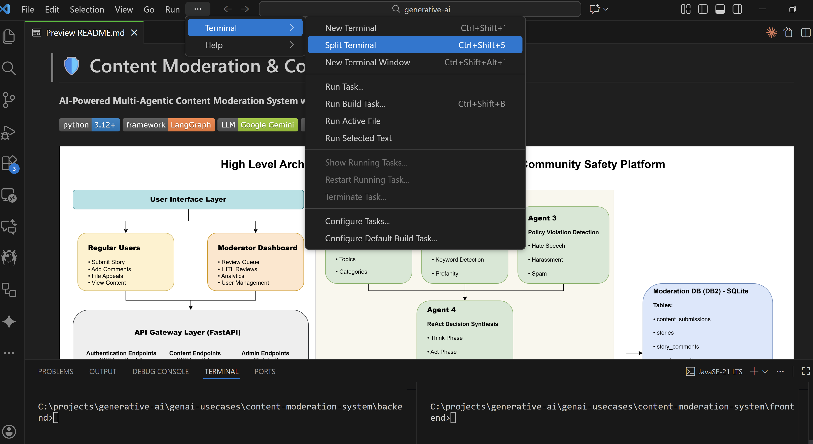
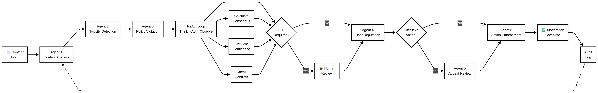
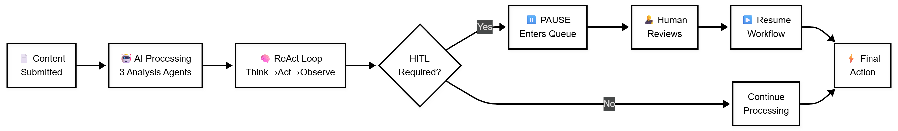
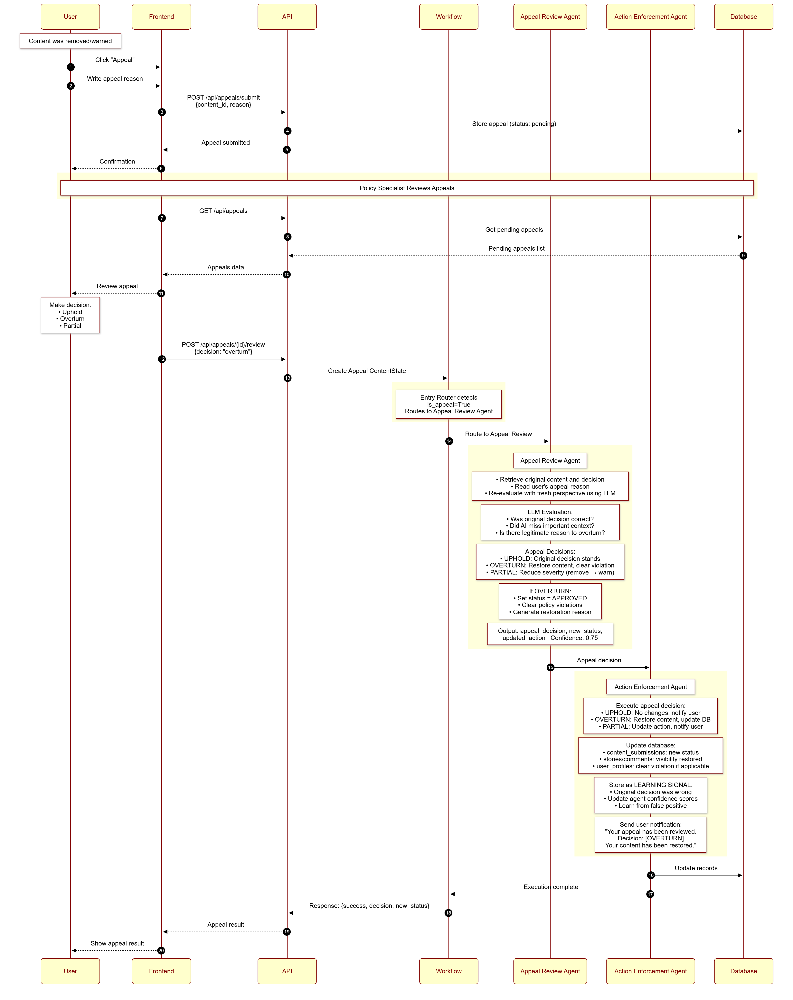

# Content Moderation & Community Safety Platform

> **Learn how to build this project step-by-step on [AI-ML Companion](https://aimlcompanion.ai/)** - Interactive ML learning platform with guided walkthroughs, architecture decisions, and hands-on challenges.

AI-powered multi-agent content moderation system with React frontend, FastAPI backend, and LangGraph orchestration.


## Table of Contents

- [Overview](#overview)
- [Quick Start](#quick-start)
- [Architecture](#architecture)
- [Features](#features)
- [Project Structure](#project-structure)
- [API Endpoints](#api-endpoints)
- [Technology Stack](#technology-stack)
- [Troubleshooting](#troubleshooting)
- [Database Cleanup](#database-cleanup)
- [Architecture Deep Dive](#architecture-deep-dive)

---

## Overview

An enterprise-grade content moderation system that automates content safety using a multi-agent AI architecture powered by Google Gemini (free-tier) and LangGraph.

**What it does:**

- Processes user-generated content through **6 specialized AI agents** using a ReAct (Reason-Act) decision loop
- Routes short content through a **Fast Mode** single-pass path (1-2 seconds vs 6-12 seconds for full pipeline)
- Escalates edge cases to human reviewers via a **priority-based HITL queue**
- Learns from outcomes using **3-tier memory** (ChromaDB vector store + episodic + semantic)
- Prevents failures with **6 production guardrails** (loop detection, budget tracking, hallucination detection, consistency checking, rate limiting, prompt injection detection)

**Estimated time to complete: 10-12 hours**

**6 user roles:** User, Moderator, Senior Moderator, Content Analyst, Policy Specialist, Admin

---

## Quick Start

### Prerequisites

Before starting, verify you have these installed:

```bash
python --version    # Must be 3.12+
node --version      # Must be 18+
git --version       # Any recent version
```

You also need a **Google Gemini API Key** (free): [Get one here](https://aistudio.google.com/app/apikey)

---

### Backend Setup (Terminal 1)

**Step 1: Clone the repository**

```bash
git clone https://github.com/genieincodebottle/aiml-companion.git
cd aiml-companion/projects/content-moderation-project
```

> **Checkpoint:** You should see `backend/`, `frontend/`, `images/`, and `README.md` in the folder.

**Step 2: Install uv and create virtual environment**

[uv](https://github.com/astral-sh/uv) is a fast Python package manager (10-100x faster than pip). Install it first, then create a virtual environment:

```bash
cd backend
pip install uv
uv venv
```

Now activate the virtual environment:

```bash
# macOS/Linux:
source .venv/bin/activate

# Windows:
.venv\Scripts\activate
```

> **Checkpoint:** Your terminal prompt should show a `(.venv)` prefix.

> **Fallback:** If uv is not available, use `python -m venv .venv` instead of `uv venv`.

**Step 3: Install Python dependencies**

```bash
uv pip install -r requirements.txt
```

Installs FastAPI, LangGraph, LangChain, ChromaDB, and all dependencies in seconds (vs 2-5 minutes with pip).

> **Checkpoint:** Run `python -c "import fastapi; import langgraph; print('OK')"` and it should print `OK`.

> **Fallback:** If not using uv, run `pip install -r requirements.txt` instead.


**Step 4: Configure environment variables**

```bash
cp .env.example .env
```

Open `.env` and replace `your_google_gemini_api_key_here` with your actual Gemini API key.

Your `.env` file should look like:

```env
# Required
GOOGLE_API_KEY=your_actual_key_here

# Fast Mode
ENABLE_FAST_MODE=true
FAST_MODE_MAX_LENGTH=200
FAST_MODE_CONTENT_TYPES=story_comment

# ML Models (set to true for hybrid ML+LLM detection, downloads ~500MB)
USE_ML_MODELS=false
ML_PRIMARY_MODEL=distilbert_toxic
ML_USE_ENSEMBLE=false
ML_PRELOAD_MODELS=true
ML_DEVICE=auto
```

> **Checkpoint:** Run `cat .env` (macOS/Linux) or `type .env` (Windows) and verify your API key is present.

**Step 5: Initialize database and demo users**

```bash
python scripts/initialize_users.py
```

> **Checkpoint:** You should see output listing 11 created users across 6 roles (user, moderator, senior_moderator, content_analyst, policy_specialist, admin).

**Step 6: Start the backend server**

```bash
python main.py
```

> **Checkpoint:** You should see:
> ```
> Starting Content Moderation API Server
> Server will be available at: http://localhost:8000
> ```
> Open http://localhost:8000/docs in your browser to verify the Swagger UI loads.

---

### Frontend Setup (Terminal 2)

Open a **new terminal** (or split your terminal in VS Code):



**Step 7: Install Node dependencies and start**

```bash
cd aiml-companion/projects/content-moderation-project/frontend
npm install
npm run dev
```

> **Checkpoint:** You should see:
> ```
> VITE v5.x.x ready
>   Local: http://localhost:5173/
> ```

---

### Access the Application

1. Open http://localhost:5173 in your browser
2. You should see a login screen
3. Log in with any demo account below

### Demo Accounts

| Username | Password | Role | What You Can Do |
|----------|----------|------|----------------|
| `raj` | `test@123` | User | Submit stories, comment, file appeals |
| `priya` | `test@123` | User | Submit stories, comment, file appeals |
| `amit` | `test@123` | User | Submit stories, comment, file appeals |
| `moderator1` | `mod@123` | Moderator | Content review, moderation dashboard |
| `moderator2` | `mod@123` | Moderator | Content review, moderation dashboard |
| `senior_mod` | `senior@123` | Senior Moderator | HITL queue review, escalations, suspensions |
| `hitl_reviewer` | `hitl@123` | Senior Moderator | HITL queue review, escalations, suspensions |
| `analyst` | `analyst@123` | Content Analyst | Analytics, patterns, trends, reports |
| `policy_expert` | `policy@123` | Policy Specialist | Appeals review, policy violations |
| `appeals_handler` | `appeals@123` | Policy Specialist | Appeals review, policy violations |
| `admin` | `admin@123` | Admin | Full system access, user management |

You can also register new accounts through the registration form (created with "user" role by default).

---

## Architecture

The system uses a LangGraph StateGraph to orchestrate 6 specialized agents in a sequential pipeline:

```
Content Submitted
       |
       v
[Fast Mode Check] --short content (<200 chars)--> [Single Gemini Call] --> Decision (1-2s)
       |
       long/complex content
       v
[Content Analysis Agent] --> topics, sentiment, categories
       v
[Toxicity Detection Agent] --> score 0-1 (ML models or keyword fallback + Gemini)
       v
[Policy Violation Agent] --> maps against 13 community guideline categories
       v
[ReAct Decision Synthesis] --> Think-Act-Observe loop aggregating all signals
       v
[HITL Checkpoint] --low confidence/high severity--> [Human Review Queue]
       v                                                     |
[User Reputation Agent] <--human decision resumes------------+
       v
[Action Enforcement Agent] --> approve / warn / remove / suspend / ban
       v
[Memory Update] --> ChromaDB stores decision for future reference
```



### Why 6 Agents Instead of 1?

- A single agent with a 2000-word prompt loses accuracy on edge cases (context dilution)
- Each specialist agent has a focused ~200-word prompt with clear input/output schema
- Failure isolation: if the policy agent fails, toxicity detection still works
- Pydantic structured output (`with_structured_output()`) ensures type-safe responses

### HITL Priority Queue

Not all flagged content is equal. The system routes to human reviewers based on priority:

| Priority | Score | Examples | Target SLA |
|----------|-------|---------|------------|
| Critical | >= 80 | Legal concerns, targeted threats | < 5 min |
| High | 60-79 | Severe first offenses, sensitive topics | < 15 min |
| Medium | 40-59 | Conflicting agent signals, low confidence | < 1 hour |
| Low | < 40 | Standard confirmations, borderline spam | Batch |

**8 HITL trigger reasons:** LOW_CONFIDENCE, CONFLICTING_DECISIONS, HIGH_SEVERITY, HIGH_PROFILE_USER, SENSITIVE_CONTENT, FIRST_OFFENSE_SEVERE, POTENTIAL_FALSE_POSITIVE, EDGE_CASE



### Appeal Workflow

Users can appeal moderation decisions. Reviewers see the original content, all agent scores, 5 similar past decisions, and user reputation. Three outcomes:

- **UPHOLD** - Original decision stands
- **OVERTURN** - Decision reversed, model learns from the correction
- **PARTIAL** - Modified severity (e.g., removal downgraded to warning)



---

## Features

<details>
<summary><strong>Backend AI System</strong></summary>

| Feature | Details |
|---------|---------|
| **6 Specialized AI Agents** | Single-responsibility design with Pydantic structured output |
| **Fast Mode** | Single-pass for short comments, 1-2s vs 6-12s (83% cost saving) |
| **ReAct Decision Loop** | Think-Act-Observe pattern for synthesizing agent decisions |
| **HITL with Priority Queue** | Configurable interrupt points (Critical/High/Medium/Low) |
| **Hybrid Toxicity Detection** | HateBERT/DistilBERT ML + keyword fallback + Gemini LLM |
| **3-Tier Memory** | ChromaDB vector store + episodic + semantic |
| **5 Production Guardrails** | Loop detection, budget tracking, hallucination detection, consistency, rate limiting |
| **Appeal Workflow** | UPHOLD / OVERTURN / PARTIAL outcomes with memory feedback |
| **Dual SQLite Databases** | moderation_data.db (content/decisions) + moderation_auth.db (users/sessions) |
| **Observability** | OpenTelemetry tracing for agent execution monitoring |

</details>

<details>
<summary><strong>Frontend Web Application</strong></summary>

| Feature | Details |
|---------|---------|
| **React 18 + Vite** | Modern, fast frontend development |
| **Material-UI (MUI) v5** | Professional, responsive UI components |
| **Community Dashboard** | Widget-based landing page (stories, stats, guidelines) |
| **Moderation Dashboard** | Integrated HITL review queue with real-time statistics |
| **Content Review** | Detailed AI analysis, toxicity scores, one-click actions |
| **Analytics** | Charts and trends with Recharts + MUI X-Charts |
| **Appeals Management** | Submit and review appeals |
| **6 Role-Based Interfaces** | Different dashboards per user role |
| **Zustand State Management** | Lightweight global state |
| **Axios API Client** | With JWT auth interceptors |

</details>

<details>
<summary><strong>Guardrails System</strong></summary>

- **Loop Detection** - Prevents infinite reasoning loops (max 10 iterations)
- **Hallucination Detection** - Identifies contradictions and unsupported claims in AI decisions
- **Cost Budget Tracking** - Monitors and limits API costs (configurable budget)
- **Consistency Checking** - Ensures agent decisions don't contradict each other
- **Confidence Adjustment** - Automatically reduces confidence when hallucinations detected

</details>

<details>
<summary><strong>Learning System</strong></summary>

- **Episodic Memory** - Stores individual moderation decisions for learning
- **Semantic Memory** - Learns generalized patterns from outcomes
- **Success Rate Tracking** - Monitors decision quality per agent
- **Pattern Recognition** - Identifies which actions work best in specific contexts
- **Adaptive Thresholds** - Learns optimal toxicity/policy thresholds over time

</details>

---

## Project Structure

```
content-moderation-project/
+-- backend/
|   +-- main.py                          # FastAPI entry point
|   +-- requirements.txt                 # Python dependencies
|   +-- .env.example                     # Environment variable template
|   +-- databases/                       # SQLite + ChromaDB storage (auto-created)
|   +-- scripts/
|   |   +-- initialize_users.py          # Create 11 demo accounts
|   |   +-- cleanup_data.py              # Reset all data
|   +-- src/
|       +-- agents/
|       |   +-- agents.py                # 6 agent implementations
|       |   +-- reasoning.py             # ReAct, Plan-Execute, Reflexion patterns
|       |   +-- tool_manager.py          # Agent tool registry
|       |   +-- workflow.py              # LangGraph StateGraph orchestration
|       +-- core/
|       |   +-- models.py                # ContentState, AgentDecision, enums
|       |   +-- llm_schemas.py           # Pydantic schemas for LLM responses
|       +-- database/
|       |   +-- auth_db.py               # User auth, sessions, audit log
|       |   +-- moderation_db.py         # Content submissions, decisions
|       +-- memory/
|       |   +-- memory.py                # ChromaDB memory manager
|       |   +-- agent_episodic_memory.py # Individual decision storage
|       |   +-- agent_semantic_memory.py # Pattern learning
|       |   +-- learning_tracker.py      # Success rate tracking
|       +-- ml/
|       |   +-- ml_classifier.py         # HateBERT, DistilBERT classifiers
|       |   +-- keyword_detectors.py     # Keyword-based fallback
|       |   +-- guardrails.py            # 6 production guardrails
|       +-- utils/
|           +-- evaluation.py            # Decision evaluation
|           +-- observability.py         # OpenTelemetry tracing
|           +-- tools.py                 # Sentiment, toxicity helpers
|
+-- frontend/
|   +-- package.json                     # Node dependencies
|   +-- vite.config.js                   # Vite config with API proxy
|   +-- index.html
|   +-- src/
|       +-- App.jsx                      # Main app with role-based routing
|       +-- main.jsx
|       +-- components/
|       |   +-- Admin/                   # User management (admin only)
|       |   +-- Analytics/               # Charts, trends, reports
|       |   +-- Appeals/                 # Submit + review appeals
|       |   +-- Auth/                    # Login + registration
|       |   +-- CommunityDashboard/      # Main landing page
|       |   +-- ContentReview/           # Detailed AI analysis view
|       |   +-- Dashboard/               # Moderator dashboard
|       |   +-- HITLQueue/               # Human review queue
|       |   +-- Layout/                  # App layout wrapper
|       |   +-- Settings/                # User settings
|       |   +-- Stories/                 # Story feed + detail view
|       |   +-- UserPortal/              # User-facing portal
|       |   +-- widgets/                 # Reusable UI components
|       +-- hooks/                       # Custom React hooks
|       +-- services/api.js              # Axios client with JWT interceptors
|       +-- store/                       # Zustand state stores
|
+-- images/                              # Architecture + sequence diagrams
+-- END_TO_END_ARCHITECTURE.md           # Detailed architecture walkthrough
+-- README.md
```

---

## API Endpoints

### Content and Moderation

| Method | Endpoint | Description |
|--------|----------|-------------|
| POST | `/api/content/submit` | Submit content for moderation (triggers full pipeline) |
| GET | `/api/stories` | Fetch approved stories |
| POST | `/api/stories/{id}/comments` | Submit comment (triggers Fast Mode if eligible) |

### HITL and Review

| Method | Endpoint | Description |
|--------|----------|-------------|
| GET | `/api/hitl/queue` | Fetch pending reviews sorted by priority |
| GET | `/api/hitl/review/{id}` | Get full review packet (AI reasoning + user stats) |
| POST | `/api/hitl/review/{id}` | Submit human decision (resumes paused workflow) |

### Analytics and Users

| Method | Endpoint | Description |
|--------|----------|-------------|
| GET | `/api/analytics/trends` | Moderation statistics over time |
| GET | `/api/auth/users` | User management (Admin only) |

Full interactive API documentation available at http://localhost:8000/docs (Swagger UI) when the backend is running.

---

## Technology Stack

### Backend

| Component | Technology | Purpose |
|-----------|------------|---------|
| AI Framework | LangChain + LangGraph | Multi-agent orchestration |
| LLM | Google Gemini (free tier) | AI reasoning + embeddings |
| ML Models | HateBERT, DistilBERT (optional) | ML-based toxicity detection |
| Web Framework | FastAPI | REST API |
| Database | SQLite (dual) | Persistent storage |
| Vector Store | ChromaDB | Memory and pattern learning |
| Auth | JWT + HTTPBearer | Secure API access |
| Observability | OpenTelemetry | Tracing and monitoring |

### Frontend

| Component | Technology | Purpose |
|-----------|------------|---------|
| Framework | React 18 + Vite | UI framework + build tool |
| UI Library | Material-UI v5 | Component library |
| State | Zustand | Lightweight state management |
| Charts | Recharts + MUI X-Charts | Data visualization |
| HTTP | Axios | API communication with auth |
| Routing | React Router v6 | Client-side routing |

---

## Troubleshooting

### 1. "ModuleNotFoundError" when running main.py

Make sure you are in the `backend/` directory and your virtual environment is activated (you should see `(.venv)` in your prompt). Run `pip install -r requirements.txt` again.

### 2. Frontend shows "Network Error" or CORS errors

Ensure the backend is running on port 8000. The frontend proxies `/api` requests to `http://localhost:8000` via `vite.config.js`. If the backend is not running, all API calls will fail.

### 3. ML models not loading

Set `USE_ML_MODELS=true` in `.env` and install PyTorch: `pip install torch transformers`. The first run downloads ~500MB of model files (HateBERT/DistilBERT). Restart the backend after changing `.env` settings.

### 4. "Database is locked" error

SQLite is file-based. Ensure you don't have the database file open in a DB viewer (like DB Browser for SQLite) while the server is running.

### 5. ChromaDB errors on startup

Delete the ChromaDB directory and restart. The system recreates it automatically:

```bash
rm -rf databases/chroma_moderation_db
python main.py
```

### 6. Flagged stories not appearing in the feed

By design. Flagged stories don't show in the public feed. Users see them in "My Stories" (under review). Moderators see them in the Moderation Dashboard.

### 7. "Invalid API Key" from Gemini

Verify your `GOOGLE_API_KEY` in `.env` is correct. Quick test:

```bash
curl -s "https://generativelanguage.googleapis.com/v1/models?key=YOUR_KEY_HERE"
```

If valid, this returns a JSON list of available models.

### 8. Node.js version issues

If `npm install` fails with syntax errors, check your Node version (`node --version`). This project requires Node 18+. Use [nvm](https://github.com/nvm-sh/nvm) to manage multiple Node versions.

### 9. Port already in use

If port 8000 or 5173 is already in use:

```bash
# Find what is using the port (macOS/Linux)
lsof -i :8000

# Kill the process
kill -9 <PID>
```

On Windows, use `netstat -ano | findstr :8000` and `taskkill /PID <PID> /F`.

### 10. Virtual environment issues on Windows

If `source .venv/bin/activate` fails on Windows, use:

```bash
.venv\Scripts\activate
```

If you see "execution of scripts is disabled", run PowerShell as Admin and execute:

```powershell
Set-ExecutionPolicy -ExecutionPolicy RemoteSigned -Scope CurrentUser
```

---

## Database Cleanup

To reset all data and start fresh:

```bash
cd backend
python scripts/cleanup_data.py
```

The script will prompt for confirmation (type `DELETE ALL` to proceed). It removes:

- All content (stories, comments, moderation decisions, appeals)
- All user accounts and sessions
- ChromaDB vector store (historical patterns)

After cleanup, reinitialize demo users and restart:

```bash
python scripts/initialize_users.py
python main.py
```

### Partial Cleanup

**Clean only content (keep users):**

```sql
-- Connect to databases/moderation_data.db
DELETE FROM content_submissions;
DELETE FROM stories;
DELETE FROM story_comments;
DELETE FROM agent_executions;
DELETE FROM appeals;
```

**Clean only ChromaDB (keep SQLite data):**

```bash
rm -rf databases/chroma_moderation_db
```

**Clean only sessions (keep users and content):**

```sql
-- Connect to databases/moderation_auth.db
DELETE FROM user_sessions;
```

---

## Architecture Deep Dive

For a detailed end-to-end architecture walkthrough, including sequence diagrams for:

- Content submission flow
- Comment moderation flow
- Appeal workflow
- HITL review process

See [END_TO_END_ARCHITECTURE.md](END_TO_END_ARCHITECTURE.md).

---

## Key Learning Outcomes

This project demonstrates:

- **Multi-Agent Architecture** - 6 specialized agents with LangGraph StateGraph orchestration
- **Hybrid Intelligence** - Combining ML models (HateBERT) with LLM reasoning (Gemini)
- **Human-in-the-Loop** - Priority-based escalation with workflow pause/resume
- **Production Guardrails** - Loop detection, budget caps, hallucination checking, consistency verification
- **Memory Systems** - ChromaDB vector store for context-aware, learning-from-outcomes moderation
- **Full-Stack Development** - React + FastAPI + SQLite + role-based access control
- **State Management** - LangGraph checkpointing for async workflow pause/resume
- **API Design** - RESTful endpoints with JWT authentication and Swagger documentation
