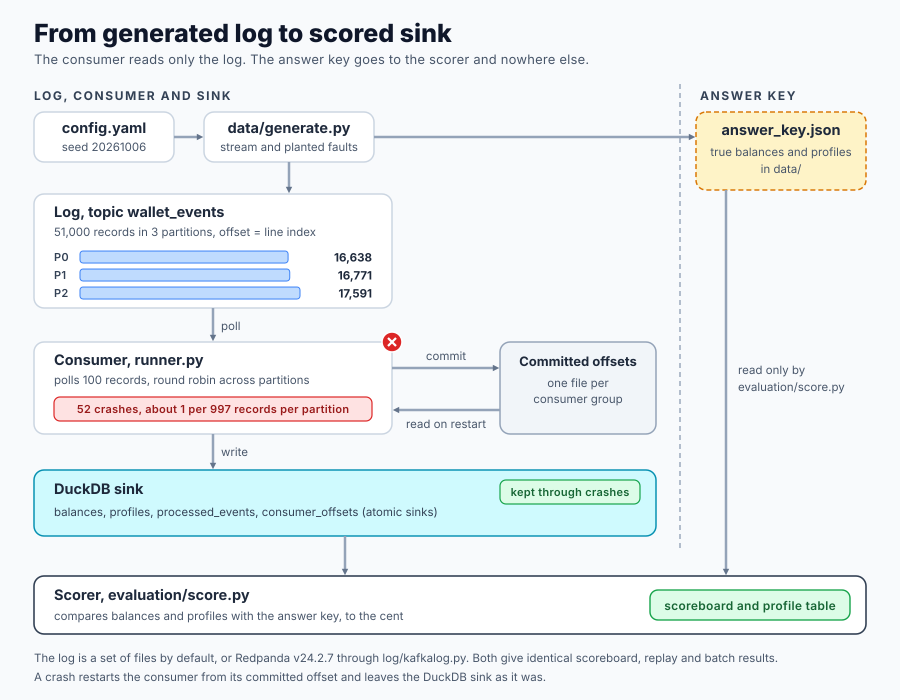

# Event Log Replay

> **Learn how to build this project step-by-step on [AI-ML Companion](https://aimlcompanion.ai/)**. Interactive ML learning platform with guided walkthroughs, architecture decisions, and hands-on challenges. Module link, [Project, Replay the Log](https://aimlcompanion.ai/module/dataEngineering/deReplayProject).


**A consumer that is correct only when nothing crashes is not correct.**

---

## 1. The problem

A wallet service writes about 50,000 events to a log with 3 partitions. A consumer
reads the log and keeps a balance table and a profile table up to date. The log
delivers each event at least once, which means some events arrive more than once.

Three things go wrong, and each one is planted at a known size.

1. The producer did not see an acknowledgement and resent 1,000 events. The same
   `event_id` now sits at two offsets.
2. 400 profile updates arrive after a newer update for the same account.
3. The consumer process is killed 52 times, at positions that are identical for every
   strategy you test.

This project runs five ways of writing the consumed events into DuckDB and scores each
one against an answer key. It then rewinds the consumer to offset zero, replays the
whole log into the same database, and diffs the tables. You get a measured result for
each idea, not a description of it.

The new depth over a basic consumer is that **idempotency depends on the event type**.

- **State events** carry absolute values, like the new tier and daily limit in a
  `profile_updated`. A guarded upsert makes them idempotent.
- **Delta events** carry changes, like a `deposit` of 500. Applying `+500` twice is
  wrong however the row is keyed, so no upsert can fix it. They need effect-level
  dedup, a processed-event-id record written in the same transaction as the balance
  change.

## 2. Why the data is generated

Real traffic cannot tell you what the balances should have been, because nobody wrote
the truth down. So `data/generate.py` builds the stream from a seed and records the
truth separately.

- Each balance is the sum of its events with every `event_id` applied once.
- Each profile is the update with the newest `(event_time, version)`.

That truth is written to `data/answer_key.json`. Only `evaluation/score.py` reads it, and
three tests enforce that. One scans every module for the name `answer_key`. One checks
the import graph of the consume path. One runs the consumer with the scorer switched off.

The stream uses one topic with two event types. Both types are keyed by `account_id`,
so one account's wallet events and profile updates share a partition and keep their
order. Two topics would put them on different partitions and add cross-topic ordering
to the problem, which is a separate lesson.

## 3. How it fits together



```
conf/config.yaml        every size, rate and seed
run.py                  zero-install entry point, puts src/ on the path
src/log_replay/
  config.py             paths, config loader
  cli.py                the subcommands
  experiments.py        strategies, replay proof, parallel jobs
  runner.py             the consume loop, kills and restarts the consumer
  faults.py             the seeded crash schedule
  report.py             ASCII tables
  data/generate.py      stream generator, planted faults, answer key
  log/base.py           Record, Consumer, partition_for, the LogBackend interface
  log/filelog.py        default backend, append-only files per partition
  log/kafkalog.py       optional backend, Redpanda or Kafka
  sinks/sql.py          schema and the SQL every strategy shares
  sinks/strategies.py   naive, commit_first, dedup_separate_txn, atomic
  evaluation/score.py   the only reader of the answer key
tests/                  pytest, test_lessons.py asserts every number below
notebooks/              standalone notebook and the script that builds it
docker-compose.yml      single-node Redpanda on host port 19092
```

The log is the part that makes this a Kafka problem. It keeps the properties the sinks
depend on.

- A partition is an append-only file, and an offset is a line index.
- Records with the same key land on the same partition, chosen by a stable `crc32`.
- Committed offsets are stored apart from the data, one append-only file per consumer
  group, like `__consumer_offsets`.
- `poll` moves an in-memory position. Only `commit` survives a restart. After a crash a
  new consumer starts from the committed offset.

A crash throws the consumer away and keeps the database. That asymmetry is the source of
every error in the tables below.

## 4. The planted faults

`python run.py produce` prints these counts. Each is exact, because each fault is placed
at a configured rate.

| fact | count |
|---|---|
| distinct events | 50,000 |
| wallet events, deltas | 45,000 |
| profile events, state | 5,000 |
| log records after producer retries | 51,000 |
| producer retries | 1,000 (891 wallet, 109 profile) |
| profile updates that arrive after a newer one | 400 |
| accounts whose last two updates share an `event_time` | 40 |
| consumer crashes | 52 |
| records per partition | 16,638, 16,771, 17,591 |

The crash schedule is a list of `(partition, offset)` positions, about one per 997
records in each partition. Each position fires once, the first time a batch reaches it.
Because the schedule is keyed to the log and not to call counts, every strategy and
every batch size sees the same 52 crashes.

## 5. Four ways to write, scored

All four run the same SQL. They differ in when it runs and in how many transactions it
takes. The consumer reads batches of 100 records, so a crash on record `i` leaves the
first `i + 1` records of the batch handled.

| strategy | order of operations | what a crash does |
|---|---|---|
| `naive` | write, then commit the offset | the write is replayed, so duplicates |
| `commit_first` | commit the offset, then write | the rest of the batch is never written, so lost events |
| `dedup_separate_txn` | transaction 1 writes, transaction 2 records the ids | the ids are missing, so duplicates |
| `atomic` | write, ids and offset in one transaction | everything rolls back, so nothing |

`python run.py compare` prints the scoreboard. Money is in currency units, kept as
integer cents underneath, so drift is exact.

| strategy | crashes | redelivered | accounts wrong | net drift | abs drift | events lost | applied twice | profiles wrong |
|---|---|---|---|---|---|---|---|---|
| naive, no crashes | 0 | 0 | 725 | 80,933.02 | 162,188.46 | 0 | 891 | 353 |
| naive | 52 | 2,470 | 1,580 | 281,567.11 | 475,194.63 | 0 | 3,109 | 353 |
| commit_first | 52 | 0 | 1,638 | -145,259.81 | 481,913.23 | 2,442 | 828 | 441 |
| dedup_separate_txn | 52 | 2,470 | 1,355 | 195,421.52 | 365,318.92 | 0 | 2,175 | 0 |
| atomic, offset only | 52 | 2,470 | 725 | 80,933.02 | 162,188.46 | 0 | 891 | 0 |
| atomic | 52 | 2,470 | 0 | 0.00 | 0.00 | 0 | 0 | 0 |

**Applied twice** counts every extra application of a wallet event, so an event applied
three times counts twice. In naive, 3,023 distinct events were applied more than once.

Read the table in this order.

1. **Naive is wrong before any crash.** With no crashes at all, the 891 retried wallet
   events are applied twice, and 725 of 2,000 accounts are wrong. Crashes then add
   2,218 more duplicate applications.
2. **Commit first swaps one error for another.** It never repeats a crash, but it loses
   2,442 events, and the net drift goes negative. It still applies the 828 retries that
   survived, because nothing dedups them.
3. **A dedup table in its own transaction fixes the retries and keeps the crash
   error.** Applied twice drops from 3,109 to 2,175, and all of what remains comes from
   crashes. Reversing the order of the two transactions would make the same crash lose events
   instead. That variant is not built or measured here.
4. **Offset alone is not enough.** The `atomic, offset only` row keeps the offset in the
   transaction and drops the id table. It matches naive with no crashes exactly, because
   a producer retry is a second record with a new offset, and exactly-once processing of
   the log is not exactly-once effect of the event.
5. **Atomic is exact.** Effect, event ids and offset commit together. 52 crashes still
   redeliver 2,470 records, and none of them change a balance.

`abs drift` is the sum of the absolute error per account. Net drift can hide errors that
cancel, which is why both are printed.

## 6. Profiles, last arrived against a guarded upsert

Profile events are state, so an upsert can make them idempotent. The policy decides
which update wins. `python run.py compare` runs all three on the atomic sink, so the
balances are exact and only the profile column moves.

| profile policy | profiles wrong | accounts with a profile |
|---|---|---|
| `last_arrived_wins` | 353 | 1,831 |
| `time_only_guard` | 34 | 1,831 |
| `guarded_upsert` | 0 | 1,831 |

- `last_arrived_wins` lets a late update overwrite a newer one. 400 late updates leave
  353 accounts wrong. Some accounts have more than one late update, and one is saved when a
  producer retry of its newest update lands after the late one.
- `time_only_guard` keeps the newest `event_time`, and gets 34 of the 40 tied accounts
  wrong. When two updates share a second, event time cannot say which is newer.
- `guarded_upsert` compares `(event_time, version)`. The version breaks the tie, and the
  upsert only applies when the incoming pair is strictly greater, so a redelivered
  update changes nothing.

## 7. The replay proof

Idempotency is easy to assert and cheap to check. `python run.py replay` runs each
strategy with the crashes, rewinds the consumer to offset zero, consumes the whole log
into the same database, and hashes the tables before and after. The atomic sink rewinds
by zeroing the offsets it stores itself. The others reset their consumer group.

| strategy | verdict | balance rows differ | profile rows differ | wrong before | wrong after |
|---|---|---|---|---|---|
| naive | checksum differs | 2,000 | 0 | 1,580 | 2,000 |
| commit_first | checksum differs | 2,000 | 107 | 1,638 | 2,000 |
| dedup_separate_txn | checksum identical | 0 | 0 | 1,355 | 1,355 |
| atomic | checksum identical | 0 | 0 | 0 | 0 |

- Naive and commit first change every balance, because the replay applies every record
  again. Naive profile rows do not change, since overwriting with the same final
  update is idempotent. That is the state against delta split in one table.
- `dedup_separate_txn` is idempotent after the first pass, because the crash window left
  no ids missing once the batch was redelivered. It is still wrong in 1,355 accounts.
  **The replay proof finds a sink that is not idempotent. It does not repair a sink
  that was already wrong, so always score against the key as well.**
- Atomic is identical before and after, and exact in both.

## 8. Batch size against redelivery

The atomic sink commits one transaction per polled batch. A crash rolls the batch back,
so a bigger batch repeats more records. `python run.py batches` reports counts, not
timings.

| batch size | transactions | crashes | records handled | redelivered | accounts wrong | profiles wrong |
|---|---|---|---|---|---|---|
| 50 | 1,020 | 52 | 52,419 | 1,419 | 0 | 0 |
| 100 | 510 | 52 | 53,470 | 2,470 | 0 | 0 |
| 500 | 102 | 52 | 62,957 | 11,957 | 0 | 0 |
| 5,000 | 11 | 52 | 174,952 | 123,952 | 0 | 0 |

Correctness is the same at every size. Redelivery is the cost of a large transaction, and
it shows up as repeated work and never as wrong data.

## 9. One account, followed through

The generator picks the smallest account that has a producer retry, an out-of-order
profile update and an event it can pin a consumer crash on. `python run.py inspect`
prints its events and what each strategy computed. For account 172 the relevant rows are

```
offset | event_id | type            | event                        | flags
-------+----------+-----------------+------------------------------+---------------------------
    72 | w-000233 | wallet_txn      | withdrawal 259.10            |
    81 | w-000233 | wallet_txn      | withdrawal 259.10            | DUPLICATE (producer retry)
   304 | w-000953 | wallet_txn      | withdrawal 220.35            | CONSUMER CRASH HERE
 16000 | p-048177 | profile_updated | v2 business limit 865,731.00 |
 16006 | p-021099 | profile_updated | v1 plus limit 953,878.00     | OUT OF ORDER
```

| strategy | balance | error | events applied wrongly | profile |
|---|---|---|---|---|
| naive | 14.47 | -479.45 | w-000233 x2, w-000953 x2 | plus |
| commit_first | 455.17 | -38.75 | w-000233 x2, w-000953 x0 | plus |
| dedup_separate_txn | 273.57 | -220.35 | w-000953 x2 | business |
| atomic | 493.92 | 0.00 | none | business |

The true balance is 493.92 and the true tier is business. Both doubled events are
withdrawals, so naive is wrong by 259.10 plus 220.35, which is the 479.45 in the table.
Commit first loses the 220.35 withdrawal, which adds money back, and still doubles the
259.10 one, so its error is 220.35 minus 259.10. Each strategy fails on exactly the events
the table names.

## 10. Run it

You need Python 3.10 or newer and about 200 MB for the install. No cloud account, no API
key and no network access at run time.

**macOS or Linux**

```bash
cd projects/data-engineering/event-log-replay
uv venv && source .venv/bin/activate
uv pip install -r requirements.txt
python run.py produce
```

**Windows PowerShell**

```powershell
cd projects\data-engineering\event-log-replay
uv venv
.venv\Scripts\activate
uv pip install -r requirements.txt
python run.py produce
```

Without uv, `python -m venv .venv`, activate it, and `pip install -r requirements.txt`.

| command | what it does | time |
|---|---|---|
| `python run.py produce` | generates the log, the answer key and the crash schedule | 2 s |
| `python run.py consume --strategy atomic` | runs one strategy and scores it | 20 s |
| `python run.py compare` | runs every strategy, prints the scoreboard and the profile table | 45 s |
| `python run.py replay` | rewind and diff for four strategies | 40 s |
| `python run.py batches` | batch size table for the atomic sink | 40 s |
| `python run.py inspect` | one account, its events and each strategy's result | 1 s |
| `python run.py all` | all of the above | 2 min |

Times are for a 16-core Windows desktop, are hardware dependent, and are never asserted
in a test. Each strategy is a separate run, so `compare`, `replay` and `batches` run them in
worker processes. Use `--jobs 1` to run in one process. The cost is DuckDB statement
overhead on a few hundred small transactions, not the data size.

Useful options.

```bash
python run.py consume --strategy naive --crash-every 0      # no crashes, retries only
python run.py consume --strategy atomic --batch 500         # bigger transactions
python run.py inspect --account 1042                        # any account
python run.py replay --strategy atomic
```

`produce` and `compare` print the planted counts and the scoreboard shown above. Every
command also writes JSON or CSV under `artifacts/`, which is not committed.

### Tests

```bash
pytest
```

The suite takes about 2 minutes, because `test_lessons.py` runs the full 50,000 events
for the scoreboard, the replay proof and the batch table. The smaller files use a few
thousand events and finish in under a minute.

- `test_lessons.py` asserts every number in sections 4 to 9.
- `test_generator.py` checks the planted counts, determinism and the answer key rules.
- `test_sinks.py` checks what a crash leaves behind in each sink and has mutation tests.
  Removing the id table, moving the offset out of the transaction and swapping the
  profile guard each change a number, which is how you know the protection is real.
- `test_log.py` checks the Kafka semantics of the file log.
- `test_kafka.py` runs only when `KAFKA_BOOTSTRAP` is set.

### The standalone notebook

`notebooks/event_log_replay_standalone.ipynb` runs top to bottom on Colab or Kaggle
with one `%pip install -q duckdb`. It uses an in-memory log, imports nothing from `src/`
and writes nothing to disk. The builder copies the real definitions out of `src/` by
name, so the notebook cannot drift from the scripts. Its numbers equal the ones above,
and a test compares them. It takes about 3 minutes and draws 6 charts.

```bash
python notebooks/_build_notebook.py
python -m nbconvert --to notebook --execute --inplace notebooks/event_log_replay_standalone.ipynb
```

### Against a real broker

The same sink code runs against Redpanda, which speaks the Kafka API. It is optional.

```bash
uv pip install -r requirements-kafka.txt
docker compose up -d
export KAFKA_BOOTSTRAP=localhost:19092        # PowerShell, $env:KAFKA_BOOTSTRAP = "localhost:19092"
python run.py produce --backend kafka
python run.py compare --backend kafka
docker compose down
```

The broker uses host port 19092 so a Kafka already on 9092 is not disturbed. Records go
to explicit partitions chosen by the same `crc32` rule, auto commit is off, and reads use
assign and seek. The stream and the crash schedule are seeded, so the numbers match the
file backend exactly. The `compare`, `replay` and `batches` result files from a Redpanda run
are byte-identical to the file backend's.

## 11. What this does not prove

- **One process, one consumer.** There is no consumer group rebalance, no concurrent
  consumers and no broker failure. The crash model is a consumer dying, not a cluster
  misbehaving.
- **Chosen crash points.** A real process can die between any two instructions. These
  tests kill it at a record boundary, after the write or before it, which is the case that
  separates the strategies.
- **DuckDB is not an OLTP database.** Its transactions are real, but a production sink
  would likely be Postgres or similar. No throughput is claimed, and none is asserted.
- **Bounded lateness.** Late profile updates arrive within 50 records of the newest one.
  Unbounded delay needs a watermark policy, which is not modelled.
- **Dedup table growth.** `processed_events` grows with the stream. A production system
  expires ids after the longest delay it will tolerate.
- **Overdrafts are allowed.** Balances can go negative, so no business rule can reject an
  event and change the result.
- **The Redpanda run is one configuration.** It shows that the sinks and the counts carry
  over to a real broker, not that every Kafka deployment behaves the same.

## 12. Track modules this covers

This repository is the companion for **Project, Replay the Log** in the Data Engineering
track, which follows the Kafka basics module.

- [Project, Replay the Log](https://aimlcompanion.ai/module/dataEngineering/deReplayProject)
