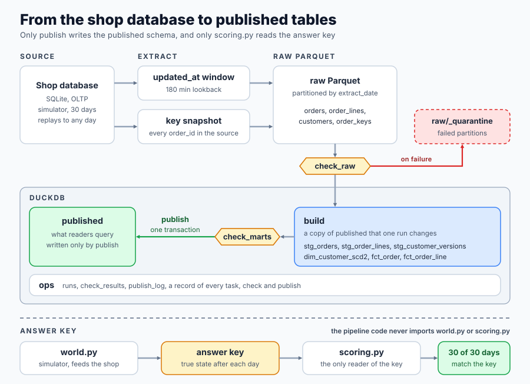

# Incremental Warehouse

> **Learn how to build this project step-by-step on [AI-ML Companion](https://aimlcompanion.ai/module/dataEngineering/dataEngCapstone)**. Interactive learning platform with guided walkthroughs, architecture decisions, and hands-on challenges.


**Run it twice and nothing changes. Break the input and nothing publishes.**

---

## 1. What you build, and why it is hard

A pipeline that keeps a warehouse in step with an OLTP database that changes every day. A simulated shop writes to SQLite for 30 days. Each day the pipeline extracts only what changed, lands it as raw Parquet partitions, builds a type 2 customer dimension and order facts in DuckDB, runs data checks, and publishes.

Loading the data once is easy. Operating the pipeline is the hard part, because the source keeps changing under you.

- A row can be committed after the extract for its day has already run, with a timestamp from before that extract. A query on `updated_at > watermark` never sees it.
- A hard delete leaves no row behind, so a watermark query cannot see it either.
- A rerun, a backfill or a half-failed run must leave the same tables as one clean pass.
- A renamed column, a null spike or a missing day of data must stop the run before anything is published.

The pipeline has three properties, and each one is a command and a test.

| Property | Command | What it shows |
|---|---|---|
| Rerun | `python run.py rerun` | run a date twice, every table checksum is identical |
| Backfill | `python run.py backfill` | past dates run late fill their own partitions, and the final tables equal a clean single pass |
| Fail before publish | `python run.py break` | bad input fails at a check, `publish` is skipped, the published tables do not change |

This is the capstone of the Data Engineering track. It assembles OLTP against OLAP, batch loads, Parquet and partitioning, dimensional modelling, SCD2, ELT, orchestration with logical dates and retries, idempotency and backfills, incremental extraction, and data quality checks. The star-schema project already teaches the modelling, so this one is about operating a pipeline.



## 2. Why the data is generated

With a real database you cannot know what the correct warehouse looks like. With a simulated one you can. `src/warehouse/source/world.py` generates 30 days of shop activity from a seed and records, separately, the committed state of every order and customer at the end of each day. That record is the answer key.

Only `src/warehouse/scoring.py` reads it. A test scans every other module for the symbol, and a second test imports every pipeline module in a fresh interpreter and checks that neither the generator nor the scorer was loaded.

Both failures are planted at counted sizes.

| Planted failure | Size |
|---|---|
| Orders ever created | 1,789 |
| Customers at the end | 455 |
| Orders in the source at the end | 1,762 |
| Order lines in the source at the end | 4,443 |
| Late commits | 111 (103 on orders, 8 on customers) |
| Hard deletes | 27 |

A late commit is a change that keeps the `updated_at` it was stamped with when its transaction started (up to 150 minutes before midnight) and becomes visible the next day. This is how a long transaction behaves in a database where `now()` is the transaction start time. Hard deletes remove revenue-counting orders and their lines.

The revenue rule is written once, in `conf/config.yaml`. An order counts when its status is `paid`, `shipped` or `delivered`. Revenue is the sum of `quantity * unit_price_cents` over its lines, in integer cents, attributed to the order's created date and to the region its customer lived in on that date.

## 3. The six decisions

| Decision | Choice | Reason, as built |
|---|---|---|
| Grain | `fct_order` one row per order, `fct_order_line` one row per line, `dim_customer_scd2` one row per customer per region span | Revenue is asked by order date and region. The line fact lets a check prove that line totals add up to order totals. |
| Ingestion | Window on `updated_at` with a 180 minute lookback, dedup on `(key, updated_at)`, plus a full key snapshot of `orders` on every run | The lookback must exceed the source lateness of 150 minutes. The key snapshot is the only way to see a hard delete. |
| SCD type | Type 2 on `region` | Revenue by region has to use the region on the order date. Type 1 puts 218 orders in the wrong region (section 5.6). |
| Load pattern | Partition overwrite by `order_date`, for every date the run touched | A date is touched by new orders, by status changes on older orders, by deletes, and by customer moves. Overwrite makes a rerun a no-op. Append double counts (section 5.3). |
| Storage | Raw Parquet partitioned by `extract_date`, DuckDB for models, checks and run history | The raw lake is the history, so any model can be rebuilt from it. Staging reads every raw partition and keeps the newest version of each key. |
| Where the checks sit | `check_raw` right after landing, `check_marts` right before publish, both as tasks that stop the run | A check that only writes a report publishes the bad day (section 5.5). |

## 4. How it fits together

One DAG run per logical date. Every task receives the logical date as `run_date` and never reads the clock.

```
extract_orders, extract_customers
  >> land_raw >> check_raw >> prepare_build
  >> stg_orders, stg_order_lines, stg_customer_versions
  >> dim_customer_scd2 >> plan_partitions
  >> fct_order, fct_order_line >> check_marts >> publish
```

`src/warehouse/pipeline.py` builds it.

```python
[t["extract_orders"], t["extract_customers"]] >> t["land_raw"] >> t["check_raw"]
t["check_raw"] >> t["prepare_build"]
t["prepare_build"] >> [t["stg_orders"], t["stg_order_lines"], t["stg_customer_versions"]]
t["stg_customer_versions"] >> t["dim_customer_scd2"]
[t["stg_orders"], t["stg_order_lines"], t["dim_customer_scd2"]] >> t["plan_partitions"]
t["plan_partitions"] >> [t["fct_order"], t["fct_order_line"]]
[t["fct_order"], t["fct_order_line"]] >> t["check_marts"] >> t["publish"]
```

### Schemas in DuckDB

| Schema | Holds | Written by |
|---|---|---|
| `build` | a copy of the published tables, changed by one run | the build tasks |
| `published` | what readers query | `publish`, in one transaction |
| `ops` | `runs`, `check_results`, `publish_log` | the runner and the checks |

`prepare_build` copies `published` into `build`. Every task after it works on `build`. `publish` drops and recreates each published table from `build` inside one transaction, so readers see the old tables or the new ones, never a mix. A failure anywhere earlier leaves `published` exactly as it was.

### The DAG runner

`src/warehouse/dag.py` is about 100 lines. Airflow does not run natively on Windows, so the runner lives in the repo. It maps to Airflow like this.

| Here | Airflow |
|---|---|
| `dag.add(name, fn)` | a `PythonOperator` task |
| `a >> b`, `[a, b] >> c` | the same operators |
| `ctx.run_date` | the logical date, `{{ ds }}` |
| `retries`, `retry_delay`, `backoff` | `retries`, `retry_delay`, `retry_exponential_backoff` |
| status `skipped` after a failure | `upstream_failed` under the default `all_success` trigger rule |
| `ctx.xcom` | XCom |
| `ops.runs` | the task instance table |

A task that raises `TransientError` is retried with a doubling delay. Any other exception fails the task at once, because retrying a failed check fails again.

### The SQL models

The models are plain SELECT files in `sql/`, rendered with Jinja, where `{{ ref('x') }}` becomes `build.x`. Each file names its dbt equivalent in a comment. This project does not use dbt, because the star-schema project already does.

| File | dbt model |
|---|---|
| `stg_orders.sql`, `stg_order_lines.sql`, `stg_customer_versions.sql` | staging models, materialized as tables |
| `dim_customer_scd2.sql` | a snapshot on `region`, or this model over the raw versions |
| `fct_order.sql`, `fct_order_line.sql` | incremental models with `insert_overwrite` by `order_date` |

### File map

```
conf/config.yaml          every size, rate, threshold and demo date
sql/                      the six models
run.py                    zero-install entry point
RUNBOOK.md                what each check failure means and how to rerun
src/warehouse/
  source/world.py         the shop history and the answer key
  source/shop.py          the SQLite OLTP source, replayable to any day
  dag.py                  the DAG runner
  extract.py              windowed extract and key snapshot
  land.py                 raw partitions, Parquet or in memory
  checks.py               check_raw and check_marts
  transform.py            renders and runs the SQL models
  load.py                 touched partitions, partition overwrite
  warehouse.py            build, published and ops schemas, atomic publish
  pipeline.py             the tasks and the DAG
  harness.py              one sandbox per scenario
  scoring.py              compares published tables with the answer key
  naive.py                six naive variants against the correct pipeline
  proofs.py               rerun, backfill, break
  cli.py                  the run.py commands
tests/                    test_lessons.py asserts every claim here
notebooks/                standalone notebook and the script that builds it
```

## 5. Each planted failure and what it costs

Every comparison is the correct pipeline with one switch changed, run over the same 30 days and scored against the answer key. The naive runs log their check failures but publish anyway, which is what a pipeline with a separate quality report does. The last column of each table is what the correct pipeline does. All of these come from `python run.py naive`.

### 5.1 Late commits, strict watermark against lookback

The strict extract reads `updated_at >= midnight`. A late commit is stamped before midnight, so no extract ever reads it.

| Measure | Strict watermark | Lookback and dedup |
|---|---|---|
| Late commits planted | 111 | 111 |
| Late commit rows landed | 0 | 111 |
| Orders missing after day 30 | 1 | 0 |
| Orders with a stale status | 25 | 0 |
| Orders in the wrong region | 9 | 0 |
| Days with exact revenue (of 30) | 7 | 30 |
| Absolute revenue error on day 30 | $3,366.16 | $0.00 |
| First reconcile failure | 2025-06-04 | none |

Most late rows are healed later, because the same order changes again and the next extract carries the whole row. That is why only 1 order is missing at the end while 111 rows were missed. The damage is stale statuses and regions for days at a time. Revenue by order date and region is wrong after 23 of the 30 daily runs. With gating checks switched on, the strict extract stops on day 3 at `check_marts`, on `reconcile_by_date`, `reconcile_order_count` and `reconcile_revenue`, and publishes nothing.

### 5.2 Hard deletes, with and without key reconciliation

| Measure | No delete detection | Key reconciliation |
|---|---|---|
| Orders hard-deleted from the source | 27 | same |
| Deleted orders still published | 27 | 0 |
| Published revenue | $527,238.96 | $519,494.81 |
| True revenue | $519,494.81 | $519,494.81 |
| Revenue overstated | $7,744.15 | $0.00 |
| First reconcile failure | 2025-06-05 | none |

### 5.3 Append against partition overwrite

Both runs execute day 15 twice, then finish the month.

| Measure | Append | Partition overwrite |
|---|---|---|
| Rows added by running day 15 twice | 249 | 0 |
| Revenue double counted by that rerun | $58,078.27 | $0.00 |
| `fct_order` rows after day 30 | 7,027 | 1,762 |
| True orders | 1,762 | 1,762 |
| Rows beyond one per order ever created | 5,238 | 0 |
| Published revenue | $1,647,637.43 | $519,494.81 |
| First grain failure | 2025-06-03 | none |

Append is wrong even without a rerun, because every status change appends another version of the order. The 1,789 orders ever created, including the 27 hard-deleted ones that append never removes, become 7,027 rows. The rerun adds the whole day again on top.

### 5.4 Wall clock against logical run_date

Five past days (2025-06-10 to 2025-06-14) are backfilled while the clock says 2025-07-15. The naive task files its data under the date from the clock.

| Measure | Wall clock | Logical run_date |
|---|---|---|
| Past days backfilled | 5 | 5 |
| Their own partitions present | 0 | 5 |
| Rows in the stray partition 2025-07-15 | 235 | 0 |
| Orders missing right after the backfill | 114 | 0 |
| Orders with a stale status right after | 230 | 0 |
| Absolute revenue error right after | $49,724.37 | $0.00 |
| Orders missing after day 30 | 1,014 | 0 |
| Published revenue after day 30 | $229,234.04 | $519,494.81 |
| First reconcile failure | 2025-06-11 | none |

All five days write to one partition, so each day replaces the one before and only the last survives. The stray partition is also the newest key snapshot, so every order created after day 13 is treated as deleted. That second effect is why the loss grows to 1,014 orders.

### 5.5 Checks as a report against checks as gating stages

A break is injected on day 20 (2025-06-21). True revenue that day is $341,757.94.

| Break | Check that fires | Published before | Published, report only | Absolute error, report only | Revenue with no region | Published, gated | Gated run | Tasks skipped |
|---|---|---|---|---|---|---|---|---|
| rename | `contract_orders` | $324,213.01 | $291,367.39 | $50,390.55 | $0.00 | $324,213.01 | stops at `check_raw` | 10 |
| nulls | `nulls_orders` | $324,213.01 | $341,757.94 | $39,996.22 | $19,998.11 | $324,213.01 | stops at `check_raw` | 10 |
| volume | `volume` | $324,213.01 | $325,722.62 | $16,059.52 | $0.00 | $324,213.01 | stops at `check_raw` | 10 |

The nulls row shows why a total is not enough. The report publishes exactly the true total, and $19,998.11 of it sits under no region. The gated runs leave the day 19 tables in place, and those tables match the day 19 answer key with an error of $0.00. They are correct but one day old, $17,544.93 below day 20 revenue.

Absolute error adds up the gap in every date and region cell, so it can exceed the gap in the total. For the volume break the total is $16,035.32 short and the cell error is $16,059.52.

### 5.6 Current region against region at order time

| Measure | SCD type 1 | SCD type 2 |
|---|---|---|
| Orders in the wrong region | 218 | 0 |
| Date by region cells wrong | 99 | 0 |
| Absolute revenue error across cells | $55,522.66 | $0.00 |
| Total revenue error | $0.00 | $0.00 |

Type 1 moves revenue between regions without changing the total, so a total check cannot see it.

## 6. The three properties

### Rerun

```
Run 2025-06-16 twice
+-----------------------------+--------------+--------------+
|                             | first run    | second run   |
+-----------------------------+--------------+--------------+
| run id                      | 2025-06-16#1 | 2025-06-16#2 |
| fct_order rows              | 904          | 904          |
| published revenue           | $254,902.91  | $254,902.91  |
| raw orders partition sha256 | bc70f3fd722a | bc70f3fd722a |
| checksum dim_customer_scd2  | 185c592dea3b | 185c592dea3b |
| checksum fct_order          | 10fb506fab99 | 10fb506fab99 |
| checksum fct_order_line     | af8198023727 | af8198023727 |
+-----------------------------+--------------+--------------+
```

The raw partition is written to a temp file and renamed over the old one, in sorted key order, so the same input gives the same bytes. The fact partitions are deleted and reinserted, never appended. The digests above depend on your library versions. What the test asserts is that the two columns are equal.

### Backfill

Days 1 to 8 run daily. Days 9 to 13 (2025-06-10 to 2025-06-14) run late, with the clock set to 2025-07-15. Then days 14 to 30 run daily.

```
+------------+-------------+---------------------+---------------------+-----------------------+
| partition  | orders rows | oldest updated_at   | newest updated_at   | inside its own window |
+------------+-------------+---------------------+---------------------+-----------------------+
| 2025-06-10 | 254         | 2025-06-09 21:24:05 | 2025-06-10 23:58:54 | True                  |
| 2025-06-11 | 236         | 2025-06-10 21:21:47 | 2025-06-11 23:57:37 | True                  |
| 2025-06-12 | 257         | 2025-06-11 21:16:39 | 2025-06-12 23:53:04 | True                  |
| 2025-06-13 | 268         | 2025-06-12 21:24:23 | 2025-06-13 23:59:05 | True                  |
| 2025-06-14 | 235         | 2025-06-13 21:02:28 | 2025-06-14 23:59:49 | True                  |
+------------+-------------+---------------------+---------------------+-----------------------+
```

There are 30 raw partitions and none is dated by the clock. The final published tables have the same checksums as a clean single pass. The oldest `updated_at` in each partition falls within the 180 minute lookback before midnight, and the newest falls before the next midnight.

### Fail before publish

```bash
python run.py break --kind nulls
```

```
Break 'nulls' injected on 2025-06-21
+---------------------------------+------------------------------------------------------+
| measure                         | value                                                |
+---------------------------------+------------------------------------------------------+
| run ok                          | False                                                |
| failed task                     | check_raw                                            |
| failed checks                   | nulls_orders                                         |
| tasks skipped                   | 10 (prepare_build, stg_orders, stg_order_lines, ...) |
| published revenue before        | $324,213.01                                          |
| published revenue after         | $324,213.01                                          |
| published tables unchanged      | True                                                 |
| raw partitions quarantined      | 4                                                    |
| rerun after fix ok              | True                                                 |
| published revenue after fix     | $341,757.94                                          |
| equals a clean pass to that day | True                                                 |
+---------------------------------+------------------------------------------------------+
    check_raw.nulls_orders: null rate above 0.01: {'customer_id': 0.344}
```

The three breaks fail with these details.

| Kind | What the source does | Detail from `check_raw` |
|---|---|---|
| `rename` | `orders.status` becomes `order_status` | `missing=['status'] unexpected=['order_status']` |
| `nulls` | `customer_id` is cleared on 2 of every 5 order ids of the day | `null rate above 0.01: {'customer_id': 0.344}` |
| `volume` | only every 10th change of the day is written | `rows=55 trailing_median=248 ratio=0.22` |

The failed raw partitions move to `data/<scenario>/raw/_quarantine/`, so no later run reads them. Rerunning the date after the fix gives the same tables as a pass that never failed.

### The runs table

`python run.py daily` makes `extract_orders` fail once on 2025-06-05 with a simulated connection reset. `python run.py runs` prints the run.

```
ops.runs for 2025-06-05#1 in scenario 'clean'
+-----+-----------------------+---------+----------+-------+
| seq | task                  | status  | attempts | error |
+-----+-----------------------+---------+----------+-------+
| 1   | extract_orders        | success | 2        |       |
| 2   | extract_customers     | success | 1        |       |
| 3   | land_raw              | success | 1        |       |
| 4   | check_raw             | success | 1        |       |
...
| 14  | publish               | success | 1        |       |
+-----+-----------------------+---------+----------+-------+
```

It also prints the broken run from `python run.py break`, with `check_raw` failed and the 10 tasks after it skipped.

## 7. Run it

### Clone

```bash
git clone https://github.com/genieincodebottle/aiml-companion.git
cd aiml-companion/projects/data-engineering/incremental-warehouse
```

### Set up with uv

[uv](https://docs.astral.sh/uv/) installs in seconds and keeps the environment inside the project.

```bash
pip install uv

uv venv
source .venv/bin/activate      # Linux / macOS
# .venv\Scripts\activate       # Windows PowerShell or cmd

uv pip install -r requirements.txt
```

Plain `pip install -r requirements.txt` works the same. Python 3.10 or newer. Nothing needs a cloud account or an API key.

### Run the story end to end

```bash
python run.py source      # the simulated source and the planted failures   (~1s)
python run.py daily       # 30 daily runs, one transient failure retried    (~12s)
python run.py score       # published revenue against the answer key        (~2s)
python run.py rerun       # run one date twice                              (~7s)
python run.py backfill    # run past dates late                             (~20s)
python run.py break       # rename, nulls and volume, then recover          (~40s)
python run.py naive       # the six naive variants against the correct one  (~2 to 3 min)
python run.py runs        # the ops.runs table for the retried and broken run (~2s)
python run.py all         # everything above from an empty data folder      (~4 min)
```

Timings depend on your hardware and are not asserted anywhere. `run.py` needs no install of this project. It puts `src/` on the path itself. Output goes to the terminal and to `artifacts/` (CSV and JSON), and run state goes to `data/`. Both are gitignored.

`python run.py score` ends with this.

```
[OK] published revenue matches the answer key on 30 of 30 days, and the day-30 tables match order by order
```

Pass `--date` to `rerun`, `break` and `runs`, `--start` and `--end` to `backfill`, and `--kind rename|nulls|volume|all` to `break`.

### Run the tests

```bash
pytest -p no:warnings          # 56 tests, about 5 minutes
```

The suite reads `src/` through `pythonpath` in `pyproject.toml`, so it does not need `pip install -e .`. Most of the time goes to `tests/test_lessons.py`, which runs every naive comparison once and asserts each number in section 5.

| File | What it asserts |
|---|---|
| `test_lessons.py` | every number in sections 5 and 6, and that published revenue equals the answer key after each of the 30 days |
| `test_isolation.py` | only the generator and scorer name the answer key, pipeline modules do not import them, nothing reads the wall clock |
| `test_pipeline.py` | the incremental fact equals a full rebuild after every day, publish rolls back on error, retries are recorded, in-memory and Parquet stores publish identical tables |
| `test_checks.py` | each check fires on the mutation it exists for and passes on clean data |
| `test_dag.py` | `>>` wiring, retry delays, no retry on a non-transient error, downstream skip, cycles |
| `test_source.py` | the planted sizes, late stamps before midnight and visible the next day, deletes leave nothing behind, replay equals running forward |
| `test_notebook.py` | the executed notebook's numbers equal the repo's, and it runs the same SQL |

## 8. The notebook

`notebooks/incremental_warehouse_standalone.ipynb` is standalone. It generates its own shop, defines every function it uses, imports nothing from `src/`, and writes nothing to disk. The warehouse is in-memory DuckDB and the raw lake is a dictionary of Arrow tables. It has 7 charts, one per measured result. It takes about 4 minutes top to bottom, most of it the naive comparisons.

Every code cell opens with a header saying what it consumes and what it produces. The SQL cell is read from `sql/` when the notebook is built, and the package source cells are copied from `src/warehouse/`, so the notebook cannot drift from the repo. A test checks both, and checks that the last cell's numbers equal what `run.py` prints.

**Locally**, after the setup above.

```bash
python notebooks/_build_notebook.py
python -m nbconvert --to notebook --execute --inplace --ExecutePreprocessor.timeout=1500 notebooks/incremental_warehouse_standalone.ipynb
```

**On Colab or Kaggle**, open the notebook and run all cells. The first cell runs `%pip install -q duckdb pyarrow`. Both runtimes already ship pandas, matplotlib, Jinja2 and PyYAML.

## 9. If something goes wrong

| Symptom | Cause | Fix |
|---|---|---|
| `Missing dependency` from `run.py` | packages not installed | `uv pip install -r requirements.txt` |
| `make: command not found` | Windows has no `make` | use the `python run.py` commands |
| `No module named pip` in the notebook's first cell | uv environments ship without pip | `uv pip install pip`, it is in `requirements.txt` |
| a notebook cell times out | the default is 30 seconds per cell | pass `--ExecutePreprocessor.timeout=1500` |
| `score` says no clean run found | `daily` has not run | it runs `daily` first, or run it yourself |
| a table digest differs from this README | other pyarrow or DuckDB version | compare the two columns of one run, not the digests across machines |

## 10. What this does not prove

- **The source replays history.** A real OLTP table keeps only current rows, so a real backfill sees the latest version of each row and not every state in between. The simulator rebuilds the exact state of any day by replaying its event log, so rerun and backfill can be proven exactly. A real project would need CDC, snapshots or a history table to do the same.
- **Lateness is bounded.** The generator never makes a commit later than 150 minutes, and the lookback is 180. A commit later than the lookback is missed, and `reconcile_by_date` would be the check that reports it. `load_config` rejects a lookback that is not larger than the maximum lateness.
- **Backfills run in order.** The reconciliation compares the warehouse with the source as of the run date. Running a past date after later dates exist makes that comparison fail. Run dates oldest first.
- **Staging is rebuilt, not incremental.** Staging models read every raw partition on each run. That is cheap at 1,762 orders and would need partition pruning at larger scale. Run time grows with history for that reason.
- **One process, one task at a time.** The runner does not parallelise, and publish is one DuckDB transaction in one file. A multi-writer warehouse needs a table format with its own commit protocol.
- **The checks are thresholds.** The volume check compares with the median of the previous 7 partitions and the contract check compares column names, not types. They catch the three planted breaks, not every possible drift.
- **Money is exact.** Revenue is integer cents, so the equality checks in this project would not survive floating point amounts.

## 11. Track modules this covers

OLTP against OLAP, batch processing, file formats and partitioning, dimensional modelling, slowly changing dimensions, ELT, orchestration, idempotency and backfills, change data capture and incremental extraction, and data quality checks and contracts. The module is [Capstone, Build a Warehouse](https://aimlcompanion.ai/module/dataEngineering/dataEngCapstone).
