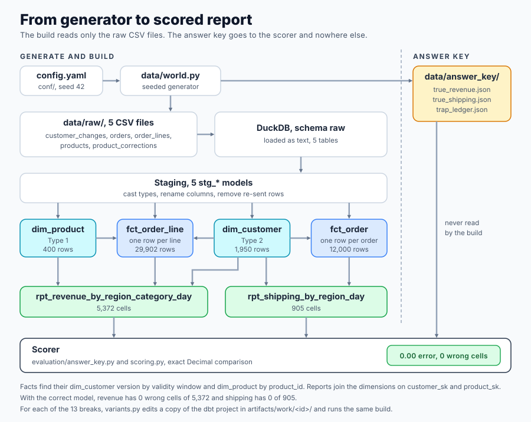

# Star Schema Modelling

> **Learn how to build this project step-by-step on [AI-ML Companion](https://aimlcompanion.ai/module/dataEngineering/deStarSchemaProject)**. Interactive ML learning platform with guided walkthroughs, architecture decisions, and hands-on challenges.


**Most of the work in a star schema is decisions, not SQL. A test is worth what it catches when the model breaks.**

---

## 1. What you build and why it is hard

You build a star schema for an online store with dbt and DuckDB. It has a Type 2 customer dimension, a Type 1 product dimension, two fact tables at two different grains, and two reports. It takes `python run.py build` about 15 seconds on a laptop.

The SQL is short. The hard part is that every wrong version of it still runs, still returns rows, and still looks right. A fact joined to the wrong customer version passes `unique` and `not_null`. A report that counts shipping twice has the right shape and plausible numbers.

So this project does three things.

1. It generates a source system with five known problems planted in it, and writes down the true answer separately.
2. It builds the correct model and shows that its reports match the true answer to the cent.
3. It breaks the model 13 realistic ways, runs the full test suite against each break, and records which tests fire. That record is the **mutation matrix**, and it is the main result of the project.

You will see that 6 of the 13 breaks pass every generic and singular test. The suite only catches them after you add a test written for that specific break. One break is caught by no test at all.

## 2. Why the data is generated

On a real export nobody knows the true revenue by region at the time of the order. You can build a model and never learn that it is wrong.

Here the generator writes the true daily revenue by region and category from its own event history. The names are `TRUE_REVENUE`, `TRUE_SHIPPING` and `TRUE_LEDGER`, and they live in `src/star_schema/data/world.py`. Nothing that builds the warehouse may read them. `tests/test_isolation.py` scans every module, every SQL file and the dbt project for those names, and fails if any file outside the generator, its writer and the scorer mentions them.

Every problem is planted at a size set in `conf/config.yaml`, so every naive error in this README can be traced to a setting.

| Planted problem | Size | Setting |
|---|---|---|
| Customers who move region once or twice | 300 and 75 customers, 450 moves | `relocate_once_share`, `relocate_twice_share` |
| Orders placed in a region the customer later left | 1,513 orders, 593,658.28 of revenue | derived |
| Shipping charged per order, not per line | 12,000 orders, 29,902 lines | `lines_per_order_weights` |
| Order lines re-sent by an upstream retry | 598 duplicate rows in 22 chunks | `resend_share` |
| Customers whose first row is stamped after their first order | 60 customers, 182 orders, 73,341.63 of revenue | `late_customer_share` |
| Orders stamped on the exact second a region changed | 60 orders, 24,485.14 of revenue | `boundary_orders` |
| Product categories corrected after the fact | 12 products | `product_correction_share` |

The seed fixes everything. Two runs give byte-identical CSV files, and `tests/test_generator.py` pins their SHA-256 hashes.

## 3. How it fits together



```
conf/config.yaml
   |
   v
data/world.py  --> data/raw/*.csv  (customer_changes, orders, order_lines, products, product_corrections)
   |                    |
   |                    v   loaded as text into schema raw
   |              warehouse/  (the dbt project)
   |                staging   stg_*    cast, rename, dedup
   |                marts     dim_customer (Type 2)   dim_product (Type 1)
   |                          fct_order_line (one row per line)   fct_order (one row per order)
   |                          rpt_revenue_by_region_category_day   rpt_shipping_by_region_day
   |                    |
   v                    v
data/answer_key/  --> evaluation/answer_key.py + scoring.py  (the only readers of the key)
```

The build never reads the answer key. The scorer reads a finished report and the key, and nothing else.

### How a break is applied

`src/star_schema/variants.py` holds each break as a list of text edits to the shipped model files. To build a break, `run.py` copies the dbt project into `artifacts/work/<id>/`, applies the edits to the copy, loads the raw CSVs into a fresh DuckDB file, and runs `dbt run` then `dbt test`. An edit that matches nothing, or matches twice, raises an error, so a break can never silently do nothing. A test confirms the shipped `warehouse/` folder is byte-identical before and after every build.

dbt runs through its programmatic `dbtRunner`, with `--project-dir` and `--profiles-dir` passed explicitly, so nothing reads or writes `~/.dbt`. There are no dbt packages. The two extra generic tests are written in `warehouse/tests/generic/`.

### File map

```
star-schema-modelling/
  run.py                         entry point, needs no install
  conf/config.yaml               seed, sizes, every trap rate
  warehouse/                     the dbt project
    profiles.yml                 DuckDB, path from the STAR_SCHEMA_DB variable
    models/staging/              stg_customer_changes, stg_orders, stg_order_lines,
                                 stg_products, stg_product_corrections, schema.yml
    models/marts/                dim_customer, dim_product, fct_order, fct_order_line,
                                 rpt_revenue_by_region_category_day, rpt_shipping_by_region_day
    tests/generic/               unique_combination_of_columns, column_is_decimal
    tests/singular/              the four business rule tests
    tests/added/                 five SQL tests added after the first matrix
                                 (two more, column_is_decimal, are tagged in marts/schema.yml)
  src/star_schema/
    data/world.py                the seeded generator and the answer key
    data/io.py                   writes the CSV files and the key
    evaluation/scoring.py        exact Decimal comparison to the key
    evaluation/answer_key.py     reads the key, scores a built report
    variants.py                  the 13 breaks, as data
    verdict.py                   which tier of test caught a break
    pipelines/dbt_driver.py      loads raw, runs dbt in a worker process
    pipelines/matrix.py          builds a variant and scores it
    pipelines/report.py          the printed tables and the artefacts
  tests/                         pytest, including test_lessons.py
  notebooks/                     standalone notebook and its builder
```

## 4. The six modelling decisions

The existing module teaches that most of the work is decisions. These are the six this repo makes, with the reason and the SQL that carries each one.

1. **Declare the grain first.** `fct_order_line` has one row per `(order_id, line_no)`. `fct_order` has one row per `order_id`. The grain test on each table follows directly from that sentence.
2. **The region question forces a Type 2 customer dimension.** "Revenue by the region the customer was in when they ordered" cannot be answered from a table that only knows where the customer is now. `dim_customer` keeps one row per version the source reported (1,950 rows for 1,500 customers), and each fact carries a `customer_sk` found by the validity window.
3. **Product corrections are Type 1.** A category correction fixes a data entry error. The old value was never right, so `dim_product` overwrites it and restates history.
4. **Shipping lives on the order grain fact.** It is charged once per order. On the line fact it counts once per line.
5. **Back-date the first customer version.** Some customers were synced after their first order. The order proves the customer existed, and the first known region is the best evidence for where they were. `valid_from` of version 1 is `1900-01-01`. An "unknown member" row would throw away a region the data has.
6. **Validity windows are half open.** `valid_from` is inclusive, `valid_to` is exclusive and equals the next version's `valid_from`. An order on the exact second of a change belongs to the new version and only the new version.

Two rules sit under all six. Staging casts, renames and removes re-sent rows, and does nothing else. Money is `DECIMAL(12,2)` from the first cast.

## 5. What each planted problem costs

`python run.py naive` builds the naive version of each problem and scores its reports against the key. The correct model scores exactly 0.00 (`python run.py check`).

True revenue is 4,758,558.74 and true shipping is 62,111.62. "Abs error" adds up the difference in every cell of the report, and "net error" is the signed total.

```
trap                       naive approach                                              measure     true total   abs error   net error  % of true  worst region (net)
-------------------------  ----------------------------------------------------------  --------  ------------  ----------  ----------  ---------  ------------------
1 relocation               Join facts to the customer dimension on is_current          revenue   4,758,558.74  834,154.02        0.00     17.53%  North 26,798.25
1 relocation               Join facts to the customer dimension on is_current          shipping     62,111.62    7,120.38        0.00     11.46%  North 269.54
1 relocation               Overwrite the customer region in place (Type 1)             revenue   4,758,558.74  834,154.02        0.00     17.53%  North 26,798.25
1 relocation               Overwrite the customer region in place (Type 1)             shipping     62,111.62    7,120.38        0.00     11.46%  North 269.54
2 mixed grain              Put order-level shipping on the line fact and sum it there  revenue   4,758,558.74        0.00        0.00      0.00%  -
2 mixed grain              Put order-level shipping on the line fact and sum it there  shipping     62,111.62   92,163.41   92,163.41    148.38%  East 19,158.07
3 re-sent delivery         Remove the dedup from stg_order_lines                       revenue   4,758,558.74   93,458.45   93,458.45      1.96%  Central 24,225.73
4 late-arriving dimension  No back-dating, and inner join facts to the window          revenue   4,758,558.74   73,341.63  -73,341.63      1.54%  South -19,699.13
4 late-arriving dimension  No back-dating, and inner join facts to the window          shipping     62,111.62      932.51     -932.51      1.50%  South -249.62
5 overlapping windows      Join with <= valid_to, so a boundary matches two versions   revenue   4,758,558.74   24,485.14   24,485.14      0.51%  Central 6,513.55
5 overlapping windows      Join with <= valid_to, so a boundary matches two versions   shipping     62,111.62      314.54      314.54      0.51%  Central 121.85
```

Each error equals what the generator says it planted. `tests/test_lessons.py` asserts that, so the table cannot drift from the generator.

* **Relocation.** The grand total is exact, because the revenue only changes region. 593,658.28 of revenue lands in the wrong region, and every region is off.
* **Mixed grain.** Revenue is untouched. Shipping is overstated by 92,163.41, which is 148.38% of the true figure, because every extra line repeats the order's shipping charge. The excess is `shipping * (lines - 1)` summed over every order.
* **Re-sent delivery.** The 598 duplicate rows carry 93,458.45 of revenue. Every one of them is counted twice.
* **Late dimension.** An inner join on the validity window drops 182 orders. Nothing errors and the report is simply 1.54% short.
* **Boundary orders.** Joining with `<= valid_to` matches both versions for 60 orders. They grow `fct_order` from 12,000 to 12,060 rows and `fct_order_line` from 29,902 to 30,050.

### Revenue by region when you join on is_current

```
region           true         naive       error
-------  ------------  ------------  ----------
Central    956,829.59    954,281.84   -2,547.75
East     1,002,410.30  1,002,297.56     -112.74
North      954,035.80    980,834.05   26,798.25
South      910,059.36    912,656.55    2,597.19
West       935,223.69    908,488.74  -26,734.95
```

### One customer who moved

Ada Quinn (customer 1) moved from North to West on `2026-03-15 12:00:00`. The generator guarantees four orders before the move and four after. `python run.py check` prints them.

```
order_id  order_ts             amount  true region  model region  is_current region  model  is_current join
--------  -------------------  ------  -----------  ------------  -----------------  -----  ---------------
102348    2026-02-04 15:15:23  436.09  North        North         West               ok               WRONG
103715    2026-02-25 13:33:36  560.07  North        North         West               ok               WRONG
104099    2026-03-03 09:06:29  728.56  North        North         West               ok               WRONG
104776    2026-03-14 03:20:23  116.66  North        North         West               ok               WRONG
105953    2026-03-31 11:41:27  330.21  West         West          West               ok                  ok
108513    2026-05-09 12:54:18   87.80   West         West          West               ok                  ok
111161    2026-06-18 01:50:47  442.05  West         West          West               ok                  ok
111878    2026-06-29 06:48:34  206.84  West         West          West               ok                  ok
```

The validity window attributes all eight orders correctly. Joining on `is_current` attributes the first four, worth 1,841.38, to West.

## 6. The mutation matrix

A test suite is judged by whether a plausible break makes a test fail. `python run.py break` applies 13 breaks, one at a time, to a copy of the model and runs every test against each.

There are 64 tests on the correct model, and all pass. They come in three tiers.

* **Generic**, 53 tests. `unique`, `not_null`, `accepted_values`, `relationships`, and `unique_combination_of_columns` for each grain. These are in `schema.yml`.
* **Singular**, 4 tests. The business rules from the brief. One current row per customer, every fact inside its customer version's window, line revenue reconciles to staging, and shipping reconciles to staging.
* **Added**, 7 tests. Written after the first matrix, each one for a break the other two tiers missed.

```
id   mutation                                                    trap                       failing G/S/A  first caught by  silent  revenue abs err  shipping abs err  answer exact
---  ----------------------------------------------------------  -------------------------  -------------  ---------------  ------  ---------------  ----------------  ------------
m01  Join facts to the customer dimension on is_current          1 relocation                   0 / 1 / 0  singular only                 834,154.02          7,120.38  no
m02  Overwrite the customer region in place (Type 1)             1 relocation                   0 / 0 / 1  added only       SILENT       834,154.02          7,120.38  no
m03  Put order-level shipping on the line fact and sum it there  2 mixed grain                  0 / 0 / 1  added only       SILENT             0.00         92,163.41  no
m04  Remove the dedup from stg_order_lines                       3 re-sent delivery             2 / 0 / 1  generic                        93,458.45              0.00  no
m05  No back-dating, and inner join facts to the window          4 late-arriving dimension      0 / 2 / 1  singular only                  73,341.63            932.51  no
m06  No back-dating, facts keep the left join                    4 late-arriving dimension      4 / 0 / 0  generic                       146,683.26          1,865.02  no
m07  Join with <= valid_to, so a boundary matches two versions   5 overlapping windows          2 / 3 / 1  generic                        24,485.14            314.54  no
m08  Dedup on order_id alone instead of (order_id, line_no)      3 re-sent delivery             0 / 0 / 1  added only       SILENT     2,839,187.42              0.00  no
m09  Cast money to DOUBLE in staging                             money type                     0 / 2 / 3  singular only                       0.00              0.00  no
m10  Collapse order lines to one row per order and category      grain                          0 / 0 / 1  added only       SILENT             0.00              0.00  no
m11  Never clear is_current on superseded versions               SCD2 maintenance               0 / 1 / 0  singular only                       0.00              0.00  yes
m12  Ignore the product category corrections                     Type 1 correction              0 / 0 / 1  added only       SILENT       278,725.42              0.00  no
m13  Derive order_date with a 6 hour offset                      date derivation                0 / 0 / 0  nothing          SILENT     1,456,896.16         11,223.22  no
```

"Failing G/S/A" counts the failing tests in each tier. "Silent" means the generic and singular tests all pass and the answer is still wrong.

| First caught by | Breaks | Count |
|---|---|---|
| A generic test | m04, m06, m07 | 3 |
| A singular test, no generic test | m01, m05, m09, m11 | 4 |
| An added test only | m02, m03, m08, m10, m12 | 5 |
| Nothing | m13 | 1 |

The typical suite is generic plus singular. It misses 6 of the 13 breaks, and all 6 leave a wrong answer. Generic tests fire for 3 breaks and singular tests for 5.

### What the matrix shows

* **Only a business rule test catches the relocation join.** m01 (join on `is_current`) fails only `assert_fact_inside_customer_window`, with 5,535 rows. No generic test can see it, because the foreign key is valid. It just points at the wrong version.
* **A Type 1 overwrite passes every structural test (m02).** There is still one current row per customer, every order is inside its window, and there are no nulls. History is gone and the report cells are off by 834,154.02 in total. Only a count of dimension rows against source versions, `assert_dim_customer_keeps_every_source_version`, notices.
* **Reconciling to a wrong staging model passes (m04, m08).** Without the dedup, staging and the fact are both inflated, so line revenue still equals staging revenue. The generic grain test catches m04. Deduplicating on `order_id` alone (m08) drops 2,839,187.42 of revenue and no generic or singular test fires, because the fact still equals the broken staging model. `assert_staging_keeps_every_distinct_source_line` goes back to the raw table and fires.
* **An inner join hides from generic tests (m05), a left join does not (m06).** With the left join, 182 orders (435 lines) have a null `customer_sk` and `not_null` fires. With an inner join the rows vanish, nothing is null, and only the two reconciliation tests notice that revenue fell by 73,341.63.
* **Shipping at the wrong grain passes every test (m03).** The line fact grows a column, a report reads it, and the report total is 154,275.03 against a true 62,111.62. `assert_report_reconciles_to_facts` compares each report to the fact of the right grain.
* **Float money is wrong by less than a cent (m09).** The report totals differ from the key by less than 1e-9 of a dollar, which prints as 0.00. The reconciliation tests fire here because they compare sums for exact equality, and float sums are not exact. The column type tests `column_is_decimal` name the cause.
* **A stale `is_current` flag changes no number yet (m11).** Every total is still exact. `assert_one_current_row_per_customer` fires for 375 customers, the ones with more than one version. The first report to filter on `is_current` would be wrong.
* **One break is caught by no test (m13).** Shifting `order_date` by 6 hours keeps every total, count and window intact, and changes the report cells by 1,456,896.16 in total (the sum of absolute cell errors). Only the answer key sees it. A test that checks `order_date = cast(order_ts as date)` would catch it. It is left out on purpose, so the matrix keeps one honest miss. Add the test and rerun `python run.py break` to see it close.

## 7. Run it

### Clone

```bash
git clone https://github.com/genieincodebottle/aiml-companion.git
cd aiml-companion/projects/data-engineering/star-schema-modelling
```

### Set up with uv

```bash
pip install uv

uv venv
source .venv/bin/activate      # Linux / macOS
# .venv\Scripts\activate       # Windows PowerShell or cmd

uv pip install -r requirements.txt
```

Plain `pip install -r requirements.txt` works the same. Python 3.10 or newer. No cloud account and no API key are needed, and nothing makes a network call when you run it.

### Run the story end to end

```bash
python run.py data     # generate the source CSVs and the answer key        (about 1s)
python run.py build    # dbt run and dbt test on the correct model          (about 15s)
python run.py check    # score the correct model, show the moved customer  (about 1s once built)
python run.py naive    # the naive version of each problem, scored         (about 30s)
python run.py break    # the 13 breaks against every test                  (about 80s)
python run.py all      # all of the above in order                         (about 2 minutes)
```

Times are hardware dependent. They are measured on a Windows laptop, with four builds running side by side.

`python run.py build` prints the rows per model and the test result.

```
Rows per model
model                                 rows
----------------------------------  ------
stg_customer_changes                 1,950
stg_orders                          12,000
stg_order_lines                     29,902
stg_products                           400
dim_customer                         1,950
dim_product                            400
fct_order                           12,000
fct_order_line                      29,902
rpt_revenue_by_region_category_day   5,372
rpt_shipping_by_region_day             905

dbt tests 64/64 passed (generic 53, singular 4, added 7)
```

`python run.py check` prints the score against the key.

```
report      true total   model total  abs error  wrong cells  exact
--------  ------------  ------------  ---------  -----------  -----
revenue   4,758,558.74  4,758,558.74       0.00    0 of 5372  yes
shipping     62,111.62     62,111.62       0.00     0 of 905  yes
```

The commands write to `artifacts/` (gitignored). `mutation_matrix.csv` has one row per build and one column per test, with the number of failing rows. `naive_vs_correct.csv` holds the table in section 5. After a build, open `artifacts/work/baseline/warehouse.duckdb` with any DuckDB client to query the model.

### Run the tests

```bash
pytest -p no:warnings          # 75 tests, about 2 minutes
```

The suite needs no install of this project. `pythonpath` in `pyproject.toml` finds `src/`. It builds the data and all 14 warehouses once into a temporary folder, so it never touches `data/` or `artifacts/`.

`tests/test_lessons.py` asserts every number in this README. That includes the exact failing tests and their row counts for each break, the error of each naive model against the generator's own ledger, and that the shipped dbt project is unchanged after every build.

## 8. The notebook

`notebooks/star_schema_modelling_standalone.ipynb` is standalone. It generates its own data, runs the same SQL in an in-memory DuckDB, imports nothing from `src/` and writes nothing to disk. It takes about 20 seconds and draws 6 charts.

`notebooks/_build_notebook.py` builds it from plain text and reads the repo as it goes. The generator, the scorer, every model, every test and the break definitions are pasted in from the repo files, so the notebook cannot drift from the project. A small resolver stands in for dbt. It fills in `ref()` and `source()`, builds models in dependency order, and runs each test query. `tests/test_lessons.py` checks that the notebook's saved numbers equal the numbers from real dbt, break by break and test by test.

Every code cell starts with a header that says what it consumes and what it leaves behind.

**Locally**, after the setup above.

```bash
jupyter lab notebooks/star_schema_modelling_standalone.ipynb
```

To rebuild and run it from the command line.

```bash
python notebooks/_build_notebook.py
python -m nbconvert --to notebook --execute --inplace notebooks/star_schema_modelling_standalone.ipynb
```

**On Google Colab or Kaggle**, add one install cell first. The hosted runtimes already have pandas and matplotlib.

```python
%pip install -q duckdb
```

[](https://colab.research.google.com/github/genieincodebottle/aiml-companion/blob/main/projects/data-engineering/star-schema-modelling/notebooks/star_schema_modelling_standalone.ipynb)

## 9. If something goes wrong

| Symptom | Cause and fix |
|---|---|
| `Missing dependency` from `run.py` | The environment is not active, or the install did not finish. Run `uv pip install -r requirements.txt` again. |
| `dbt worker crashed` | Run `python -m dbt.cli.main --version` inside the environment. A broken dbt install is the usual cause. |
| `data/raw` not found | Run `python run.py data` first. `build`, `naive` and `break` read the CSV files it writes. |
| Output looks garbled on Windows | Output is plain ASCII on purpose. If it still garbles, set `PYTHONIOENCODING=utf-8`. |

## 10. What this does not prove

* **The data is generated.** Each problem is planted at a rate chosen to be visible. Real exports break in ways nobody planted.
* **Thirteen breaks are a sample.** They are plausible edits, not a census of ways to break a star schema.
* **The added tests were written after the first matrix.** A clean second run shows they close the gaps found. It does not show that no gaps remain, and m13 shows one that stays open.
* **Duplicated rows are exact copies.** A retry that re-sends a row with a changed value would need a different dedup rule, and a choice about which copy wins.
* **There are no refunds, cancellations or late corrections to orders.** Status is kept as an attribute only.
* **Customer changes are region moves.** There are no name or email changes, so every new version is a new region.
* **The float result depends on summation order.** DuckDB runs with one thread here, which fixes the order. The digits of the m09 error can differ between DuckDB versions. The lesson, that floats are inexact and the type test names the cause, does not.
* **The tests are a teaching suite.** 64 tests on 11 models is not a production standard, and dbt features such as snapshots, incremental models and source freshness are out of scope.
