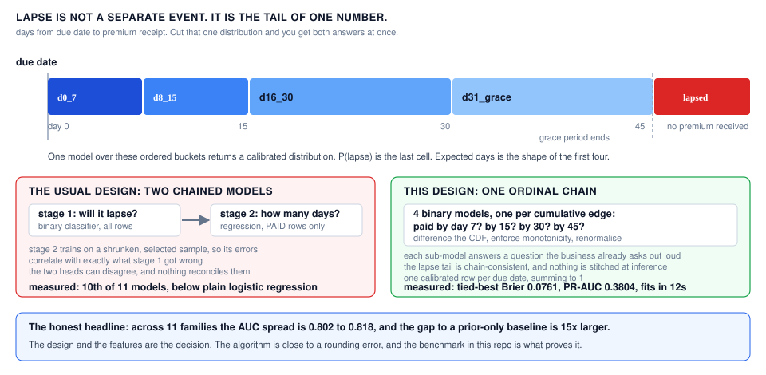
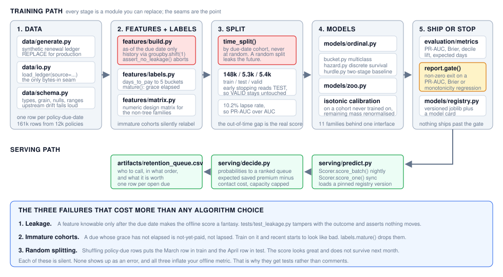
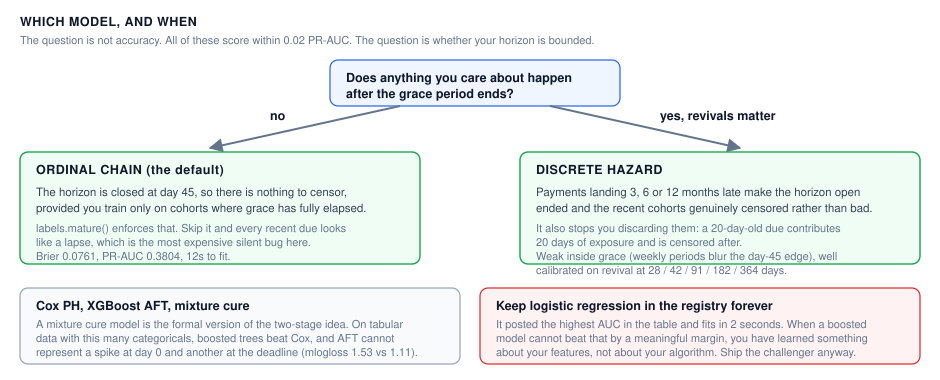

# Lapse Prediction

> **Learn how to build this project step-by-step on [AI-ML Companion](https://aimlcompanion.ai/)**. Interactive ML learning platform with guided walkthroughs, architecture decisions, and hands-on challenges.


Predicts, at the moment a policy is pulled up, **whether a renewal premium will
lapse** and **when the premium is likely to arrive**, from one model rather
than two chained ones.

---

## 1. The problem

Ops needs two answers about every open renewal, and they usually get built as
two systems. *Will this policy lapse?* is a classifier. *When will the money
land?* is a regression. Two models, two training sets, two sets of errors, and
nothing that makes them agree.

The retention team then has to act on both at once, because the only decision
that matters is a ranked call list: who to phone today, in what order, and
whether the call is worth more than it costs.

## 2. Why one model instead of two

A lapse is not a separate event from a late payment. It is the tail of one
underlying quantity: **days from due date to premium receipt**. Lapse just
means that number exceeded the grace period.



Model that one quantity once, over ordered buckets, and both answers fall out
of a single calibrated distribution. `P(lapse)` is the last cell. Expected days
is the shape of the first four. No stitching at inference, and no stage 2 that
is blind to what stage 1 got wrong.

| bucket | meaning |
|---|---|
| `d0_7`, `d8_15`, `d16_30`, `d31_grace` | paid within the grace period |
| `lapsed` | no premium received inside grace |

The two-stage design is not dismissed here, it is **implemented and measured**.
It finished 10th of 11, below plain logistic regression.

## 3. How it fits together



Read that bottom band before the model code. On this problem the three silent
data failures cost far more than any algorithm choice, and each of them gets a
test rather than a comment.

---

## 4. Run it

### Clone

```bash
git clone https://github.com/genieincodebottle/aiml-companion.git
cd aiml-companion/projects/lapse-prediction
```

Everything below runs from this directory.

### Set up with uv

[uv](https://docs.astral.sh/uv/) resolves and installs in seconds and keeps the
environment inside the project, so nothing leaks into your system Python.

```bash
pip install uv

uv venv
source .venv/bin/activate      # Linux / macOS
# .venv\Scripts\activate       # Windows PowerShell or cmd

uv pip install -r requirements.txt
uv pip install -e .            # optional, gives you the `lapse` command
```

Plain `pip install -r requirements.txt` works identically if you would rather
not add a tool. Python 3.10 or newer either way.

### Drive it

```bash
lapse data      --n 20000          # build and cache the renewal ledger  (~40s)
lapse train     --model ordinal_chain
lapse benchmark --n 12000          # the bake-off, 11 models             (~5 min)
lapse score                        # write the retention queue
lapse models                       # list persisted versions
```

**If `lapse` is not found**, this form always works and needs no install:

```bash
python -m lapse_prediction.cli train --model ordinal_chain
```

**If `pip install -e .` fails**, you do not need it at all. Put the source
directory on the path instead:

```bash
PYTHONPATH=src python -m lapse_prediction.cli train           # Linux / macOS
set PYTHONPATH=src && python -m lapse_prediction.cli train    # Windows cmd
$env:PYTHONPATH="src"; python -m lapse_prediction.cli train   # PowerShell
```

The `Makefile` wraps the same commands, but `make` is not installed by default
on Windows, so the commands above are the portable path.

### Run the tests

```bash
pytest -p no:warnings          # 57 tests: leakage, schema, split, contracts, e2e
```

## 5. The notebook

`notebooks/lapse_prediction_standalone.ipynb` is **standalone**. It generates
its own data in memory, defines every function it uses, imports nothing from
`src/`, and writes nothing to disk. Roughly 3 to 4 minutes top to bottom, 10
charts.

**This is the recommended starting point if you are new to the problem.** It
explains the reasoning as it goes and needs no install, no config and no CLI.
It covers why the timing distribution is bimodal and therefore why you must not
regress on raw days, who lapses, the leakage rule *and a test that proves there
is none*, cohort maturity, the out-of-time split, three competing model designs,
calibration, decile capture, and the retention queue with its economics.

Every code cell carries a header saying what it consumes and what it leaves
behind, so you can land in the middle and still know where you are.

**Locally**, after the setup above:

```bash
jupyter lab notebooks/lapse_prediction_standalone.ipynb
```

**On Google Colab**, no install at all:

[](https://colab.research.google.com/github/genieincodebottle/aiml-companion/blob/main/projects/lapse-prediction/notebooks/lapse_prediction_standalone.ipynb)

Colab already ships pandas, numpy, scikit-learn, lightgbm and matplotlib, so it
runs as-is.

**On Kaggle**, it is published as a notebook you can copy and edit:

[](https://www.kaggle.com/code/genieincodebottle/lapse-prediction)

Click **Copy and Edit** to get your own runnable copy. No internet access is
needed, since the notebook builds its own data, and the Kaggle image already
ships lightgbm and everything else it imports.

To go faster on any of the three, change `n_policies=8000` to `3000` in the
data cell.

`notebooks/_build_notebook.py` regenerates it. The notebook is authored as a
plain-text script so it reviews and diffs like code rather than JSON. Re-run
it, then `nbconvert --execute` to refresh the embedded outputs.

Because it is standalone the notebook deliberately duplicates logic that lives
in `src/`. That is the trade: it is for reading and teaching, `src/` is what
runs. If you change modelling logic, change it in `src/` first.

## 6. If something goes wrong

| symptom | cause | fix |
|---|---|---|
| `lapse: command not found` | the console script landed in a Scripts or bin dir that is not on PATH | use `python -m lapse_prediction.cli ...` |
| `uv: command not found` after `pip install uv` | the scripts dir is not on PATH | use `python -m uv venv`, or fall back to plain `pip` |
| `pip install -e .` gives `OSError ... .exe.deleteme` | a stale entry-point file from a previous install, common on Windows | `pip uninstall lapse-prediction` then reinstall, or skip the install and use `PYTHONPATH=src` |
| `ModuleNotFoundError: lapse_prediction` | running without installing, from the wrong directory | run from `projects/lapse-prediction` with `PYTHONPATH=src` |
| `make: command not found` | Windows has no `make` | use the `lapse` or `python -m` commands directly |
| first command sits silent for ~40s | it is generating the synthetic book | expected once, it is cached to `data/` afterwards |
| `lapse train` exits non-zero | the release gate rejected the model | read the logged reason, the gate is doing its job |

---

## 7. Which model, and when



## 8. Bake-off results

`lapse benchmark` runs 11 algorithm families through one identical out-of-time
split (148,159 train / 5,272 test / 5,424 validation, 10.2% lapse). Reproduced
across two runs.

| model | lapse PR-AUC | AUC | Brier | mlogloss | days MAE | capture@20% | fit |
|---|---|---|---|---|---|---|---|
| blend(RF+ordinal) | 0.3833 | 0.8163 | 0.0761 | 1.1040 | 13.33 | 59.8% | n/a |
| random_forest | 0.3831 | 0.8161 | 0.0762 | 1.1047 | 13.38 | 58.2% | 14s |
| **ordinal_chain** | 0.3804 | 0.8151 | 0.0761 | 1.1273 | 13.28 | 59.1% | 12s |
| lgbm_multiclass | 0.3786 | 0.8150 | 0.0762 | 1.1050 | 13.34 | 59.6% | 7s |
| logit | 0.3729 | 0.8178 | 0.0762 | 1.1093 | 13.34 | 59.8% | 2s |
| deephit_mlp | 0.3725 | 0.8154 | 0.0765 | 1.1081 | 13.29 | 58.7% | 63s |
| discrete_hazard | 0.3688 | 0.8141 | 0.0915 | 1.1730 | 13.14 | 59.6% | 12s |
| xgb_aft | 0.3673 | 0.8110 | 0.0793 | 1.5332 | 13.33 | 58.0% | 11s |
| cox_ph | 0.3643 | 0.8170 | 0.0780 | 1.1444 | 14.65 | 60.0% | 1s |
| hurdle_2stage | 0.3576 | 0.8017 | 0.0780 | 1.1347 | 13.24 | 58.3% | 46s |
| xgb_multiclass | 0.3560 | 0.8024 | 0.0781 | 1.1285 | 13.27 | 57.1% | 48s |
| prior (baseline) | 0.1018 | 0.5000 | 0.0915 | 1.2651 | 16.16 | 19.2% | 0s |

1. **The algorithm barely matters.** Every legitimate model sits in AUC 0.802
   to 0.818. Multinomial logistic regression has the highest AUC in the table
   and fits in 2 seconds. Best-to-worst real model is 0.027 PR-AUC. Any of them
   to the prior baseline is 0.28. Spend the time on payment-history features.
2. **The two-stage hurdle finished 10th of 11**, below logistic regression.
   Splitting the problem means stage 2 trains on a shrunken, selected sample
   and the two heads can disagree.
3. **The ordinal chain is the recommendation**: tied-best Brier, and its
   sub-models answer the business question verbatim ("in by day 7? by 15? by
   30?") with a chain-consistent lapse tail.
4. **AFT has the worst full distribution by a wide margin** (mlogloss 1.53 vs
   about 1.11). A log-normal cannot represent the spike at day 0 *and* the
   spike at the grace deadline.
5. **`discrete_hazard` is weak inside the grace window**, since weekly periods
   read the day-45 edge at day 42. Its real job is revival, where it is well
   calibrated at every checkpoint: predicted 0.574 / 0.795 / 0.916 / 0.924 /
   0.940 against actual 0.567 / 0.812 / 0.903 / 0.913 / 0.933 at days 28 / 42 /
   91 / 182 / 364.

Keep `logit` in the registry permanently as the challenger. When a boosted
model cannot beat a two-second regression by a meaningful margin, that is
information about your features, not your algorithm.

## 9. The things that matter more than the algorithm

1. **Leakage.** Every feature must be knowable *at the due date*. Reminders
   sent and collection actions taken after it are out unless modelled
   explicitly. `features/build.py` builds all history via `groupby.shift(1)`,
   `assert_no_leakage()` fails the run if a forbidden column reaches the
   matrix, and `tests/test_leakage.py` tampers with the current outcome and
   asserts no feature moves.
2. **Cohort maturity.** Training on dues whose grace has not elapsed silently
   relabels not-yet-paid as lapsed. `labels.mature()`.
3. **Out-of-time validation.** Split by due-date cohort, never randomly. Early
   stopping uses the TEST cohort so VALID stays untouched.
4. **Calibration.** Ops treats the score as a risk number, not a ranking, so
   isotonic recalibration is fitted on a cohort the model never trained on and
   the remaining bucket mass is renormalised to keep rows summing to 1.
5. **Imbalance.** Report PR-AUC and decile lift alongside AUC.
6. **Never regress on raw days.** Days-to-payment is skewed and spiky, with
   mass on day 0 and again at the grace deadline. Expected days is derived from
   the bucket distribution.
7. **Release gate.** `evaluation.report.gate()` fails the training pipeline
   with a non-zero exit on PR-AUC, Brier or monotonicity regressions, so a bad
   model cannot ship silently.

## 10. Where the data lives

| path | what | size (12k policies) |
|---|---|---|
| `data/dues.parquet` | raw ledger, one row per policy-due-date, 12 cols | 161,394 rows / 0.8 MB |
| `data/modelling_table.parquet` | features, labels and maturity filter, 34 cols | 158,855 rows / 2.6 MB |
| `models/<name>/<version>/` | `model.joblib` plus `model_card.json` | per training run |
| `artifacts/retention_queue.csv` | the scored queue ops consumes | one row per open due |
| `artifacts/benchmark.csv` | bake-off results | one row per algorithm |

`data.io.load_ledger()` reads the cache if present and generates on first use,
so every model in the bake-off sees byte-identical input. Parquet keeps it
small: 70 MB in pandas memory is 0.8 MB on disk. All of `data/`, `artifacts/`
and `models/` are gitignored and reproducible from config plus seed.

## 11. Layout

```
conf/config.yaml                  business and modelling settings, no magic numbers in code
docs/img/                         the three diagrams in this README
src/lapse_prediction/
├── cli.py                        argparse entry point, becomes `lapse`
├── config.py                     YAML to a validated Config, CFG singleton
├── data/
│   ├── generate.py               synthetic renewal ledger (REPLACE for production)
│   ├── io.py                     the only module that knows where bytes come from
│   └── schema.py                 ingest contract: types, grain, null and range checks
├── features/
│   ├── build.py                  as-of-due-date features plus the leakage guard
│   ├── labels.py                 bucket target, cohort maturity, out-of-time split
│   └── matrix.py                 numeric design matrix for the non-tree models
├── models/
│   ├── base.py                   the one interface, plus monotone CDF to buckets
│   ├── ordinal.py                RECOMMENDED: ordinal cumulative chain
│   ├── bucket.py                 multiclass over buckets, isotonic calibration
│   ├── hazard.py                 discrete-time survival, revival horizon
│   ├── hurdle.py                 two-stage baseline, kept to be measured
│   ├── zoo.py                    all 11 families behind one interface
│   └── registry.py               versioned persistence plus model cards
├── evaluation/
│   ├── metrics.py                PR-AUC, calibration, decile lift, expected days
│   └── report.py                 one report shape plus the release gate
├── serving/
│   ├── predict.py                Scorer: score_batch (nightly) / score_one (sync)
│   └── decide.py                 probabilities to a ranked retention queue
├── pipelines/
│   ├── train.py                  ledger to model plus card
│   └── benchmark.py              the bake-off
└── utils/logging.py
notebooks/                        standalone walkthrough plus its builder
tests/                            57 tests
```

## 12. Going to production

Replace `data/generate.py` with your warehouse query. Everything else already
points at the seam, and `load_ledger(source=...)` is where the branch goes. The
query must return one row per policy-due-date with:

```
policy_id, due_date, policy_year, premium_freq, payment_mode, product,
channel, annual_premium, cust_age, sum_assured_mult, agent_active, days_to_pay
```

`days_to_pay` is NaN when the premium was never received. Extra columns flow
through to features automatically. `data/schema.py` validates the contract at
ingest so an upstream change fails loudly instead of degrading the model
quietly.

## 13. Honest limitations

All numbers in this README come from synthetic data with a known generative
process. Real books show weaker history signal and more drift, so check the
out-of-time gap first thing after porting.

The engineering around the model is production-shaped: versioned registry,
model cards, ingest contract, release gate, leakage tests. The **model** is not
production-validated. There is no drift monitoring, no fairness or model-risk
review, and unseen categorical levels currently score without complaining. Read
those as the work remaining rather than as work done.
