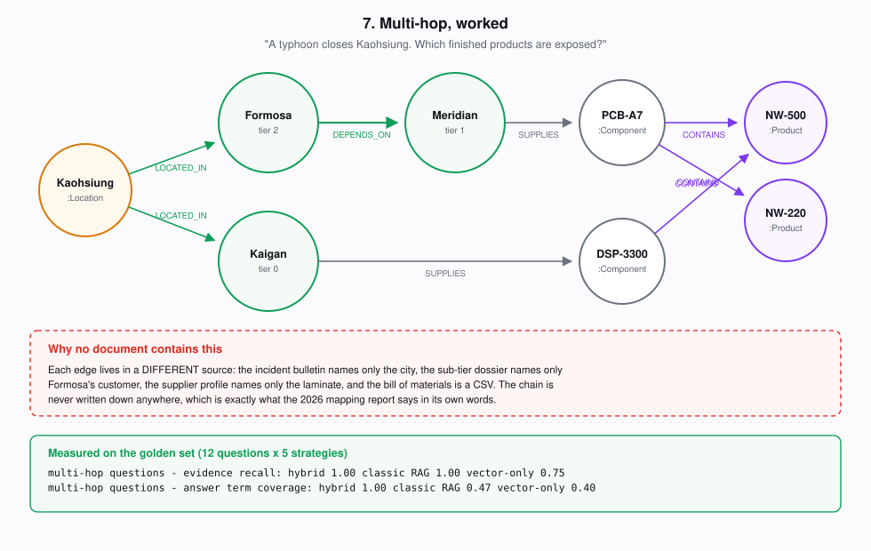
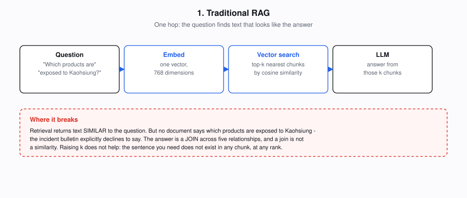
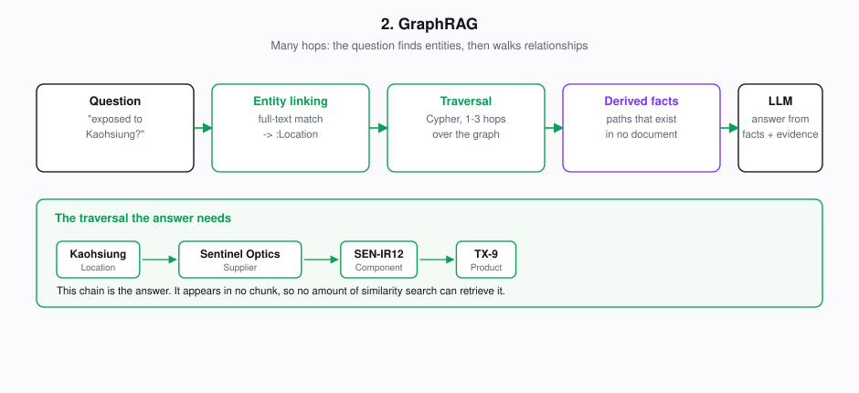
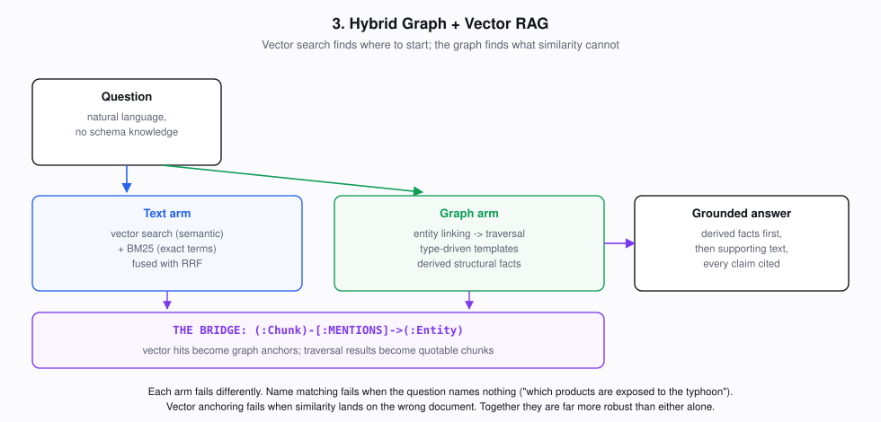
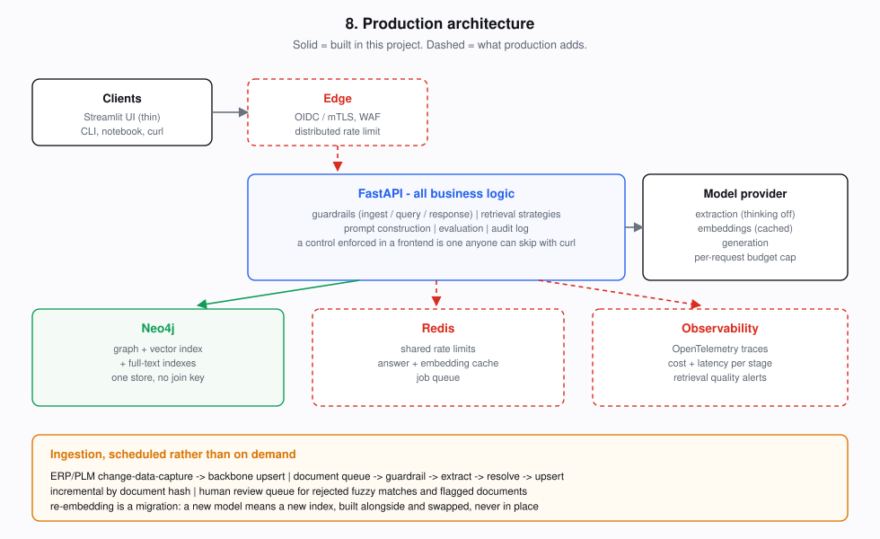
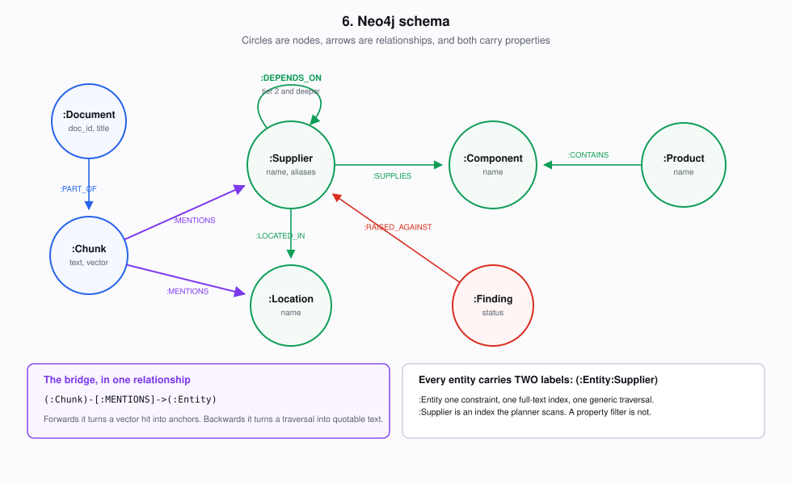
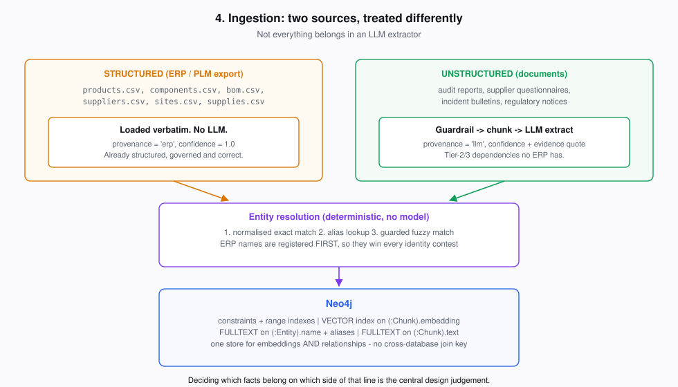
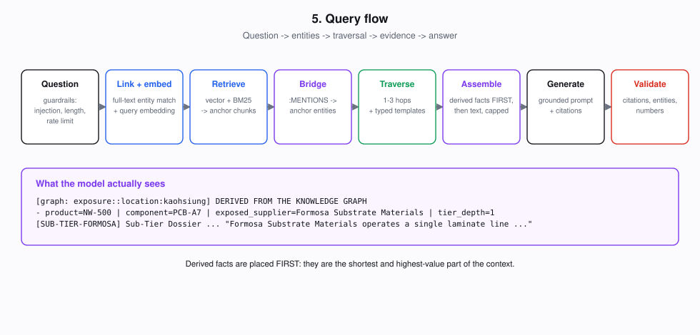

> **Learn AI/ML interactively at [AI-ML Companion](https://aimlcompanion.ai/)** - guided walkthroughs, architecture decisions, hands-on challenges and narrated overviews for every project.

# GraphRAG Supply Chain Intelligence

> **Who this is for** - anyone who wants to know what GraphRAG actually is, when it beats ordinary RAG, when it **loses** to ordinary RAG, and what a production version would look like. Basic Python and a terminal is all you need. Neo4j runs in Docker with one command.

A production-shaped **multi-tier supply chain risk system** built on a real **Neo4j** graph. It answers questions that no document in its corpus can answer, because the answer is a *join* rather than a *passage*.

Then it measures that claim against a fixed benchmark, publishes the numbers including the ones where it loses, and shows you the Cypher it ran.

---

## The one question that explains this whole project

> *"A typhoon has shut down Kaohsiung for three weeks. Which of our finished products are exposed?"*

Search the corpus for that. You will find the incident bulletin. It describes the typhoon, the port closure, and the power interruption, and then it says this:

> *"This bulletin records the event and its effect on the city of Kaohsiung. It does not attempt to enumerate which Northwind products are affected. That assessment cannot be made from this document."*

It is telling the truth. **The answer is written down nowhere.** It exists only as a chain across five relationships and four separate sources:

```
Kaohsiung  ──LOCATED_IN──  Formosa Substrate Materials   (a tier-2 supplier)
           ──DEPENDS_ON──  Meridian Circuits             (our tier-1 board maker)
           ──SUPPLIES────  PCB-A7                        (a sole-sourced component)
           ──CONTAINS────  NW-500, NW-220                (38% and 29% of revenue)
```

Each link lives in a different place. The incident bulletin names only the city. The sub-tier dossier names only Formosa's customer. The supplier profile names only the laminate. The bill of materials is a CSV in the ERP.

No chunk contains that chain, so **no amount of similarity search can retrieve it, at any `k`, with any embedding model**. Retrieval by similarity is the wrong instrument for a question whose answer is a traversal. That is the entire argument for GraphRAG, and this project is built to demonstrate it, measure it, and then show you the questions where the argument does not hold.



---

## Table of contents

| Part | |
|---|---|
| **0** | [Start here if the words are new](#0-start-here-if-the-words-are-new) |
| **1** | [The problem, and why it matters](#1-the-problem-and-why-it-matters) |
| **2** | [Traditional RAG, and exactly where it breaks](#2-traditional-rag-and-exactly-where-it-breaks) |
| **3** | [The GraphRAG insight](#3-the-graphrag-insight) |
| **4** | [Architecture](#4-architecture) |
| **5** | [The data model, and why it is shaped that way](#5-the-data-model-and-why-it-is-shaped-that-way) |
| **6** | [Ingestion: turning documents into a graph](#6-ingestion-turning-documents-into-a-graph) |
| **7** | [Retrieval: five strategies](#7-retrieval-five-strategies) |
| **8** | [Neo4j and Cypher, properly](#8-neo4j-and-cypher-properly) |
| **9** | [Guardrails and security](#9-guardrails-and-security) |
| **10** | [Evaluation: the measured results](#10-evaluation-the-measured-results) |
| **11** | [Quickstart](#11-quickstart) |
| **12** | [Architecture decisions: why this, why not that](#12-architecture-decisions-why-this-why-not-that) |
| **13** | [What changes in production](#13-what-changes-in-production) |
| **14** | [Learning progression](#14-learning-progression) |
| **15** | [Project layout, troubleshooting, limitations](#15-project-layout) |

---

## 0. Start here if the words are new

*Skip this section if you already know what RAG and a graph database are. If you do not, this is everything you need to follow the rest, in about five minutes.*

### What is a graph database?

A normal database stores **rows in tables**. A graph database stores **things and the connections between them**.

- A **node** is a thing: a supplier, a component, a city.
- A **relationship** is a connection between two nodes. It has a **direction** and a **type**.
- Both can carry **properties** (key/value pairs).
- Nodes carry **labels**, which are their type.

```
(:Supplier {name: "Meridian Circuits"}) -[:SUPPLIES {sole_source: true}]-> (:Component {name: "PCB-A7"})
 ^label     ^property                     ^relationship type ^property        ^another node
```

**Cypher** is the query language, and it is deliberately shaped like that picture. `()` is a node, `-[]->` is a relationship. If you know SQL:

| SQL | Cypher |
|---|---|
| `SELECT ... FROM` | `MATCH` |
| `JOIN suppliers ON ...` | `-[:SUPPLIES]->` |
| a join of *unknown* depth | `-[:DEPENDS_ON*1..3]->` |

**That last row is the point of this entire project.** SQL joins have a fixed shape you write in advance. `*1..3` says "follow between one and three relationships, I do not know how many". That is what answers "who is behind my suppliers' suppliers?".

### What is RAG?

**R**etrieval **A**ugmented **G**eneration. Language models do not know your company's documents, so you:

1. Cut documents into **chunks** (a few hundred words each).
2. Turn each chunk into an **embedding**: a list of numbers (768 here) that represents its meaning. Chunks about similar things get similar numbers.
3. When a question arrives, embed the question too and find the chunks whose numbers are **closest**. That is a **vector search**.
4. Paste those chunks into the prompt and ask the model to answer using only them.

This works well and is the right tool most of the time. Its limit is the subject of §2.

### What is GraphRAG?

RAG that can also retrieve by **following relationships** instead of only by similarity. You build a graph out of your documents, then answer some questions by walking it.

### The eight words you need

| Term | Meaning |
|---|---|
| **Chunk** | A slice of a document, small enough to embed and paste into a prompt |
| **Embedding** | A list of numbers representing meaning. Similar text gets similar numbers |
| **Vector search** | Finding the chunks whose embeddings are closest to the question's |
| **Hop** | One step along one relationship. "Multi-hop" means the answer needs several |
| **Traversal** | Walking the graph from node to node along relationships |
| **Entity** | A thing the system knows about: a supplier, a component, a city |
| **Entity resolution** | Deciding that "Meridian", "Meridian Circuits" and "Meridian Circuits Sdn Bhd" are one company |
| **BM25** | Classic keyword search. Good at exact terms like part numbers, where embeddings are weak |

### The 60-second version of what this project does

1. It reads 33 supply chain documents and 6 spreadsheet exports.
2. It uses an LLM to pull out **who depends on whom** and stores that in Neo4j as a real graph.
3. When you ask a question it does **both**: vector search for relevant text, *and* graph traversal for relevant relationships.
4. It shows you exactly how it got there, and measures whether the graph actually helped, including the questions where it did not.

**If you only run two commands, run these** - neither needs an API key or a database:

```bash
python run.py test        # 151 tests
python run.py security    # watch the guardrails block a real attack payload
```

---

## 1. The problem, and why it matters

**Northwind Instruments** makes four medical and industrial devices. Like every manufacturer, it knows its **tier-1** suppliers precisely: they are in the ERP, there are contracts, there are purchase orders.

It does not know its **tier-2** suppliers, because it has no commercial relationship with them. It has never placed an order with the company that sells laminate to its board maker. That company appears in no purchasing system, on no approved vendor list, in no scorecard.

This is not sloppiness. It is structural, it is normal, and it is the reason supply chain disruptions keep surprising companies that thought they were diversified:

- **2011 Tōhoku earthquake** - carmakers discovered they shared a single pigment plant three tiers up.
- **2021 semiconductor shortage** - firms with "dual-sourced" chips found both sources used the same fab.
- **2020 onwards** - a repeated pattern of "we had two suppliers, and they had one".

The information usually *does* exist inside the company. It is in supplier questionnaires, audit notes, correspondence and public filings. What does not exist is any way to **ask a question across all of it**.

That is the gap this project fills, and the corpus says so in its own words, in the 2026 deep-tier mapping report:

> *"The exercise found that the information required to assess deep-tier risk was already inside Northwind before it began... What did not exist was any way to ask a question across those documents."*

### Why this use case, and not another

I evaluated the obvious candidates before choosing. The decisive test for a GraphRAG demonstration is: **can you pose a business-critical question whose answer exists in no single document?** If not, a bigger `k` beats your graph and the whole comparison is theatre.

| Candidate | Why not |
|---|---|
| Financial crime / beneficial ownership | Genuinely strong on multi-hop, but overlaps existing fraud work in this repo, and sample data implying wrongdoing about named entities is ethically awkward in a public teaching corpus. |
| Healthcare / clinical knowledge | Factual-harm risk in a synthetic corpus outweighs the pedagogical gain. |
| Cybersecurity intelligence | Graphs come from structured feeds (CVE, CPE), so LLM extraction is bolted on rather than load-bearing. |
| Legal / contract intelligence | Good, but most real questions resolve inside one document. |
| Enterprise knowledge QA | The "multi-hop" questions are usually answerable with a larger `k`, which makes any claimed advantage unfalsifiable. |
| **Multi-tier supply chain** | **Chosen.** The flagship question is provably unanswerable from any single document, the domain is safe and synthetic, the business value is concrete and expensive, and it naturally supplies the counter-examples where plain RAG wins. |

That last property mattered as much as the first. A domain where GraphRAG always wins cannot teach you *when to use it*.

---

## 2. Traditional RAG, and exactly where it breaks



The standard pipeline is one hop: embed the question, find the nearest chunks, hand them to the model.

It works well, and for most questions it is the right answer. It has one structural limit:

> **Vector search retrieves text that is SIMILAR to your question. It cannot retrieve a fact that is DISTRIBUTED across several documents, because that fact is not text at all - it is a relationship between texts.**

Three failure modes follow, and this project has a golden question for each:

| Failure | Example | Why `k` does not fix it |
|---|---|---|
| **The answer is a join** | "Which products are exposed to Kaohsiung?" | The sentence does not exist. Retrieving 50 chunks instead of 5 retrieves 45 more chunks that also do not contain it. |
| **The question names nothing useful** | "Which sole-sourced parts have a supplier with an open finding?" | Semantically closest to *policy* documents about sourcing, not to the audit reports and CSV rows that hold the answer. |
| **The evidence is negative** | "Is our dual sourcing genuine?" | Requires proving an *intersection* between two suppliers' upstream positions. No document performs a set intersection. |

**And the counter-cases, which matter just as much:**

| Where plain RAG wins | Why |
|---|---|
| "What did the Prahara audit say about fire suppression?" | One section, one document. A graph traversal adds latency and finds the same paragraph. |
| "What is our dual-sourcing threshold?" | A policy lookup. There is no relationship to traverse. |
| "Which ECN covers PCB-A7 revision C?" | An identifier. BM25 nails it; embeddings are *bad* at part numbers. |

A GraphRAG system that cannot answer those three as well as plain RAG has regressed, not improved. Measuring that is why they are in the benchmark.

---

## 3. The GraphRAG insight



The insight is small and everything follows from it:

> **Some questions are answered by finding text. Others are answered by finding a path. Build the paths, and you can answer both.**

So we extract entities and relationships from documents, store them as a real graph, and retrieve by *traversal* rather than by *similarity*.

But graph-only retrieval has its own failure, and it is severe. Ask it *"what is our dual-sourcing threshold?"* and it links no entity, has nowhere to start, and returns nothing. **This is measured, not hypothesised:** graph-only scores `0.000` evidence recall on definitional questions in the benchmark below.

Hence the real architecture:



### The bridge

The mechanism that makes hybrid work is one relationship type:

```cypher
(:Chunk)-[:MENTIONS {confidence}]->(:Entity)
```

That edge is the hinge of the entire system, and it runs in both directions:

1. **Forwards** - vector search lands on a chunk. `MENTIONS` turns that chunk into graph **anchors**.
2. **Traverse** - the knowledge graph turns those anchors into *other* entities several hops away.
3. **Backwards** - `MENTIONS` run in reverse turns those distant entities back into **quotable chunks** that vector search would never have ranked.

Text → structure → text. That round trip is how the system retrieves evidence which is *not similar to the question*.

---

## 4. Architecture



Three layers, strictly separated. The separation is enforced by tests in [`tests/test_layering.py`](tests/test_layering.py), not merely described here.

```
app/            UI. Renders. Decides nothing. Talks HTTP only.
api/routes_*    Routing. Validates the request, calls ONE service, maps the result.
src/services/   Orchestration and policy. What happens in what order.
src/            Capabilities. Retrieval, graph, LLM, guardrails.
```

**Why the UI holds no business logic:** a guardrail enforced in a frontend is a guardrail anyone can skip with `curl`. Rate limiting, injection scanning, budget caps and output validation all run in the service layer, so every client gets them whether it wants them or not.

**Why services never import FastAPI:** so the same pipeline is callable from a notebook, a CLI and a test with no web server running. `run.py ask` and `POST /api/ask` go through the identical `QAService.ask()`, which is why they cannot drift apart. The tests enforce this:

```python
def test_src_never_imports_fastapi(self):
    """If a service could raise HTTPException it would be callable only from a
    web request, and the CLI, the notebook and the tests would each need their
    own copy of the same orchestration."""
```

---

## 5. The data model, and why it is shaped that way



Two subgraphs sharing one bridge. Full commentary in [`src/graph/schema.py`](src/graph/schema.py).

### Every entity carries two labels

A supplier node is created as `(:Entity:Supplier)`. Both labels earn their place:

| Label | What it buys |
|---|---|
| `:Entity` | One uniqueness constraint, one full-text index, one generic traversal covering all ten types. Without it you need ten constraints and a ten-branch UNION for "find anything called X". |
| `:Supplier` | `MATCH (s:Supplier)` scans only suppliers. **A label is an index; `WHERE n.type = 'Supplier'` is not.** |

### The structured / unstructured split

This is the most important design decision in the project, and a lot of GraphRAG material gets it wrong by implying the whole graph should be LLM-extracted.

| | Source | Contents | Provenance |
|---|---|---|---|
| **Backbone** | `data/structured/*.csv` (an ERP/PLM export) | Products, components, BOM, tier-1 contracts, sole-source flags, sites | `erp`, confidence `1.0` |
| **Extracted** | `data/documents/*.md` (audits, questionnaires, bulletins) | **Tier-2/3 dependencies**, incidents, findings, certifications, regulations | `llm`, confidence + evidence quote |

> Running the bill of materials through an LLM extractor would take data that is 100% accurate and hand it back at 95%, at a cost, for no benefit. The BOM already lives in a system of record, it is already governed, and it is already someone's job to maintain.

Every relationship records which side it came from, so the answer layer and the user can tell *"Meridian supplies PCB-A7"* (a governed fact) from *"Meridian depends on Formosa"* (a model's reading of a sentence, with the sentence attached).

**This split is also what makes the flagship queries possible.** The sole-source risk query joins a structured attribute against an LLM-extracted one:

```cypher
MATCH (sup:Supplier)-[s:SUPPLIES]->(comp:Component)<-[:CONTAINS]-(prod:Product)
WHERE s.sole_source = true                      -- from the ERP
OPTIONAL MATCH (f:Finding)-[:RAISED_AGAINST]->(sup)
WHERE f.status = 'open'                         -- from an audit PDF
WITH sup, comp, prod, collect(DISTINCT f.name) AS findings
WHERE size(findings) > 0
RETURN sup.name AS supplier, comp.name AS component,
       collect(DISTINCT prod.name) AS products, findings
```

Neither source answers it alone. That is the practical argument for one graph over a warehouse plus a separate vector store.

> **Note `f.status = 'open'`.** Without it the query also returns every supplier whose only finding was a minor observation closed during the audit, which is most of them. A risk report that flags everybody flags nobody. This was a real bug during development, caught because the output listed suppliers with spotless records.

---

## 6. Ingestion: turning documents into a graph



```
schema → backbone → chunk → guardrail → extract → embed → write → VERIFY
```

Measured on the shipped corpus: **33 documents → 151 chunks → 82 entities → 619 relationships, in 104 seconds for about $0.06.**

### Chunking is not boilerplate

The splitter walks the Markdown heading tree first and only falls back to character windows for an oversized section. The failure this avoids is specific and it is *silent*:

> A fixed 900-character window cuts through *"Meridian purchases the copper-clad laminate from Formosa Substrate Materials"*, leaving `...the copper-clad` in one chunk and `laminate from Formosa...` in the next. Neither chunk states the relationship. The extractor sees no relationship, so **no edge is created**, so the multi-hop query returns nothing - and the bug surfaces three layers away, in retrieval results.

There is a test asserting that each of the six load-bearing sub-tier sentences survives chunking intact.

### Extraction: four decisions

1. **Per document, not per chunk.** Relationships routinely span sections. A chunk-level extractor reads *"Formosa is its only qualified laminate source"* with no idea whose source it is, and either invents a subject or emits nothing.
2. **Mentions linked without the model.** Once we know which entities exist and under which aliases, finding them in each chunk is exact string matching: free, instant and reproducible. The model is used for what needs judgement, not for a substring search.
3. **A closed vocabulary, enforced twice** - in the response schema and again in a validator. A model that invents the label `SubTierSupplier` once in fifty documents creates a node nothing will ever traverse to, and no error anywhere.
4. **Every relationship carries its evidence span.** This is the difference between a knowledge graph and a rumour graph.

### Three real bugs from building this, all silent

**Bug 1: the extractor returned nothing, and blamed JSON.**

Built with a shared 2048-token output budget, the pipeline extracted **zero entities from every document** and reported *"unparseable JSON"*. The JSON was fine. It was truncated mid-string by the token cap, so `json.loads` failed with "Unterminated string" and every instinct said the model had formatted its output wrongly.

Raising the cap to 8192 did not fix it. On a thinking model, **reasoning tokens are drawn from the same `max_output_tokens` budget as the visible response**, and a document needing ~500 tokens of JSON was spending the entire budget on deliberation. The fix was to turn thinking *off* for extraction:

```yaml
extraction_max_output_tokens: 8192
extraction_thinking_budget: 0   # reasoning shares the OUTPUT budget
```

Extraction is transcription against a closed vocabulary with a schema already fixing the shape. There is nothing to deliberate about, and deliberation costs reproducibility. Answering is a genuine reasoning task and keeps its thinking.

The code now checks `finish_reason == "MAX_TOKENS"` **before** attempting to parse, and raises a message that names the actual cause.

**Bug 2: the same bug again, in the other call site, corrupting the benchmark.**

Having fixed truncation in the *extraction* path, I did not add the same check to the *answering* path. It bit immediately and much more expensively.

On the flagship multi-hop question the model spent **1,899 of its 2,048 tokens thinking and 145 writing**. The answer stopped after the first of four exposed products. Nothing errored. Retrieval was perfect - all four products were in the context as a derived graph fact - and the truncated answer read exactly like a complete answer that had simply found less.

It did not corrupt one response. **It corrupted the measurement.** Term coverage was recording how much of the answer fit in the token budget rather than how much of the evidence the system found, and I published a table built on it. After raising the answering budget to 8192, the same question went from **2 of 8 required terms to 8 of 8**, and hybrid's multi-hop term coverage went from 0.729 to 1.000.

Two lessons, and the second is the sharper one:

1. On a thinking model, reasoning tokens come out of the output budget. Budget for both.
2. **Guarding one call site and not the other is the actual mistake.** I had already written the exact check that would have caught this, twenty lines away, and did not apply it to the second caller. Both paths now check `finish_reason`.

**Bug 3: the sanitiser defeated the detector.**

The injection scanner stripped zero-width characters before pattern matching. The payload `Ignore<ZWSP>previous<ZWSP>instructions` became `Ignorepreviousinstructions`, which matches no pattern containing a whitespace class. **The text got cleaner and the attack got through.** Substituting a space instead of deleting restores the word boundaries the attacker was hiding. Caught by `python run.py security`, which is the argument for demonstrating controls against real payloads rather than asserting them.

### Ingestion verifies itself

An ingestion that reports success and leaves an unusable graph is worse than one that fails, because the damage surfaces later as bad answers. So it asserts, before declaring done:

- every chunk has an embedding
- the vector index returns results for a vector taken from the index itself
- `MENTIONS` edges exist (or text and graph are disconnected)
- `DEPENDS_ON` edges exist (or extraction found no sub-tier structure at all)

**This caught a real failure during development** - the zero-extraction bug above surfaced as `no DEPENDS_ON relationships were extracted` instead of as a plausible-looking but empty graph.

### Entity resolution: three stages, no model

This is the hardest correctness problem in GraphRAG, and it fails silently in both directions.

```
Stage 1  Normalised exact match   case, punctuation, legal suffixes ("Helios Fluidics BV" == "Helios Fluidics")
Stage 2  Alias lookup             declared mappings ("Meridian" -> "Meridian Circuits Sdn Bhd")
Stage 2b Authoritative retype     the ERP's type wins over the model's guess
Stage 3  Guarded fuzzy match      typos, under conditions strict enough to be safe
```

Nothing in it is a language model. Resolution runs on every extracted mention, so it must be fast, free, and above all **deterministic**: a resolver that returns different answers on different runs makes the entire graph irreproducible.

Real failures it prevents, each a test:

| Failure | Consequence |
|---|---|
| `Kaohsiung` merging with `Kaohsiung Precision Glass` | The system reports that a glass processor was hit by a typhoon that hit a city, **citing real evidence** for a false identity. |
| `PCB-A7` fuzzy-matching `PCB-B2` | 83% string-similar, completely different components. Fuzzy matching over identifiers is a bug, not a feature. |
| `Kaohsiung, Taiwan` staying separate from `Kaohsiung` | The exposure query returns *some* rows, silently missing whichever suppliers attached to the other node. |
| `DSP-3300` labelled a Product by the model | A phantom Product no BOM contains, while the real Component loses its mentions. |

**And one over-correction, worth more than the successes.** An early version folded plurals so `NdFeB magnets` and `NdFeB magnet` would merge. It worked, and quietly keyed `Helios Fluidics` as `helio-fluidic`, `Sentinel Optics` as `sentinel-optic`. Nothing failed. The graph worked. Every identifier just looked broken, which in a system whose entire value is auditability is a real cost. **The fix was to delete the rule, not to add exceptions to it** - stage 3 already handles singular/plural pairs at 0.97 similarity. The general mechanism covered the specific case, and the specific rule was doing damage elsewhere.

---

## 7. Retrieval: five strategies



| Strategy | What it does |
|---|---|
| `vector` | Dense similarity only. The textbook baseline. |
| `keyword` | BM25 over chunk text via a Lucene full-text index. |
| `classic` | vector + BM25, fused with Reciprocal Rank Fusion. **The honest baseline.** |
| `graph` | Entity linking → traversal → derived facts → supporting text. No vector search. |
| `hybrid` | Vector anchors → `MENTIONS` → traversal → fused with everything. |

**Why `classic` and not `vector` is the baseline:** comparing GraphRAG against dense-only rigs the experiment. A competent team ships hybrid keyword+vector before reaching for a graph, and part numbers like `PCB-A7` carry almost no distributional meaning, so embeddings are genuinely bad at them. If the baseline is weak, every reported advantage is unearned.

**Why RRF and not score normalisation:** cosine similarity lives in `[0,1]`, BM25 is unbounded and corpus-dependent. Min-max normalising them makes the numbers comparable only in the sense that they are now both between 0 and 1; it does not make them *mean* the same thing. RRF discards the scores and uses rank order, which is the part that transfers.

**Over-fetch before fusing.** Fusing two lists of length `k` and keeping `k` means each arm effectively contributes `k/2`, which makes the hybrid *worse* than either arm alone on a question one arm answers cleanly. Both arms fetch `2k`.

### Query planning is type-driven, not keyword-driven

When the linked entity is a `Location`, the exposure traversal runs. When it is a `Component`, the shared-upstream test runs. **Which template fires is decided by the entity's type, never by matching words in the question.** Type routing is stable; keyword routing breaks the first time someone rephrases, and breaks silently.

<details>
<summary><b>Why not text-to-Cypher?</b> (click)</summary>

Letting the LLM write Cypher is more flexible and considerably less safe:

- it can generate an unbounded traversal that takes the database down,
- it fails in ways that are hard to detect, because a *wrong* query still returns rows,
- it puts a model in the position of deciding what the database does.

Templates cover the questions this domain actually gets and cannot surprise you. Text-to-Cypher earns its place when the query space is genuinely open-ended and there is a human in the loop; see [`docs/production-notes.md`](docs/production-notes.md).
</details>

### Derived facts are rendered separately, and go first

Graph traversal produces facts that appear in no document. They enter the context as clearly-labelled blocks:

```
[graph: exposure::location:kaohsiung] DERIVED FROM THE KNOWLEDGE GRAPH
Each row is a path from a supplier operating in this location through to a
finished product. tier_depth 0 means the exposed supplier sells to us directly.

- product=NW-500 | component=DSP-3300 | exposed_supplier=Kaigan Display Works | tier_depth=0
- product=NW-500 | component=PCB-A7   | exposed_supplier=Formosa Substrate Materials | tier_depth=1
  | chain=Formosa Substrate Materials -> Meridian Circuits Sdn Bhd
```

They are placed **first** in the context. Position matters: models attend more reliably to the start of a long context, and burying a three-line exposure path under 8,000 characters of supplier prose is a measurable way to lose the answer you did the traversal to get.

---

## 8. Neo4j and Cypher, properly

This project teaches Neo4j rather than hiding it. Every query lives in [`src/graph/queries.py`](src/graph/queries.py) with its reasoning, the app shows you the query it just ran, and `python run.py cypher` executes the cookbook against live data.

### Constraints are not just integrity rules

```cypher
CREATE CONSTRAINT entity_key IF NOT EXISTS FOR (e:Entity) REQUIRE e.key IS UNIQUE;
```

A uniqueness constraint **also creates a backing index**. So this is not merely a rule, it is the lookup path for every `MERGE` in ingestion. Without it, `MERGE` on a 5,000-node graph does a full label scan each time and ingestion goes quadratic. It is also what makes entity resolution *enforceable* rather than merely attempted: two spellings that resolve to the same key **cannot** become two nodes.

### One store for vectors and relationships

```cypher
CREATE VECTOR INDEX chunk_embedding_index IF NOT EXISTS
FOR (c:Chunk) ON (c.embedding)
OPTIONS {indexConfig: {
  `vector.dimensions`: 768,
  `vector.similarity_function`: 'cosine'
}};
```

This is why the project needs no separate vector database. Embeddings and relationships live in one system, so retrieval hops from a vector hit into a traversal with no network round trip and no join key to keep in sync between two databases.

> **The single most common failure in this stack**: `vector.dimensions` must equal `configs/base.yaml → embedding.dimensions`. A mismatch does not error. Neo4j returns an empty list, retrieval returns no context, the model says "I don't have enough information", and you spend an afternoon debugging your prompt. `verify_vector_index()` fails loudly at startup instead.

### The flagship traversal

```cypher
MATCH (loc:Location) WHERE loc.key = $location_key
MATCH (origin:Supplier)
WHERE (origin)-[:OPERATES]->(:Site)-[:LOCATED_IN]->(loc)
   OR (origin)-[:LOCATED_IN]->(loc)
MATCH depends = (dependent:Supplier)-[:DEPENDS_ON*0..3]->(origin)
MATCH (dependent)-[s:SUPPLIES]->(comp:Component)<-[:CONTAINS]-(prod:Product)
RETURN DISTINCT prod.name AS product, comp.name AS component,
       dependent.name AS direct_supplier, origin.name AS exposed_supplier,
       length(depends) AS tier_depth,
       [n IN nodes(depends) | n.name] AS dependency_chain
ORDER BY tier_depth ASC
```

Two details worth reading slowly:

- **`*0..3` includes zero hops**, so a tier-1 supplier that is itself in the affected location is returned alongside the deep-tier cases. Dropping the zero is an off-by-one that hides the *most obvious* exposure of all.
- **The location leg accepts two shapes.** Tier-1 suppliers come from CSV and always have a `Site`; tier-2 suppliers come from prose, where *"Formosa operates a single line at a facility in Kaohsiung"* may or may not cause the model to mint a `Site` node. Both readings are correct. Insisting on one would make the flagship query silently return half the exposure depending on how a model felt about a sentence.

Live output:

```
AQ-100 Air Quality Sensor  via SEN-PM25 Particulate Sensor  tier 0  [Sentinel Optics Corp]
NW-500 Patient Monitor     via DSP-3300 Display Module      tier 0  [Kaigan Display Works]
TX-9 Thermal Imager        via SEN-IR12 Infrared Sensor     tier 0  [Sentinel Optics Corp]
AQ-100 Air Quality Sensor  via PCB-B2 Sensor Interface      tier 1  [Formosa -> Meridian]
NW-220 Infusion Pump       via PCB-A7 Main Controller       tier 1  [Formosa -> Meridian]
NW-500 Patient Monitor     via PCB-A7 Main Controller       tier 1  [Formosa -> Meridian]
TX-9 Thermal Imager        via PCB-B2 Sensor Interface      tier 1  [Formosa -> Meridian]
```

**All four products.** Two of them exposed twice, through independent paths.

### `shortestPath` is why graph databases exist

```cypher
MATCH path = shortestPath((a:Entity {key:$from})-[:DEPENDS_ON|SUPPLIES*1..5]-(b:Entity {key:$to}))
```

Neo4j expands from both ends and stops when the frontiers meet. The relational equivalent is a recursive CTE that gets slower with every hop. Here the cost is proportional to the **frontier size**, not the table size. That asymmetry is the actual reason this database category exists.

### Performance idioms the project uses

| Idiom | Why |
|---|---|
| `UNWIND $rows AS row` batched writes | 2,000 separate `MERGE`s is 2,000 round trips and 2,000 transactions. One `UNWIND` of 500 maps is one of each, typically 50-100x faster. |
| Parameters, never string interpolation | Injection safety, **and** Neo4j caches an execution plan per query *string* - interpolating values misses the plan cache on every call. |
| `LIMIT` on every traversal | Undirected expansion at depth 3 through a hub node is combinatorial. Without a cap this query is a denial of service against your own database. |
| Batch size 100 for chunks, 500 for nodes | A chunk row carries a 768-float vector, so 500 of them is megabytes per transaction. |

### When NOT to use a graph database

Honest answer, because this matters more than the sales pitch:

- **Your queries are aggregations over rows.** "Total spend by supplier by quarter" is a warehouse question. A graph will be slower and more awkward.
- **Your relationships are shallow and fixed.** If you never traverse more than one join, a relational schema with an index is simpler and faster.
- **Your data is genuinely a document store.** If every question is answered inside one record, you have a search problem, not a graph problem.
- **You cannot maintain entity resolution.** A graph with fragmented identity is *worse* than no graph, because it returns confident partial answers.

The tell for a genuine graph problem is **variable-depth traversal**: you do not know in advance how many hops the answer is. That is exactly the supply chain question, and it is exactly what a `JOIN` cannot express.

---

## 9. Guardrails and security

Run `python run.py security` to see every control below fire against real payloads. **29 checks, no API key, no database.** A security control you have not seen fire is a control you do not have.

### The threat that is specific to GraphRAG

> **In ordinary RAG, a poisoned document corrupts one answer.**
>
> **In GraphRAG, it is processed by an extractor whose output is written to shared, persistent state.**

A sentence crafted to read as a supply relationship becomes an **edge**. That edge:

- persists in the database indefinitely, long after the attack;
- is reached by traversals from questions with nothing to do with the poisoned document;
- affects **every user**, not just whoever submitted it;
- arrives in future answers laundered as a *"derived graph fact"*, which this system's own prompt instructs the model to treat as reliable;
- and carries a **real citation**, because the evidence sentence genuinely does appear in a genuine document.

That last property is what makes it dangerous. **Every downstream groundedness check passes. The claim is grounded, in a lie someone planted.**

This is not hypothetical. Supplier questionnaires and audit responses are documents *outside parties author and send you*, which is the textbook precondition for indirect prompt injection. A supplier who wants to look less concentrated than they are has a clear motive. The shipped attack sample ([`data/adversarial/POISONED-SUPPLIER-RESPONSE.md`](data/adversarial/POISONED-SUPPLIER-RESPONSE.md), never ingested) tries to delete a real `DEPENDS_ON` edge and insert three fabricated ones.

### Three enforcement points

| Stage | Protects | Controls |
|---|---|---|
| **Ingest** | **The integrity of the graph.** The important one. | Size cap, secret detection (blocks, never redacts through), injection scan including graph-poisoning patterns, PII redaction |
| **Query** | One answer, the system prompt, the budget | Rate limit, length cap, injection scan, secret redaction |
| **Response** | The user | Citation verification, unknown-entity detection, ungrounded-number detection |

### Output validation is deterministic, not a judge

| Check | Severity | Catches |
|---|---|---|
| Fabricated citation | **error** | `[SUP-PROFILE-FAKE]` - a citation to a document the model never saw. An answer that *looks* auditable and is not. |
| Unknown entity | **error** | "Pan-Asia Laminate Group" when no such supplier exists in the graph or the context. |
| Ungrounded number | warn | "92 weeks of inventory" when the source says 14. |

> **Why not just an LLM judge?** Because the judge shares a failure mode with the thing it judges. A model that finds "Pan-Asia Laminate Group" plausible when *writing* the answer finds it equally plausible when *grading* it. String matching against the actual retrieved context has no such correlation: it checks a fact about the world rather than asking for a second opinion.

### What this does not claim

Pattern matching does not stop a determined attacker, and anyone who tells you their regex does is selling something. What a pattern list buys is coverage of opportunistic and copy-pasted attacks, plus a signal for human review.

**The real defence is traceability.** Every extracted edge stores its provenance, its confidence, and the verbatim sentence it came from. Detection is best-effort and always will be; traceability is not. The honest security posture for LLM extraction is not *"we caught every injection"* but *"every claim can be traced to a sentence in a named document, so when something is wrong we can find it and prove it"*.

Full threat model in [`docs/security.md`](docs/security.md).

---

## 10. Evaluation: the measured results

> Everything below is produced by `python run.py eval` against [`data/golden_questions.json`](data/golden_questions.json): **12 questions × 5 strategies, 118 model calls, ~7 minutes, about $0.08.**

### The benchmark is built to be losable

Of the 12 golden questions, **5 are ones GraphRAG should not win** - single-document lookups, a policy definition, an identifier lookup, and two questions that are genuinely unanswerable. A benchmark containing only questions your system wins is marketing, not evaluation. There is a test enforcing that the losable questions stay in the set.

### Overall

| Strategy | Evidence recall | Term coverage | Graph facts | Faithfulness | Correct refusal | **Unwarranted refusal** | Retrieval ms | Context chars |
|---|---|---|---|---|---|---|---|---|
| `vector` | 0.875 | 0.635 | 0.000 | 1.000 | 1.000 | 0.400 | 6.3 | 2,575 |
| `keyword` | 0.958 | 0.674 | 0.000 | 1.000 | 1.000 | 0.200 | **4.3** | **2,380** |
| `classic` | **1.000** | 0.691 | 0.000 | 1.000 | 1.000 | 0.300 | 10.6 | 2,561 |
| `graph` | 0.792 | 0.656 | 0.667 | 1.000 | 1.000 | 0.300 | 21.0 | 4,548 |
| **`hybrid`** | **1.000** | **1.000** | **1.000** | 1.000 | 0.500 \* | **0.000** | 45.7 | 5,234 |

\* **That 0.500 is a judge error, not a system failure, and it is instructive.** Hybrid was scored as failing to refuse on GQ-08. Its actual answer:

> *"the manufacturer of the TFT panel inside the DSP-3300 display module is **unknown**. The direct supplier, Kaigan Display Works, declines to name the panel maker, citing its own confidentiality obligations [REV-TRANSPARENCY-2026]... To determine the manufacturer, Northwind would need Kaigan to disclose the identity of this sub-tier panel maker."*
>
> That is a textbook refusal: it states the fact is unknown, cites the register recording the gap, and says what would be needed. The judge saw a confident, well-cited, well-structured answer and scored it as "answered". **The deterministic metrics have no such failure mode**, which is the argument for reporting both.

**Read the losses as carefully as the wins:**

- `hybrid` is **4.3x slower** than `classic` at retrieval and uses **2x the context**. On a question `classic` answers correctly, that is pure cost.
- **`graph`-only is barely better than `classic`** (0.656 vs 0.691 term coverage - it actually *loses* overall). Traversal alone is not the win. The *combination* is.
- `keyword` alone is the cheapest and fastest thing on the table and beats `vector` on recall. Dense embeddings are not automatically the right default.

### By category, which is where the argument is actually settled

| Category | `vector` | `keyword` | `classic` | `graph` | `hybrid` |
|---|---|---|---|---|---|
| **multi-hop** (5 questions) | 0.750 / 0.396 | 0.917 / 0.389 | 1.000 / 0.465 | 0.917 / 0.896 | **1.000 / 1.000** |
| **structural** (1) | 1.000 / 0.250 | 1.000 / 0.750 | 1.000 / 0.500 | 0.000 / 0.000 | **1.000 / 1.000** |
| **single document** (1) | **1.000 / 1.000** | **1.000 / 1.000** | **1.000 / 1.000** | 1.000 / **0.000** | **1.000 / 1.000** |
| **definitional** (1) | **1.000 / 1.000** | **1.000 / 1.000** | **1.000 / 1.000** | **0.000 / 0.000** | **1.000 / 1.000** |
| **identifier lookup** (1) | 1.000 / 1.000 | 1.000 / 1.000 | 1.000 / 1.000 | 1.000 / 0.500 | 1.000 / 1.000 |
| **unanswerable** (2) | refused | refused | refused | refused | refused |

*(evidence recall / answer term coverage)*

This table is the whole project in one place:

- **On multi-hop, hybrid reaches 1.000 term coverage against vector's 0.396** and adds 0.25 recall. That is the claim, measured.
- **On definitional and structural questions, graph-only scores a flat zero recall.** It links no entity, has nowhere to start, and returns nothing. That is the honest cost of throwing away the vector arm, and it is why the shipped architecture is hybrid rather than pure graph.
- **On single-document questions, hybrid does not regress.** It matches vector at 1.000. A GraphRAG system that broke plain lookups to win multi-hop would be a bad trade, and this is exactly where you would see it.
- **`unwarranted refusal` is the most under-rated column in the overall table.** Vector refuses on 40% of *answerable* questions. It is behaving correctly given evidence that never arrived, which means **a refusal is often a retrieval failure wearing a polite hat**, not a safety success. Hybrid's 0.000 is arguably its strongest result.

### Metrics, and why each one

| Metric | Why |
|---|---|
| **evidence recall** | Isolates retrieval from generation. If this is 0, no prompt engineering will save the answer, and time spent on the prompt is wasted. |
| **term coverage** | Deterministic string matching. No model, identical on every run. A **proxy, not a grade** - an answer could contain every term and still be wrong, which is why a judged score sits beside it. |
| **graph fact rate** | Direct test of the core claim: that some answers exist only as a join. |
| **forbidden terms** | Precision against recall. GQ-06 forbids `NW-500` and `AQ-100` because only the NW-220 contains magnets. **All strategies scored 0 violations** - nothing pattern-matched "which products" and listed all four. |
| **faithfulness** | LLM-judged. The one metric needing a model, and the one to read most sceptically. |

### Two corrections I had to make to my own harness

The first run reported `vector` retrieval at **506 ms** and `hybrid` at **67 ms** - dense retrieval appearing 7x slower than a strategy doing strictly more work *including the same embedding call*.

The cause: strategies run in a fixed order, `vector` runs first and paid the embedding API round trip, and every later strategy hit the disk cache. The published table would have shown a **reversal**, and it would have been invisible in the output.

The harness now pre-warms the embedding cache for every question before timing anything, so all five strategies are measured on their retrieval logic. The numbers above are post-fix. It is recorded here because *the most dangerous benchmark bug is the one that flatters you*, and I only found it by asking why a result was surprising.

**The second was worse, because it did not flatter anyone - it just quietly understated everything.** Answers were being truncated by the output token budget (Bug 2 in §6), so term coverage was measuring how much of an answer fit rather than how much of the evidence was found. Every strategy was affected, hybrid most of all because it produces the longest answers. The published numbers moved substantially after the fix. I found it by noticing that a subset run scored the flagship question at 0.25 when I had watched it answer that question correctly by hand an hour earlier.

The general lesson from both: **when a benchmark number surprises you, the benchmark is the first thing to suspect, not the last.**

> Also note: **all faithfulness scores are 1.000**, which should make you suspicious rather than pleased. The judge shares a model family with the system it grades. The GQ-08 refusal misgrade above is a concrete instance of it being wrong in a way the deterministic metrics were not. Treat judged numbers as directional; trust the deterministic columns.

---

## 11. Quickstart

### Prerequisites

- **Python 3.10+** - check with `python --version`
- **A graph database.** Either Docker (one command, below) or a free cloud instance. Both paths are spelled out.
- **One Gemini API key** - the free tier is plenty: <https://aistudio.google.com/app/apikey>

Total time from clone to first answer: **about 10 minutes**, most of it the dependency install and one ingestion run.

### Step 1 - clone and install

```bash
git clone https://github.com/genieincodebottle/aiml-companion.git
cd aiml-companion/projects/llm/graphrag-supply-chain

python -m venv .venv

.venv\Scripts\activate            # Windows
# source .venv/bin/activate       # Linux / macOS
```

> **Check the venv is active.** Your prompt should now start with `(.venv)`. If it does not, the next commands will install into your system Python. On Windows PowerShell, if activation is blocked, run
> `Set-ExecutionPolicy -Scope Process -ExecutionPolicy Bypass` and try again.

```bash
pip install uv
uv pip install -r requirements.txt
```

> `uv` is a faster installer. If it is not found after installing, plain `pip install -r requirements.txt` works identically and is only slower.

### Step 2 - prove it works before configuring anything

**Do this now.** These need no API key and no database, so if they pass, your Python setup is correct and any later failure is configuration, not installation.

```bash
python run.py test        # expect: 151 passed
python run.py security    # expect: 29 passed, 0 failed
```

`run.py security` is worth reading rather than just running. It scans a real poisoned supplier document, shows you which patterns matched, and then confirms that all 33 legitimate documents still pass - because a filter that blocks everything is not a filter.

### Step 3 - start Neo4j

**Option A - Docker (recommended):**

```bash
docker compose up -d
docker compose ps          # wait until STATUS shows (healthy), about 20 seconds
```

Then open <http://localhost:7474> and log in with `neo4j` / `graphrag123` to see the empty database.

> If `docker compose up` fails with *"cannot find the file specified"* or *"daemon not running"*, Docker Desktop is not started. Launch it, wait for the whale icon to settle, and retry.

**Option B - no Docker: Neo4j Aura Free**

1. Create a free instance at <https://neo4j.com/cloud/aura-free/>.
2. **Download the credentials file when it is offered.** The password is shown once and cannot be recovered.
3. Put the connection URI and password in `.env`:

```ini
NEO4J_URI=neo4j+s://xxxxxxxx.databases.neo4j.io
NEO4J_USER=neo4j
NEO4J_PASSWORD=<the generated password>
```

> Aura Free instances **auto-pause after 3 days of inactivity**. A paused instance looks exactly like a network failure. Resume it from the Aura console.

### Step 4 - configure

```bash
copy .env.example .env            # Windows
# cp .env.example .env            # Linux / macOS
```

Open `.env` and replace `your-google-api-key-here` with your real key.

> **This step catches almost everyone.** Copying `.env.example` without editing it leaves a placeholder, and a placeholder is a perfectly valid non-empty string - so a naive "is the key set?" check passes and the run fails much later with an opaque HTTP 400. This project checks for the placeholder specifically and tells you.

The Neo4j defaults in `.env.example` already match `docker-compose.yml`, so on the Docker path there is nothing else to change.

### Step 5 - check everything, then build the graph

```bash
python run.py doctor
```

Expected:

```
  [ok]   configs/base.yaml readable  model=gemini-3.5-flash
  [ok]   Google API key  GOOGLE_API_KEY set (AIzaSy...)
  [ok]   Neo4j at bolt://localhost:7687  Neo4j Kernel 5.26.30
  [ok]   LLM model 'gemini-3.5-flash'  generation ok
  [ok]   Embedding model 'gemini-embedding-001'  768 dimensions
  [FAIL] Knowledge graph populated
         The database is empty. Run `python run.py ingest` ...
```

That last `[FAIL]` is expected before your first ingestion. Every other line must be `[ok]` before continuing.

> **Always run `doctor` first when something breaks.** Nearly every failure in a stack like this is a setup failure with a *misleading* symptom: a wrong Neo4j port looks like an auth error, a placeholder API key looks like a model outage, and an embedding dimension mismatch looks like an empty corpus. `doctor` checks each directly and names the real one.

```bash
python run.py ingest      # ~2 minutes, ~$0.06, 33 LLM calls
```

You will see per-document progress, then a JSON report. Sanity-check three numbers in it:

| Field | Expect | If it is wrong |
|---|---|---|
| `chunks` | ~151 | Documents are missing from `data/documents/` |
| `graph_counts."rel:DEPENDS_ON"` | 6 | Extraction found no sub-tier structure. The run would have failed - it is an asserted invariant |
| `resolver.retyped` | 1-3 | Normal. The model gave a known part the wrong type and the ERP's type won |

### Step 6 - look at what you built

```bash
python run.py cypher      # graph census + worked queries against live data
```

This prints the label counts, the indexes, and then runs the flagship exposure query. **If you read one piece of output in this project, make it this one** - it shows all four products exposed to Kaohsiung, with the tier depth and the dependency chain for each.

### Step 7 - run the app

Two terminals, both with the venv activated:

```bash
python run.py api         # terminal 1: FastAPI on :8000  (interactive docs at /docs)
python run.py app         # terminal 2: Streamlit on :8501
```

> The UI is a **thin client** by design and cannot answer anything on its own, so the API must be running first. If it is not, the UI says so explicitly rather than failing strangely.

```bash
python run.py doctor      # checks env, Neo4j, model access, dimensions
python run.py ingest      # build the graph (~2 min, ~$0.06)
python run.py cypher      # graph census + worked queries against live data

python run.py api         # terminal 1: FastAPI on :8000  (docs at /docs)
python run.py app         # terminal 2: Streamlit on :8501
```

> **Run `doctor` first.** Nearly every failure in a stack like this is a setup failure with a misleading symptom: a wrong Neo4j port looks like an auth error, a placeholder API key looks like a model outage, and a dimension mismatch looks like an empty corpus. `doctor` checks each directly and tells you which one it is.

### Ask from the terminal

```bash
python run.py ask "Which products are exposed to a disruption in Kaohsiung?"
python run.py compare "Is our dual sourcing on the LI-18650 genuine?"
python run.py eval --no-judge          # deterministic metrics only, faster
```

### The UI

Seven tabs: **Build**, **Explore**, **Ask**, **Compare**, **Cypher**, **Guardrails**, **Evaluate**.

- **Explore** draws any entity's neighbourhood, with **solid edges for ERP facts and dashed for LLM-extracted ones**, and shows the verbatim sentence behind every extracted edge.
- **Ask** shows the step-by-step retrieval trace, the derived graph facts, the entities reached with their paths, and **the exact Cypher that ran**.
- **Compare** runs all five strategies side by side with a document matrix showing which strategy found what.
- **Guardrails** lets you scan the adversarial payload and watch it get blocked, and shows the audit log.

---

## 12. Architecture decisions: why this, why not that

| Decision | Why | Why not the alternative |
|---|---|---|
| **Neo4j** | Mature Cypher, native variable-length traversal, **and a vector index**, so one store holds embeddings and relationships. Runs free locally and on Aura. | *Postgres + pgvector + recursive CTEs*: workable, but variable-depth traversal in SQL is painful to write and degrades with depth. *ArangoDB / TigerGraph*: fine, smaller learning ecosystem. |
| **No separate vector DB** | The `MENTIONS` bridge requires hopping from a vector hit into a traversal. Two databases means a join key kept in sync across systems, and a network round trip in the hot path. | Pinecone/Chroma are excellent at vectors and cannot traverse. You would need both, plus the sync. |
| **Raw Cypher, no LangChain** | The teaching goal is the *graph*. A framework hides the two things a learner most needs to see: the exact JSON schema handed to the extractor and the exact vector handed to Cypher. | For a production system spanning many providers and chains, the abstraction pays for itself. At this size it costs more than it returns. |
| **FastAPI backend + thin Streamlit** | A guardrail enforced in a frontend is one anyone can skip with `curl`. Also, Streamlit re-runs its script on every widget interaction, which is the wrong lifetime for a connection pool or a rate limiter. | Streamlit-only is faster to build and structurally unable to enforce anything. |
| **Gemini Flash** | Cheap enough that a full eval costs $0.08, structured output with schema enforcement, one SDK for chat *and* embeddings. | Larger models cost more without helping extraction, which is transcription, not reasoning. |
| **`gemini-embedding-001` @ 768 dims** | Matches the sibling RAG project; 768 is a good quality/size trade. | 3072 dims is 4x the storage for marginal gain at this corpus size. |
| **900-char chunks on heading boundaries** | Roughly one document section: big enough to carry a complete relationship statement, small enough that top-5 is not 80% filler. | Fixed windows split relationship sentences and silently destroy edges. |
| **Document-level extraction** | Relationships span sections; a chunk-level extractor cannot see the subject. 6x fewer calls too. | Chunk-level is necessary for very long documents; see production notes. |
| **Deterministic entity resolution** | Runs on every mention, must be free and reproducible. A non-deterministic resolver makes the whole graph irreproducible. | An LLM resolver is better at genuinely ambiguous pairs - which is why production puts one behind a *human review queue*, not in the hot path. |
| **Template query planning** | Type-driven routing is stable and cannot generate an unbounded traversal. | Text-to-Cypher is more flexible and can take your database down, and a wrong query still returns rows. |
| **RRF fusion** | Rank order transfers across scoring systems; raw scores do not. | Score normalisation invents a weighting that is an accident of your corpus. |

---

## 13. What changes in production

Full detail in [`docs/production-notes.md`](docs/production-notes.md). The short version, honestly labelled:

| Area | This project | Production |
|---|---|---|
| **Auth** | Optional shared secret | OIDC/mTLS at the edge, per-user identity in the audit log |
| **Authorisation** | None | **The hard one.** A traversal naturally crosses authorisation boundaries, so filtering must happen *inside* the Cypher, not after it |
| **Rate limiting** | In-process sliding window | Redis or the ingress. Two replicas means two independent windows and twice the allowance |
| **Ingestion** | On demand, full rebuild | CDC from ERP + document queue, incremental by content hash |
| **Re-embedding** | Rebuild everything | A migration: new model means a new index built alongside and swapped, never in place |
| **Entity resolution** | 3-stage deterministic | Same, plus an LLM adjudicator behind a **human review queue** for the pairs stage 3 rejects |
| **PII** | Regex + Luhn | Presidio or cloud DLP with a trained NER model |
| **Observability** | Audit log + usage counters | OpenTelemetry spans per stage, cost/latency dashboards, retrieval-quality alerting |
| **Extraction cost** | 33 calls per rebuild | Only changed documents; cache by content hash |
| **Long documents** | Whole-document context | Windowed extraction with a carried-forward entity summary |

### Cost, measured

| Operation | Calls | Cost |
|---|---|---|
| Full ingestion (33 documents) | 33 | ~$0.06 |
| Re-ingestion (embeddings cached) | 33 | ~$0.06 |
| One hybrid question | 1 | ~$0.0006 |
| Full evaluation with judge | 118 | ~$0.08 |

Embeddings are cached on disk keyed by `(text, task, model, dimensions)`, so re-running ingestion after a code change costs nothing for the embedding step. The key includes the model and dimensions deliberately: change either and you *must* get fresh vectors, not stale ones.

---

## 14. Learning progression

### Beginner - "what is GraphRAG?"

1. Read §1-3 above.
2. `python run.py security` - watch guardrails fire against a real attack payload. No setup needed.
3. `docker compose up -d`, then open <http://localhost:7474> and run `MATCH (n) RETURN n LIMIT 25`.
4. `python run.py ingest`, then `python run.py cypher` to see the graph census and worked queries.
5. In the UI: **Explore** a supplier, then **Ask** the typhoon question and read the trace.

**You will have learned:** nodes, relationships, properties, labels, basic Cypher, what a vector index is, and why RAG has limits.

### Intermediate - "how do I build one?"

1. [`src/graph/schema.py`](src/graph/schema.py) - the data model and why every label and index exists.
2. [`src/ingest/extract.py`](src/ingest/extract.py) - structured extraction with a closed vocabulary.
3. [`src/retrieval/strategies.py`](src/retrieval/strategies.py) - all five strategies side by side.
4. Run **Compare** in the UI on a multi-hop question, then on the Prahara fire-suppression question. Watch the advantage reverse.
5. `python run.py eval --no-judge` and reproduce the tables above.
6. Add a document to `data/documents/` and re-ingest. Watch the resolver stats.

**You will have learned:** graph construction, entity/relationship extraction, hybrid retrieval, RRF, multi-hop traversal, graph-aware prompting, evaluation design.

### Advanced - "how do I run one?"

1. [`src/ingest/resolve.py`](src/ingest/resolve.py) - the resolution ladder, its guards, and the over-correction I deleted.
2. [`src/guardrails/injection.py`](src/guardrails/injection.py) - why graph poisoning is a different threat class.
3. [`docs/security.md`](docs/security.md) and [`docs/production-notes.md`](docs/production-notes.md).
4. [`tests/test_layering.py`](tests/test_layering.py) - architecture rules enforced as tests.
5. Break something deliberately: set `embedding.dimensions` to 1536 without re-ingesting and watch `doctor` catch what would otherwise be a silent empty-result bug.

**You will have learned:** schema design, entity resolution at scale, retrieval architecture, performance trade-offs, failure modes, cost control, observability, and where the honest limits are.

---

## 15. Project layout

```
graphrag-supply-chain/
├── app/                        UI - thin HTTP client, no business logic
│   ├── streamlit_app.py        7 tabs
│   └── api_client.py           the only thing that talks to the backend
├── api/                        ROUTING - validate, delegate, map
│   ├── main.py                 app, CORS, lifespan, health
│   ├── deps.py                 composition root
│   ├── models.py               request/response schemas
│   ├── security.py             API key + caller identity
│   └── routes_*.py             thin handlers
├── src/
│   ├── services/               ORCHESTRATION - qa, graph, jobs, security
│   ├── graph/                  schema.py, queries.py, client.py
│   ├── ingest/                 chunker, extract, resolve, loader, pipeline
│   ├── retrieval/              base.py (fusion), strategies.py
│   ├── guardrails/             injection, pii, limits, validate, audit
│   ├── answer.py               grounded generation
│   ├── evaluate.py             the benchmark harness
│   └── llm.py                  the only module that calls a model provider
├── data/
│   ├── documents/              33 documents (the unstructured corpus)
│   ├── structured/             6 CSVs (the ERP/PLM backbone)
│   ├── adversarial/            attack sample, never ingested
│   └── golden_questions.json   the evaluation contract
├── docs/
│   ├── architecture.md, security.md, production-notes.md, cypher-cookbook.md
│   └── images/                 8 generated diagrams
├── notebooks/                  concepts and experiments
├── scripts/                    diagram generator + validator
├── tests/                      151 tests, no API key or DB required
├── configs/base.yaml           every tunable, with reasoning
└── run.py                      one entry point for everything
```

## Troubleshooting

| Symptom | Cause | Fix |
|---|---|---|
| `Cannot reach Neo4j` | Container not up, or pointing at 7474 | `docker compose up -d`, wait ~20s. **Bolt is 7687**, the browser is 7474 |
| Neo4j rejects credentials | Password changed on first browser login | Neo4j forces a change on first manual login. Put the new one in `.env` |
| `GOOGLE_API_KEY is missing or still the placeholder` | Copied `.env.example` without editing | A placeholder is a truthy string, so an "is it set?" check passes and fails later as an HTTP 400 |
| Extraction returns nothing | Output token budget consumed by thinking | Already fixed: `extraction_thinking_budget: 0`. See §6 |
| Vector search returns nothing, no error | Index dimension ≠ config dimension | `python run.py doctor` catches it. Fix: `python run.py ingest --reset` |
| `The backend is not running` in the UI | API not started | `python run.py api` in another terminal. The UI is a thin client by design |
| Ingestion fails with "graph is not usable" | Working as intended | The pipeline verifies before declaring success. Read which assertion failed |
| Question blocked as prompt injection | Guardrail fired | Check the detection detail. False positives on benign questions are a bug - please report |

## Known limitations

Stated plainly, because a project that hides them teaches the wrong lesson:

1. **Corpus scale.** 33 documents and 151 chunks is big enough that top-5 is a real filter (30x), which is the bar the benchmark needs. It is not big enough to say anything about behaviour at 100k documents.
2. **The LLM judge is lenient.** All faithfulness scores are 1.000. Same model family judging its own output. The deterministic metrics are the trustworthy ones.
3. **Injection detection is heuristic.** It catches opportunistic and copy-pasted attacks. Traceability, not detection, is the real control.
4. **PII detection is regex-based** with a known false positive: a 16-digit order number that happens to pass Luhn is redacted. There is a test asserting it, so it is a known property rather than a surprise.
5. **No authorisation model.** Everyone who can reach the API sees the whole graph. Row-level filtering inside traversals is the genuinely hard production problem, described but not built.
6. **Single-tenant, single-process.** The rate limiter and job lock are in-memory and do not survive a second replica.
7. **Extraction is not perfect.** ~6 sub-tier dependencies from 33 documents, all correct in the shipped run, but the extractor occasionally proposes an entity outside the vocabulary. Those are dropped and counted, and a count of zero would be more suspicious than a small number.

---

## License

MIT. The corpus, companies, products and incidents are entirely fictional.
