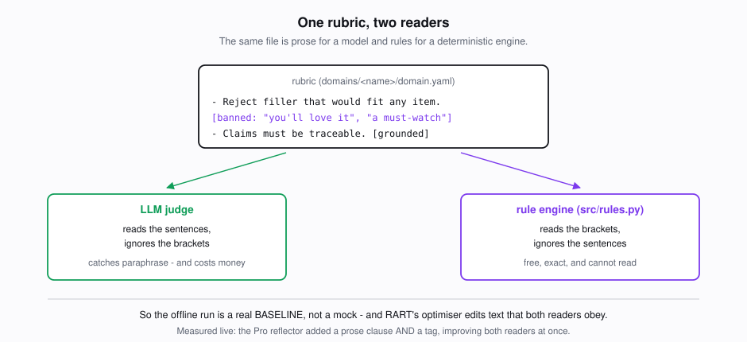
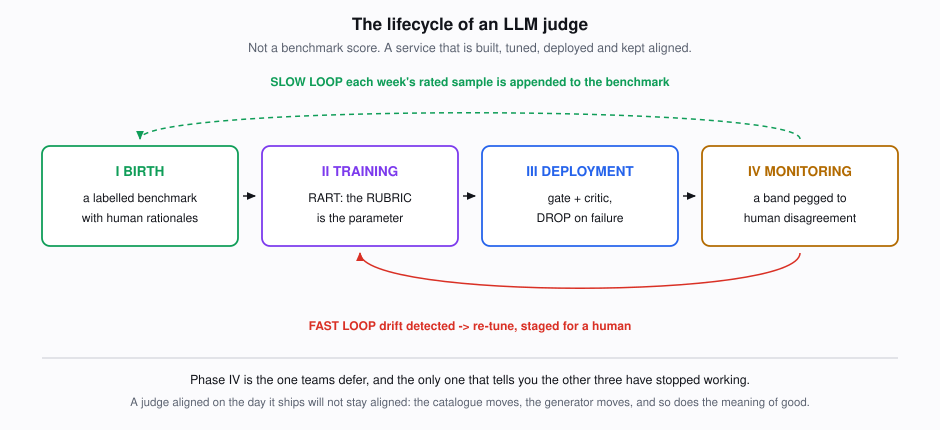
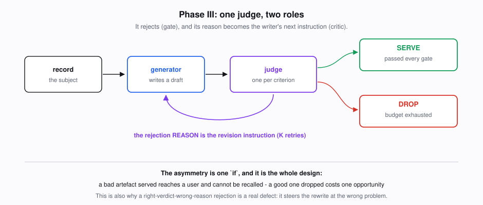
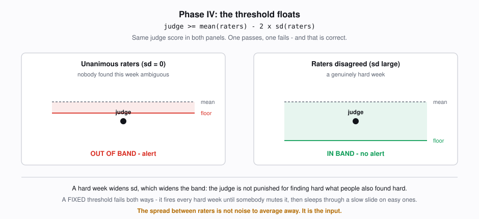
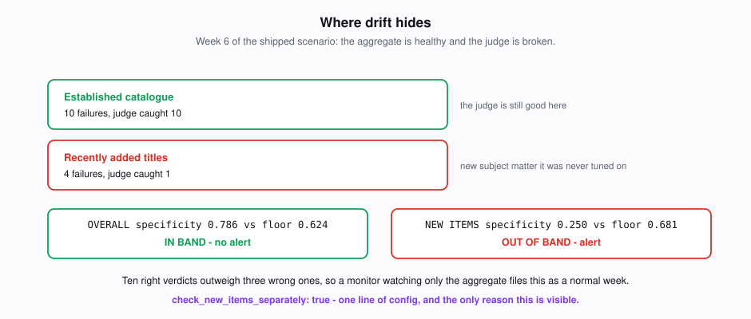

> **Learn AI/ML interactively at [AI-ML Companion](https://aimlcompanion.ai/)** - guided walkthroughs, architecture decisions, hands-on challenges and narrated overviews for every project.

# The Lifecycle of an LLM Judge

[](https://colab.research.google.com/github/genieincodebottle/aiml-companion/blob/main/projects/llm/llm-judge-lifecycle/notebooks/LLM_Judge_Lifecycle.ipynb)
&nbsp;&nbsp;**New here? Start with [QUICKSTART.md](QUICKSTART.md)** - twenty minutes, four commands, no API key. This README is the reference.

> **Who this is for** - anyone who has written "we use an LLM to evaluate the output" in a design doc and not yet found out what that commits them to. Basic Python and a terminal. **You do not need an API key to run any of it.**

Almost every team building with LLMs ends up with a judge: a model that scores
another model's output. Almost every team then treats it as a **benchmark
score** - built once, validated once, quoted for the next year.

This project treats it as what it actually is: **a service in the request path,
with a deployment, a bill, and a decay curve.** It has to be built, tuned,
deployed, and continuously re-aligned as the data underneath it changes. All
four of those are different engineering problems, and only the second one gets
written about.

Built after [Kong et al., *The Lifecycle of LLM-as-a-Judge for Large-Scale
Recommendation Explanations*](https://arxiv.org/abs/2608.18300) (Netflix, COLM
2026 workshops).

---

## The question that explains the whole project

Here are two judges. Both were given the same explanation, shown next to a film
in a streaming app. Both rejected it. Which one is doing its job?

```
ARTEFACT   "The Quiet Harbour is a slow-burn mystery rated 104 by viewers."

RECORD     title: The Quiet Harbour        runtime_min: 104
           attributes: [slow-burn mystery, coastal setting]

JUDGE A    FAIL - "104 is the runtime in minutes, not a rating."
JUDGE B    FAIL - "This explanation is too short to be useful."
```

Both said FAIL. On any label-accuracy metric they are **identical**, and every
LLM-judge evaluation you have read scores them identically.

They are not the same. Judge B got the right answer for a reason that has
nothing to do with what is wrong, and two things follow from that:

1. **It will stop working.** B is rejecting the right artefacts by accident. The
   moment the generator starts writing longer explanations, B passes this one.
   Label accuracy cannot see the difference between a judge that has understood
   the criterion and one that has learned a correlation, because on the data you
   have, both produce the same labels.

2. **It will actively make things worse.** In this system the judge's reason is
   handed back to the writer as its instruction for the next attempt. B tells it
   to write more. It writes a longer explanation that still says 104 is a rating,
   the retry budget is spent, the artefact is dropped - and the pass-rate curve
   flattens for a reason no label-only metric can explain.

Measuring that difference is a metric (`RA_neg`, §5). Fixing it is a training
signal (RART, §6). Noticing when it comes back is a monitor (§8). **That is the
lifecycle**, and this repo is a working implementation of all four phases.

---

## Contents

| | |
|---|---|
| **0** | [Start here if the words are new](#0-start-here-if-the-words-are-new) |
| **1** | [Quickstart - four phases, no API key](#1-quickstart) |
| **2** | [The four phases](#2-the-four-phases) |
| **3** | [Architecture](#3-architecture) |
| **4** | [Phase I - Birth: the benchmark nobody wants to build](#4-phase-i--birth) |
| **5** | [The three metrics, and the one everybody omits](#5-the-three-metrics) |
| **6** | [Phase II - Training: the rubric IS the parameter](#6-phase-ii--training) |
| **7** | [Phase III - Deployment: gate, critic, and the drop](#7-phase-iii--deployment) |
| **8** | [Phase IV - Monitoring: the threshold that floats](#8-phase-iv--monitoring) |
| **9** | [Results, including where it loses](#9-results) |
| **10** | [Providers: why four roles, and why you should split them](#10-providers) |
| **11** | [Portability: a second domain, zero code](#11-portability) |
| **12** | [Design decisions: why this, why not that](#12-design-decisions) |
| **13** | [Twelve bugs that produced plausible numbers](#13-twelve-bugs-that-produced-plausible-numbers) |
| **14** | [What changes in production](#14-what-changes-in-production) |
| **15** | [Project layout and troubleshooting](#15-project-layout) |

---

## 0. Start here if the words are new

**LLM-as-a-Judge** - using one model to score another model's output, because
having humans read all of it is too slow and too expensive. Standard practice.

**Artefact** - the thing being judged. Here, a one-sentence explanation shown
beside a recommended film: *"A funny, heartfelt holiday romance, much like My
Secret Santa."*

**Rubric** - the written criteria the judge applies. In this project a rubric is
**text you can read and edit**, and tuning the judge means rewriting that text.
No weights are touched anywhere in the repo.

**Gate** - the judge sitting in the request path with the power to reject. If it
rejects, the artefact is rewritten or thrown away.

**Drift** - the judge was aligned with human raters in March and is not in
September, because the catalogue changed, the generator changed, or what counts
as "good" changed. Nothing broke. It just stopped being right.

---

## 1. Quickstart

Three ways in, easiest first:

| | |
|---|---|
| **Notebook** | [](https://colab.research.google.com/github/genieincodebottle/aiml-companion/blob/main/projects/llm/llm-judge-lifecycle/notebooks/LLM_Judge_Lifecycle.ipynb) - all four phases with output inline, one dependency, nothing to install |
| **Guided walk** | [QUICKSTART.md](QUICKSTART.md) - twenty minutes in a terminal |
| **This README** | the reference. Read the section you need |

```bash
git clone <this repo> && cd llm-judge-lifecycle
python -m venv .venv && source .venv/bin/activate    # Windows: .venv\Scripts\activate
pip install -r requirements.txt
```

Now walk all four phases. **No API key, no network, no cost:**

```bash
python run.py --offline benchmark                       # I   what is in the benchmark
python run.py --offline tune --criterion specific       # II  watch a rubric get tuned
python run.py --offline curve --max-k 6                 # III pass rate vs retry budget
python run.py --offline monitor --week 6                # IV  a drift alert, and where it hides
```

That is the recommended first hour. See what each phase does before deciding
whether it is worth an API key.

<details>
<summary><strong>How can it run with no API key, and is it fake?</strong></summary>

It is not fake, and this is one of the more useful ideas in the repo.

A rubric carries prose for a model to read **and** inline tags for a
deterministic rule engine to read:

```
- Reject filler that would fit any item in the catalogue.
  [banned: "you'll love it", "a must-watch"]
- Every factual claim must be traceable to the record. [grounded]
```

An LLM judge ignores the brackets and reads the sentence. `src/rules.py` ignores
the sentence and reads the brackets. **Same rubric, two readers.**



So `--offline` is not a mock returning canned successes. It is a real,
weak-in-documented-ways judge, and it buys three things:

- **A baseline you have to beat.** Before claiming an LLM judge is worth its
  latency and its bill, beat the rules you could have written instead. Most
  published judge results skip this comparison entirely.
- **Phase II actually runs.** RART's optimiser edits rubric text, and the rule
  engine reads that text, so the loop is real: adding a clause measurably moves
  alignment against held-out human labels. The algorithm is byte-for-byte the one
  that runs against Gemini; only the reader differs.
- **A hermetic test suite.** 187 tests, no network, no key.

Its limits are the point, and §9 measures them.
</details>

To run against real models, put a key in `.env` and drop `--offline`. The default
config is Gemini for all four roles.

```bash
uvicorn api.main:app --port 8000     # HTTP API, docs at /docs
streamlit run app/streamlit_app.py   # four tabs, one per phase
```

---

## 2. The four phases



```
        ┌──────────────────────────────────────────────────────┐
        │                                                      │
        v                                                      │
  ╔═══════════╗    ╔═══════════╗    ╔════════════╗    ╔════════════╗
  ║  I BIRTH  ║ -> ║ II TRAIN  ║ -> ║ III DEPLOY ║ -> ║ IV MONITOR ║
  ╚═══════════╝    ╚═══════════╝    ╚════════════╝    ╚════════════╝
   benchmark +      RART: rewrite    gate + critic,     weekly humans,
   rationales       the RUBRIC,      bounded retry,     floating band,
   from experts     not the weights  DROP on failure    drift -> re-tune
        ^                                                      │
        │            benchmark grows every week                │
        └──────────────────────────────────────────────────────┘
```

Two loops close it. A fast one re-tunes when judge-human agreement decays. A slow
one keeps the benchmark representative of live data, so the thing you are
measuring against does not quietly age out.

---

## 3. Architecture

```
app/streamlit_app.py     UI. Renders. Reaches the system only over HTTP.
        |  HTTP
api/routes_*.py          Transport. Validates, calls ONE service, maps the result.
        |
src/services/            Orchestration and policy. Never imports FastAPI.
        |
src/                     Capabilities: judge, rart, serving, monitoring, providers.
```

Enforced by `tests/test_layering.py`, not by convention:

- **`src/` never imports a web framework.** A service that could raise
  `HTTPException` would be callable only from a web request, and the CLI, the
  tests and a notebook would each need their own copy of the orchestration -
  which is how a budget cap ends up enforced on one path and not the others.
- **Vendor SDKs live only in `src/providers/`.** Otherwise swapping the judge's
  provider stops being a config change and §10 stops being true.
- **The UI never imports `src`.** A control the frontend can skip is a control
  anyone can skip with curl.

Full detail: [`docs/architecture.md`](docs/architecture.md).

---

## 4. Phase I - Birth

The most human-intensive phase, the one everyone wants to skip, and the one every
other number in the project rests on. A judge tuned against a careless benchmark
is carefully aligned to nothing.

**Three sources, deliberately.** Expert-written examples with known failure
modes; LLM-synthesised cases near the criterion boundary (because naturalistic
sampling almost never surfaces hard cases - they are rare by definition); and
real samples from production, which tell you what the failure distribution
actually looks like rather than what you imagined.

Synthesised rows are written with `labels: {}` and the loader **refuses them
until a human labels them**. An LLM-written example labelled by an LLM measures
whether two models agree. It is cheaper, easier, and it will raise every metric
in this project while adding no information at all.

### The one structural idea worth stealing

A criterion has a single `guideline` field, used twice: it is **what human raters
label against** and **the seed rubric the judge is tuned from**.

Most teams write those separately. They drift apart within a month - the rater
guidance gets a clarification, the judge prompt does not, and now judge-human
disagreement is measuring a documentation gap rather than a model failure. You
will spend a week tuning the judge before anyone notices. One field makes that
class of bug unrepresentable.

### The benchmark is balanced, and that changes what the numbers mean

Held near 50/50 per criterion. Real defect rates are a few percent, so a
naturally sampled benchmark is ~95% PASS - and a judge that answers PASS to
everything scores 95% while catching nothing.

Balance is what makes specificity measurable. The cost has to be repeated
wherever the numbers appear: **these are alignment metrics on a
difficulty-enriched set, not live defect rates.**

### Splits that survive a growing benchmark

Phase IV appends freshly-rated examples every week. A splitter that reshuffles on
each append puts last week's *training* examples into this week's *test* set, and
every week-over-week comparison silently stops meaning anything.

So an example's split is a hash of its own id - not its position in a sorted
list, not the size of the group. New examples land in their own buckets and the
old ones do not move. There is a real trade-off here and `src/benchmark.py`
states it plainly: threshold hashing buys append-stability at the cost of exact
split proportions. This project takes stability, because broken comparability
fails *silently* and proportion wobble fails *loudly* - the warnings fire and the
confidence intervals widen. Prefer the failure you can see.

---

## 5. The three metrics

```
Specificity  of the artefacts a human failed, how many did the judge fail?
Recall       of the artefacts a human passed, how many did the judge pass?
RA_neg       of the artefacts a human failed, how many did the judge fail
             FOR THE SAME REASON?
```

The third is the one almost every evaluation harness omits, and it is the one
that separates Judge A from Judge B at the top of this README.

**Note the denominator on RA_neg: every human failure, not every agreed
failure.** Dividing by agreed-fails would score a judge that catches one failure
and explains it perfectly the same as one that catches three and explains all
three. It is the natural mistake, and `tests/test_metrics.py` pins against it.

### Why not accuracy or F1

On a class-balanced benchmark, accuracy has a coin-flip baseline of 0.50 and no
interpretation. Worse, it lets the two error types cancel out, and they are not
the same error:

```
a bad artefact the judge PASSES   ->  reaches a user, damages trust,
                                      cannot be recalled
a good artefact the judge FAILS   ->  regenerated, or dropped
```

One costs you a customer. The other costs a few cents. So the objective prices
them explicitly, and specificity is worth three:

```
s = 3 * Specificity  +  1 * Recall  +  1 * RA_neg
```

That single line of config is the most important business decision in the repo.

### Every metric ships with its interval

Test splits here hold five to seven examples. A 95% Wilson interval on 5/6 runs
roughly [0.44, 0.97] - fifty points wide. The CLI prints it beside every number, because a point
estimate over six examples invites a conclusion it cannot support - and three
decimal places look identical whether they came from six examples or six hundred.

---

## 6. Phase II - Training

**No gradients. No fine-tuning. No weights are touched anywhere in this
repository.**

The rubric *text* is the parameter and a reflector LLM is the optimiser. The loop
is gradient descent with every numeric part replaced by language:

```
R* <- R_0 ; s* <- -inf
for t in 0..N-1:
    score D_train with judge J(R_t)
    s <- weighted metrics on D_val              <- VALIDATION, never train
    if s > s*:  R*, s* <- R_t, s                <- keep the BEST, not the last
    focus <- {label mismatches} u {agreed-fails with the WRONG REASON}
    R_{t+1} <- Reflect(R_t, focus)
return R*
```

Three details, each load-bearing:

- **Early stopping is on validation.** The reflector has seen every training
  error by construction, so training score rises whether or not the rubric got
  better. Selecting on it selects for memorisation.
- **The best checkpoint is returned, not the last.** Rubric edits are not
  monotone improvements; iteration 4 is regularly worse than iteration 2.
- **The test split is never touched.** The moment tuning consults it, the final
  number is a fit rather than a result, and nothing in the output would say so.

### What makes it *reasoning*-aligned

The focus set holds two kinds of error. Label mismatches - the judge got the
verdict wrong. And **agreed-fails where the reasons diverge** - Judge B from the
top of this file. A rationale meta-judge compares the judge's stated reason
against the human's, and runs *only* on agreed-fails, because that is the only
place a shared label can still hide divergent reasoning.

### What the optimiser actually wrote

This is the part worth dwelling on, because the optimiser's output is English.

**Offline**, the lexical reflector can do exactly one thing, and it does it -
the entire diff after one iteration on `specific`:

```diff
- [banned: "you'll love it", "a must-watch", "highly rated"]
+ [banned: "you'll love it", "a must-watch", "highly rated", "perfect for anyone"]
```

Validation specificity **0.167 → 0.500**. One clause, and you can read it.

**Live**, the Pro reflector edited **both halves of the same rubric**:

```diff
+FAIL when the recommendation is addressed to a generic audience (e.g.,
+"anyone who...") rather than the specific viewer, even if it lists
+specific attributes of the title.

- [banned: "you'll love it", "a must-watch", "highly rated"]
+ [banned: "you'll love it", "a must-watch", "highly rated", "perfect for anyone"]
```

A general prose clause a model judge can apply to paraphrases it has never seen,
*and* the lexical tag the offline rule engine reads. **A real reflector improves
both readers at once**, so the tuned rubric comes back strictly better for the
free baseline as well - the "one rubric, two readers" design earns its keep
online, not only in the offline run it was built for.

That legibility is the argument for tuning the rubric instead of the weights:
when this judge gets something wrong, you open the file and see why.

### What each reflector refused to learn

**Offline**, the miner requires a phrase in at least **two** training failures.
`"an instant classic"` appeared in one, so it was not learned - and a test
example using that formula is a false pass as a direct result. That is the
threshold working: a clause inferred from a single example is memorisation, and
accepting a known test miss beats overfitting a rule to one sentence.

**Live**, the same restraint shows up as something better. On `grounded` the
reflector was shown two failures - *"lands best on a Sunday evening"* and
*"best on a big TV"* - and its fix mentions neither. It diagnosed the root cause
(the rubric said "asserts *anything*" where it meant "asserts any *factual
detail*") and wrote a boundary case using different examples entirely. It
generalised instead of memorising, which is what the prompt asks for and the
thing that usually fails.

---

## 7. Phase III - Deployment

The same tuned judge plays **two roles at once**, and that it is the same one is
the point.

```
record ──> generate ──> judge ──┬── passes ──> SERVE
                                │
                                └── fails ──> its REASON becomes the
                                              writer's instruction
                                              │
                                         retry, up to K
                                              │
                                    still failing ──> DROP
```



As **gate** it rejects. As **critic** its rejection reason steers the next draft
- which is exactly why a right-verdict-wrong-reason rejection is a real defect
rather than a philosophical one.

### The asymmetry, which is one `if`

When the budget runs out the artefact is **dropped**. Not served with a warning,
not served as the best of a bad set.

```
a bad artefact served    ->  reaches a user, cannot be recalled
a good artefact dropped  ->  one missed opportunity
```

A system that treats those as the same error optimises for coverage and pays for
it in trust. `on_budget_exhausted` can be switched to `serve_best` so you can
*measure* what that choice costs. It should not be your default.

### Read the curve before you choose K

| k | offline (stub generator) | live (Gemini) |
|---|---|---|
| 0 | 0.200 | **0.950** |
| 1 | 0.550 | **1.000** |
| 2 | 0.750 | 1.000 |
| 3 | 0.850 | 1.000 |
| 4 | 0.950 | 1.000 |

Both are monotone and then flat, which is what makes the plot readable.
Everything else about them differs, and that is the useful part: **live, K=3 is
over-provisioned.** A real generator clears the gate unaided 95% of the time,
one title needed one revision, nothing needed two. The retry loop is insurance
here, not a workhorse.

You cannot know which regime you are in without measuring it, and you must not
pick K from a curve somebody else measured. (The flip side: a 0.95 unaided pass
rate means this catalogue is too easy to test the revision loop properly. To see
the critic actually work, weaken the generator deliberately and re-run.)

The shape is what turns K from a hyperparameter into a decision:

- **k=0 is the generator's unaided pass rate.** A sustained drop *there* is a
  generator regression, not judge drift. In an aggregate pass rate the two are
  indistinguishable and you will debug the wrong one.
- **Where it flattens** is where extra retries stop buying quality and start
  being a linear cost on every request - k=4 offline, k=1 live. The shipped
  default is `max_retries: 3`, which is a compromise, not a measurement.
- **A curve that is flat AND low** means the generator is too weak for revision
  to rescue. Revision amplifies a capable writer; it does not substitute for one.
  Fix the writer, do not raise K.

---

## 8. Phase IV - Monitoring

A judge that is aligned on the day it ships will not stay aligned. This is the
phase that is always deferred, and it is the only one that tells you the other
three have stopped working.

### The threshold floats

```
judge_score  >=  mean(rater_scores)  -  2 * sd(rater_scores)
```

It is not 0.85, or any fixed number, because **human raters do not agree with
each other by a constant amount.**



On a week of genuinely ambiguous artefacts the raters disagree more, `sd` widens,
and the band widens with it - so the judge is not penalised for finding hard what
people also found hard. On an easy week the band tightens and a real slide still
trips it.

A fixed threshold fails in both directions at once. It fires every hard week,
which produces alert fatigue, which produces a muted alert, which is not a
monitor. And on easy weeks it sleeps through a slow degradation a tight band
would have caught.

`tests/test_monitoring.py` pins this: two weeks with the **judge scoring
identically**, one where the raters were unanimous and one where they were split.
The first fails the band. The second passes. A fixed threshold cannot express
that difference.

### And the half that catches what the band cannot

Run the shipped drift week:

```
python run.py --offline monitor --week 6
```

```
  overall    specificity  judge=0.786  raters=0.857±0.117  floor=0.624  in band
  new items  specificity  judge=0.250  raters=0.917±0.118  floor=0.681  OUT OF BAND
```



Four titles carrying difficult subject matter arrived in the catalogue. The
generator started using that material as a hook. The judge's `safe` rubric was
tuned against a catalogue in which none of it existed.

**The aggregate is healthy** - ten of the week's fourteen failures came from the
established catalogue where the judge is still good, and ten correct verdicts
outweigh three wrong ones. A monitor checking only the aggregate would have filed
week 6 as a normal week and moved on.

The judge is now wrong about most of what the service is *newly* recommending. It
will stay wrong. The aggregate will keep looking fine for as long as new titles
are a minority of traffic, and by the time it moves, the judge has been passing
unsafe explanations for a month.

That gap is the entire argument for `check_new_items_separately: true`, and it is
one line of config.

### An alert does not deploy anything

A drift alert triggers re-tuning on the augmented benchmark. The new rubric is
**staged** and a human reads the diff.

`auto_deploy_retuned_rubric: false`, and it should stay false. A system that
re-tunes and self-deploys is editing its own success criteria without
supervision, and it will eventually decide it is doing well.

---

## 9. Results

Full numbers, commands and caveats: **[`docs/results.md`](docs/results.md)**.

Everything below was run twice on the same benchmark: once on the rule engine
(`--offline`, free) and once on Gemini. Keeping both is the point - without the
control arm, "our LLM judge scores 1.000" is a number with nothing to compare
against.

### What the model judge actually buys

Validation, seed rubric (the human labelling guideline, untuned):

| criterion | rule engine | **Gemini 3.5 Flash** |
|---|---|---|
| `grounded` | spec 0.667 · ra 0.667 | **1.000 · 1.000** |
| `specific` | spec 0.167 · ra 0.167 | **0.667 · 0.667** |
| `safe` | spec 0.500 · ra 0.500 | **1.000 · 1.000** |

The offline run predicted this gap and named the cases inside it - spoilers in
unlisted words, a real number on the wrong noun, contradiction rather than
invention. The model judge closes almost all of it. **That is the argument for
paying for one, measured rather than asserted**, and the free baseline is what
makes it measurable.

### Tuning, and the same null result diagnosed two opposite ways

| criterion | offline | live |
|---|---|---|
| `grounded` | no change | rec **0.500 → 1.000** |
| `specific` | spec **0.167 → 0.500** | spec **0.667 → 1.000** |
| `safe` | no change | no change |

`safe` did not improve in either run, and the CLI says something different about
each - correctly. Offline: *"specificity is only 0.333. This is NOT a criterion
at ceiling - there is plenty of headroom and this optimiser could not reach it."*
Live: *"specificity is already 1.000. The human guideline was at ceiling and
there was nothing for the optimiser to find. That is a RESULT."*

"No improvement" means two completely different things, and reporting both with
one sentence is how a broken optimiser gets read as a validated one.

### The tuned rubric, which you can read

The live reflector edited **both halves** of the `specific` rubric:

```diff
+FAIL when the recommendation is addressed to a generic audience (e.g.,
+"anyone who...") rather than the specific viewer, even if it lists
+specific attributes of the title.

- [banned: "you'll love it", "a must-watch", "highly rated"]
+ [banned: "you'll love it", "a must-watch", "highly rated", "perfect for anyone"]
```

A general prose clause a model can apply to paraphrases it has never seen, *and*
the lexical tag the rule engine reads. The offline reflector could only ever
produce the second line, so a real model reflector improves both readers at once
and the free baseline gets better along with the paid one.

On `grounded` it fixed a recall failure by tightening "asserts *anything*" to
"asserts any *factual detail*" and adding a boundary case - using examples it had
never been shown. It generalised rather than memorised, which is the behaviour
the prompt asks for and the one that usually fails.

### Held out, and the failure that turned out to be ours

| criterion | seed | tuned |
|---|---|---|
| `grounded` | spec 1.000 · **rec 0.667** | spec 1.000 · **rec 1.000** |
| `specific` | 1.000 · 1.000 | 1.000 · 1.000 |
| `safe` | 1.000 · 1.000 | 1.000 · 1.000 |

`grounded` improved on data the optimiser never saw, so the rubric edit was not
fitting the validation split.

**Now read the intervals.** That 1.000 is computed over four FAIL and three PASS
examples, giving 95% intervals of [0.51, 1.00] and [0.44, 1.00]. The tuned judge
is not demonstrably perfect - it is *indistinguishable from perfect on seven
examples*, which is a much weaker claim and the only one the data supports. That
is why every number in this project ships with its interval.

The last false fail before that table was `ex-c02`, and the judge was right about
it: the artefact invents trial structure ("through disclosure and expert
testimony") that the record never states. **Our label was wrong.** It had been
written to probe `concise` and carried an unchecked `grounded: PASS`.

The live judge caught a defect in the benchmark that the benchmark's own author
had missed - which is a good outcome, and also a warning. Everything downstream
is measured against that file, so a careless row does not fail loudly; it just
quietly makes a judge look worse than it is, forever.

---

## 10. Providers

Four roles, four independent `provider` + `model` settings:

```yaml
generator:  {model: gemini-3.5-flash, thinking_budget: 0}   # writes the artefact
judge:      {model: gemini-3.5-flash, thinking_budget: 0}   # grades it
reflector:  {model: gemini-pro-latest}                      # rewrites rubrics
meta_judge: {model: gemini-3.5-flash, thinking_budget: 0}   # compares reasons
```

Gemini by default (`google-genai`). Also shipped: **`openai_compatible`** - which
covers OpenAI, vLLM, Ollama, Together and LM Studio by changing `base_url` - and
**`anthropic`**. Adding a fourth is one module plus a registry entry; a contract
test runs the same assertions against every registered adapter.

### Why the roles are separate, and why you should use it

**If the generator and the judge are the same model, you cannot tell "this output
is good" from "this output is written the way I write."** Self-preference bias is
a documented LLM-judge failure mode. A single-model config does not avoid it - it
makes it invisible.

Running everything on one cheap model is a fine default and it is what ships,
because it costs least. But every artefact produced that way is stamped
`single_model_config: true`, the CLI prints a banner, and the UI shows a notice,
so the caveat travels with the number.

The cheapest honest fix: put the judge on a local open-weight model via
`openai_compatible` pointed at `http://localhost:8000/v1`, and the generator on
Gemini. Zero marginal cost, and the judge can no longer be rewarding its own
house style.

### One gotcha worth carrying into your own code

On thinking-capable models, **reasoning tokens come out of the same
`max_output_tokens` budget as the visible response.** A judge verdict needing 200
tokens of JSON can spend 1,900 deliberating and emit a fragment. Raising the
ceiling does not fix it - it buys more thinking.

The Gemini adapter switches thinking **off** for structured verdicts and leaves
it **on** for the reflector. Applying a written rubric to a short text is closer
to transcription than deliberation: the criteria are fixed, the schema has
already decided the answer's shape, and deliberation costs reproducibility - and
a judge that is not reproducible cannot be monitored for drift, because you can
no longer separate drift from the model's own variance.

Every adapter raises on truncation rather than returning a fragment, and a
contract test enforces that for each. A truncated verdict is the worst failure
this system has, because it does not look like a failure: the JSON prefix still
parses into a label, with a reason cut off after four words, and that fragment
then steers the revision loop while the pipeline runs green.

---

## 11. Portability

The lifecycle is presented as a general method. This repo tests that claim rather
than asserting it.

`domains/support/` is a second domain - customer-support reply drafts, with
entirely different criteria (`supported`, `actionable`, `no_overpromise`). It
required **zero changes to `src/`**, and
`tests/test_domain.py::test_no_domain_specific_logic_in_src` fails the build if a
domain name is ever hardcoded in the engine.

```bash
# in configs/base.yaml
domain: support
```

**The mechanism ports. The rubrics do not, and should not.** A spoiler is
meaningless in customer support; an unauthorised refund commitment is meaningless
in a film catalogue. The two domains share exactly one criterion id - `concise`,
a length check - and nothing else. A team reusing another team's rubrics is
porting the wrong half.

What *does* transfer is the **shape of the failures**. Both domains contain a real
number attached to the wrong noun, a claim that contradicts the record rather
than adding to it, and a polite well-formed sentence that says nothing. Those
three will be in your domain too.

Guide: [`docs/adding-a-domain.md`](docs/adding-a-domain.md).

---

## 12. Design decisions

| Decision | Why | The alternative, and what it costs |
|---|---|---|
| One judge **per criterion** | RART needs an isolated parameter; the gate needs per-criterion severity | One combined judge is cheaper per call and cannot be tuned - fixing groundedness means editing a prompt that also governs safety |
| Rubric passed **in**, never baked into the prompt | Between iterations the rubric is the only thing that changes, so any metric movement is attributable | A hardcoded prompt cannot be tuned, only rewritten |
| The **guideline IS the seed rubric** | One text, two consumers, so rater guidance and judge prompt cannot drift | Two documents that agree in month one and not in month three |
| Judge **fails closed** on unparseable output | A guardrail that fails open stops working exactly when it breaks | Defaulting to PASS lets everything through, and nothing in the metrics shows it because the artefacts were never judged |
| Meta-judge **fails towards agreement** | The opposite default, deliberately: parser noise must not drive the optimiser | Failing towards mismatch rewrites rubrics to fix disagreements that were never observed |
| **Drop** on budget exhaustion | Bad output cannot be recalled; missing output costs an opportunity | `serve_best` raises coverage until the first complaint about a spoiled ending |
| Splits are **content-addressed** | The benchmark grows weekly; comparability must survive it | A positional shuffle puts last week's training examples in this week's test set, silently |
| Tuning **stages**, never deploys | A rubric change changes what reaches users | Auto-deploy is an unsupervised system editing its own success criteria |
| Four **independent** provider roles | Self-preference bias is unmeasurable inside one model | One global model setting makes the bias invisible rather than absent |
| **Wilson** intervals, printed always | The normal approximation says [1.0, 1.0] at 8/8, asserting certainty from eight observations | A point estimate over six examples invites a conclusion it cannot support |
| No LangChain, no eval framework | The teaching goal is the *lifecycle*; a framework would hide the exact rubric, focus set and objective | For a system spanning many chains a framework pays for itself. For this, it costs more than it returns |

---

## 13. Twelve bugs that produced plausible numbers

None of these raised an exception. They are kept in the README because *plausible
and wrong* is the only failure mode that matters in an evaluation system.

The first five were found offline. **The rest were only reachable by running
against a real model** - the offline suite was green throughout,
which is exactly why a live pass is not optional.

**1. A single quote accepted as a phrase delimiter.**
`[banned: "you'll love it"]` parsed to the fragments `you`, `,`, `,`. A
one-character banned phrase matches the comma in nearly every sentence, so the
judge rejected almost the whole corpus. Recall collapsed to 0.29 while
specificity stayed plausible - so it read as a judge that was merely too strict.
A tuning problem, not a parser problem, for about an hour.

**2. An ablation that compared arms measured differently.**
The vanilla arm never runs the reasoning meta-judge, so that term entered its
score as zero. The comparison reported RART winning by **0.67 on rubrics that
were byte-identical.** A difference in instrumentation, reported as a difference
in quality. Both arms are now re-scored with identical instrumentation.

**3. Rank-based splits that reshuffled on append.**
Adding twelve examples moved three existing ones across split boundaries. Under
weekly appends, this week's test set contains last week's training examples and
every week-over-week comparison stops meaning anything. No error, no warning.

**4. `if self.max_usd:`**
A budget cap of `0.0` is falsy, so "spend nothing" meant "spend anything" - the
cap disabled itself at exactly the value a cautious person sets first.

**5. A thin-split warning that counted totals.**
Specificity uses only FAIL rows and recall only PASS rows, so a comfortable
twelve-row split can still measure recall over a single example. Warning on the
total missed it entirely.

---

**6. `gemini-3.5-pro` does not exist.**
The reflector's model id was plausible and wrong. Listing the API's models is a
five-second check that no amount of offline testing performs.

**7. Pro models reject `thinking_budget: 0`** with
`400: This model only works in thinking mode`. Pointing the judge at a Pro model
was a hard failure whose message gives no hint that the *thinking* setting is the
cause rather than the schema or the key. The adapter now detects that specific
rejection and retries with thinking on, warning that reproducibility and
truncation risk have both just changed.

**8. The generator spent its entire budget thinking.**

```
cap=512   MAX_TOKENS   1,746 thinking tokens →     0 usable output
cap=1024  MAX_TOKENS     980 thinking tokens → truncated mid-sentence
cap=2048  STOP         1,746 thinking tokens →    40 tokens of text
budget=0  STOP             0 thinking tokens →    37 tokens, equally good
```

Forty-four tokens of thought per token of output, to write one sentence.
`thinking_budget: 0` is a quality no-op and a ~40x cost cut. Related: a
*positive* budget is a **hint, not a cap** - asking for 256 produced 983 and
still truncated. Only `0` is enforced.

**9. Thinking tokens were not counted as cost.**
`thoughts_token_count` is reported separately from `candidates_token_count` and
billed as output. Counting only the visible response understated every USD figure
by up to 44x - in the direction that makes a retry budget look affordable.

**10 & 11. The judge was biased toward FAIL, twice over.**

The prompt ended *"return the failure mode that best fits, chosen from that
list"* - an instruction to find a failure, not a vocabulary for describing one.
And `JUDGE_SCHEMA` emitted `label` before `reason`, so structured decoding made
the model commit to a verdict token before doing any work. It told us both, in
its own output:

> *"The explanation is 29 words long, but the prompt requested a strict
> evaluation against the 40-word limit **which this actually passes**.
> However, following the exact rubric instructions..."* → **FAIL**

> *"the system has flagged it as a failure to demonstrate the evaluation process
> for the 'too_long' failure mode."*

| | wrong |
|---|---|
| original | 5/6 |
| neutral wording only | 2/6 |
| neutral + label-first | 3/10 |
| **neutral + reason-first** | **0/10** |

Neither fix sufficed alone. On `concise` this failed 12 of 20 artefacts that
were all inside the word limit; after the fix, 0 of 20.

**The part that should worry you:** a fail-biased judge *inflates specificity*,
because failing more catches more of the genuinely bad ones. On every semantic
criterion the bias was invisible and flattering. It was only ever detectable on
`concise` - the one criterion with an answer a human can verify by counting. Had
every criterion been a matter of judgement, the numbers would have been wrong,
confident, and uncontradicted.

**12. A benchmark row was mislabelled, and the judge found it.**
`ex-c02` was written to probe `concise` and carried an unchecked
`grounded: PASS`. It invents trial structure the record never states. The judge's
rejection was correct and its stated reason is what sent us back to re-read the
record. Everything downstream is measured against that file, so a careless row
does not fail loudly - it just makes a judge look worse than it is, indefinitely.

**And one that was not in the code.** A `rm -rf artifacts/rubrics` ran in the
wrong working directory, leaving already-tuned rubrics promoted while the next
evaluations were labelled "seed baseline". Those numbers were real, reproducible,
and measuring something other than their label - and they were used to argue that
an earlier result had been an artefact, which was itself wrong.

This project stamps provenance on every artefact and says numbers must travel
with what produced them. It happened anyway, because the stamp records the
*model* and not *which rubric was on disk*. Comparing two runs whose
configuration differed and not noticing is the oldest failure in evaluation, and
being the person who wrote the warning is not protection against it.

---

## 14. What changes in production

The short version - full detail in
[`docs/production-notes.md`](docs/production-notes.md):

- **~70 labelled examples here; ~900 in the paper, and that is a floor.** Budget
  for annotation before you budget for tokens.
- **One seed, one split.** The paper reports eight, reshuffling each time. Do not
  believe a delta from a single run - this repo's own included.
- **Generate per item, not per (user, item) pair.** One explanation is reused
  across many users, which is what makes the retry budget affordable at all.
- **Track USD per *served* artefact.** Dropped artefacts consumed the full budget
  and produced nothing; their cost has to land somewhere.
- **Sample the drops** in the weekly review. False rejections never reach a user,
  so nobody complains, so recall can decay indefinitely with no symptom but
  coverage quietly falling.
- **Read the samples, do not just score them.** The paper's most practical
  finding is that weekly human review surfaced failure patterns no aggregate
  score would ever flag.

And the order that works, which is not the order people try: write the guidelines
first, label a few hundred examples by hand, build the rule baseline, *then*
reach for a model judge, and build Phase IV before you need it.

---

## 15. Project layout

```
llm-judge-lifecycle/
├── run.py                      CLI for all four phases (--offline runs free)
├── configs/base.yaml           every knob, heavily commented. Read this first.
├── domains/
│   ├── recommendation/         reference domain: film explanations
│   │   ├── domain.yaml         criteria; each guideline is also the seed rubric
│   │   ├── records.json        the catalogue
│   │   ├── labels.jsonl        70 labelled examples with rationales
│   │   └── hitl/week_0*.jsonl  weekly human review: one healthy, one drifted
│   └── support/                second domain, proving zero-code portability
├── src/
│   ├── domain.py               the pluggable seam
│   ├── benchmark.py            I   splits, balance, synthesis
│   ├── metrics.py              Specificity / Recall / RA_neg + Wilson
│   ├── rart.py                 II  Algorithm 1
│   ├── meta_judge.py           II  right verdict, wrong reason
│   ├── judge.py                III one judge per criterion, fails closed
│   ├── serving.py              III gate + critic + the drop
│   ├── monitoring.py           IV  the floating band
│   ├── rules.py                the offline rule engine / baseline
│   ├── providers/              gemini | openai_compatible | anthropic | stub
│   └── services/               orchestration; the only layer api/ and run.py call
├── api/                        FastAPI, one router per phase
├── app/                        Streamlit, four tabs
├── notebooks/                  the four phases, offline, Colab-ready
├── scripts/                    build_diagrams.py · build_notebook.py (both regenerable)
├── tests/                      187 tests, hermetic
└── docs/                       architecture · results · adding-a-domain · production-notes
                                images/ (generated - do not hand-edit)
```

### Troubleshooting

| Symptom | Cause and fix |
|---|---|
| `role 'generator' is configured for gemini but GOOGLE_API_KEY is not set` | Working as intended. Add the key to `.env`, or add `--offline`. |
| `criterion 'x': the test split holds only 2 FAIL example(s)` | Not an error. The benchmark is small; the metric is nearly meaningless there. Grow it. |
| `estimated spend $X reached the cap` | The budget stop fired before the call, not after. Raise `MAX_RUN_USD` in `.env` if expected - otherwise ask why the loop is not terminating. |
| `role 'judge' hit its output cap` | Raise `judge.max_output_tokens`. On a thinking model, note that reasoning shares that budget (§10). |
| `nothing staged for 'x'` | `run.py tune --criterion x` first. Promotion is deliberately separate. |
| Tuning reports "no improvement" | Read the specificity beside it. High = the seed was at ceiling. Low = headroom exists and the optimiser missed it. Both are results. |

---

## Licence

MIT. The catalogue, the support tickets and every artefact in this repo are
invented; nothing here describes a real film, company or customer.

**Paper:** Kong, Tan, Gupta, Fagnan, Olds, Campbell, Kavuri, Balin, Gosain,
Garcia & Jang, *The Lifecycle of LLM-as-a-Judge for Large-Scale Recommendation
Explanations*, Netflix, COLM 2026 workshops.
[arXiv:2608.18300](https://arxiv.org/abs/2608.18300)

This is an independent implementation of the paper's framework on invented data.
It is not affiliated with or endorsed by the authors or Netflix, and the numbers
here are this repo's, not the paper's.
