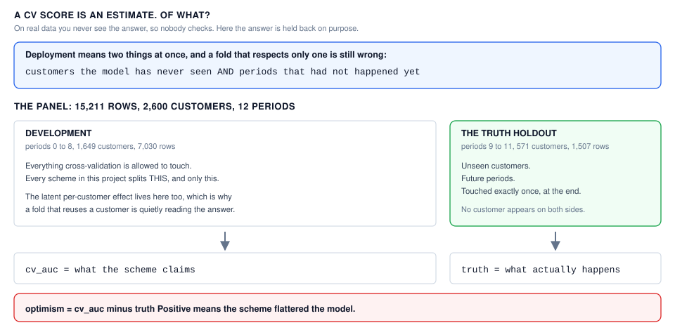
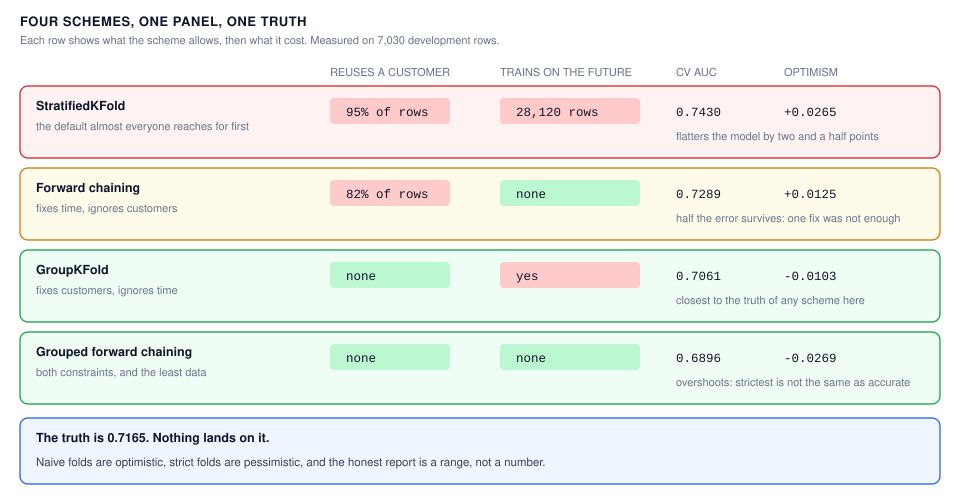
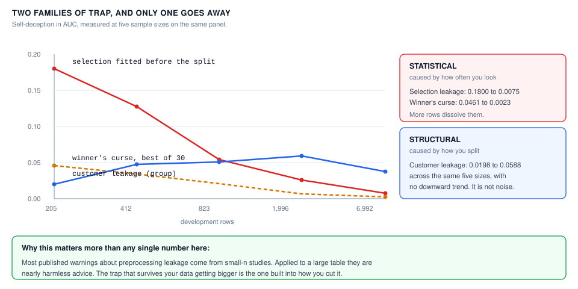

# Cross-Validation Trap Lab

> **Learn how to build this project step-by-step on [AI-ML Companion](https://aimlcompanion.ai/)**. Interactive ML learning platform with guided walkthroughs, architecture decisions, and hands-on challenges.


**Everyone knows cross-validation can lie to you. Almost nobody measures by how
much. This project holds back the answer, then checks.**

---

## 1. The problem

You run 5-fold CV and get AUC 0.743. You ship. Reality returns 0.716.

The gap has a name, optimism, and the usual advice about it is a list of things
to avoid: do not fit your scaler before the split, group your folds, respect
time. All good advice. None of it tells you which mistake cost you the 0.027,
whether the fix is worth its cost, or whether your careful new number is right
either.

The reason nobody answers those questions is that **on real data you never see
the truth**. A CV score is an estimate of something you cannot observe.

So here it is observable. A synthetic subscription panel is split so that one
part is never touched until the very end:



Deployment means two things at once, and a fold that respects only one of them
is still wrong. Every scheme in this project is scored by one number:

```
optimism  =  cv_auc  minus  truth
```

Positive means the scheme flattered the model.

## 2. Five traps, one panel

| trap | the mistake | the fix |
|---|---|---|
| **preprocessing** | fitting an imputer, scaler or feature selector before splitting | fit inside every fold |
| **grouped** | the same customer in train and validation | `GroupKFold` |
| **temporal** | training on periods that had not happened yet | forward chaining |
| **selection** | quoting the best of N candidates as an estimate | nested CV |
| **variance** | reading a 0.001 difference as a result | repeat and look at the spread |

The panel is generated with the structure each trap needs, at a known strength:
a latent per-customer effect, drifting coefficients, 150 pure-noise columns.
Turn the dials to zero and the traps genuinely switch off, which is the control
that makes the rest of it falsifiable.

## 3. What the splits actually cost



Three things in that table are worth slowing down for.

**Naive folds reuse 95% of customers.** Not a subtle leak. The `leakage_report`
counts it fold by fold rather than trusting the splitter's name.

**Fixing time alone recovers about half the error.** Forward chaining removes
28,120 future training rows and lands at +0.0125, still optimistic, because the
customers are still shared. Most write-ups treat "use TimeSeriesSplit" as the
answer for panel data. Here it is half an answer.

**Nothing lands on the truth.** GroupKFold sits at -0.0103 and grouped forward
chaining at -0.0269. The careful schemes are **conservative, not accurate**, and
a project that stopped at "grouped CV is correct" would be making the original
mistake in the opposite direction.

## 4. The finding that reorganised the project

Two of these traps behave completely differently from the other two, and it only
becomes visible when you vary the sample size:



| development rows | selection leakage | winner's curse | customer leakage |
|---|---|---|---|
| 205 | **0.1800** | 0.0461 | 0.0198 |
| 412 | 0.1270 | 0.0345 | 0.0475 |
| 823 | 0.0545 | 0.0207 | 0.0505 |
| 1,996 | 0.0261 | 0.0066 | 0.0588 |
| 6,992 | **0.0075** | 0.0023 | 0.0375 |

**Statistical traps** come from how many times you look at the data. They are
maxima and correlations found by chance, so more rows dissolve them. Selecting
20 of 159 columns before validating is worth 0.18 AUC of self-deception at 205
rows and 0.0075 at 6,992.

**Structural traps** come from how you cut the data. Customer leakage does not
shrink; the model is being handed information about the validation rows, and
more rows does not stop that.

This has a practical edge. Most of the well-known warnings about preprocessing
leakage come from small-sample studies, where they are entirely correct. Applied
unchanged to a large table they are close to harmless advice, while the trap that
survives your data getting bigger is the one built into how you split it.

## 5. The winner's curse, made honest

Search 30 candidates, keep the best, quote its CV score. That score is a maximum
over 30 noisy draws, and a maximum is biased upward even when every candidate is
equally good.

Making that measurable took two failed attempts, both instructive:

- Varying `C` and `select_k` gave candidates within 0.008 of each other. No
  dispersion, nothing for a maximum to exploit, nested CV had nothing to correct.
- Fully random feature subsets gave candidates from 0.48 to 0.70, because most
  subsets missed the real columns. There the search finds real signal, and
  picking the best of it is competent rather than cursed.

The trap needs candidates that differ **in score but not in merit**. So each
candidate keeps all 9 real columns and adds a different random draw of noise.
They are interchangeable by construction, and every point of spread between them
is luck.

| estimate | AUC | vs truth (0.7682) |
|---|---|---|
| best candidate's own CV score | 0.7453 | -0.0229 |
| mean across all candidates | 0.7430 | -0.0252 |
| nested CV | 0.7434 | -0.0248 |

The winner sits 0.0023 above the average candidate and 0.0019 above nested CV,
and all 30 candidates span only 0.0038. That is the whole curse at this sample
size: real, correctly signed, and far too small to matter.

It matters at small n. Measured as best-minus-average across the same five
sizes, the curse runs **0.0461 at 205 rows** down to **0.0023 at 6,992** (the
`winner's curse` column in section 4). Note that all three estimates here sit
*below* the truth, for the train-size reason in section 12; the curse is the gap
between them, not their distance from the truth.

## 6. The trap that is not a bias

`python run.py variance` reshuffles the same grouped 5-fold CV 20 times:

| model | mean | std | min | max | spread |
|---|---|---|---|---|---|
| A (C=1.0) | 0.7490 | 0.0007 | 0.7478 | 0.7504 | 0.0025 |
| B (C=0.1) | 0.7489 | 0.0007 | 0.7478 | 0.7503 | 0.0024 |

The gap between the models is **0.0001**, one twenty-fifth of the spread within
either. A beat B in 16 of 20 repeats: consistent in direction, meaningless in
size. A single CV number with no error bar cannot tell you which of those two
statements applies.

## 7. Run it

### Clone

```bash
git clone https://github.com/genieincodebottle/aiml-companion.git
cd aiml-companion/projects/machine-learning/cross-validation-traps
```

### Set up with uv

[uv](https://docs.astral.sh/uv/) resolves and installs in seconds and keeps the
environment inside the project.

```bash
pip install uv

uv venv
source .venv/bin/activate      # Linux / macOS
# .venv\Scripts\activate       # Windows PowerShell or cmd

uv pip install -r requirements.txt
```

Plain `pip install -r requirements.txt` works identically. Python 3.10+.

### The argument, in order

```bash
python run.py data           # generate and cache the panel            (~4s)
python run.py truth          # what every scheme is scored against     (~2s)
python run.py preprocessing  # transformer before vs inside the split (~10s)
python run.py grouped        # the same customer on both sides        (~30s)
python run.py temporal       # training on the future                 (~15s)
python run.py selection      # the winner's curse and nested CV       (~50s)
python run.py variance       # the trap that is noise, not bias       (~20s)
python run.py sweep          # all four biased traps, ranked          (~90s)
```

Timings are from a mid-range laptop and move by roughly a factor of two under
load; the whole sequence is about four minutes. Nothing needs a GPU, the cached
panel is 22 MB, and peak memory is under 100 MB.

`run.py` needs **no install of this project**. It puts `src/` on the path
itself. Optionally `uv pip install -e .` also gives you a `cvtraps` command.

You can also start anywhere: every command generates the panel on first use, so
`python run.py sweep` on a fresh clone works without running `data` first.

### Run the controls

This is the part that makes the project falsifiable rather than a demonstration.
Pass the dials to the trap itself, not to `data`, so the panel and the config
agree:

```bash
python run.py grouped --group-effect 0.0 --drift 0.0
python run.py temporal --group-effect 0.0 --drift 0.0
```

With no latent customer effect and no drift, customers are exchangeable and the
process is stationary, which is the one world where naive KFold is the correct
estimator. What happens:

| | traps on | control |
|---|---|---|
| StratifiedKFold | 0.7430 | 0.7938 |
| GroupKFold | 0.7061 | 0.7938 |
| **gap** | **0.0369** | **0.0000** |

The two schemes agree to four decimal places. Grouping buys exactly nothing when
there is nothing to group away, which is what rules out the alternative
explanation that grouped folds simply score lower because they train on fewer
distinct customers.

The same control leaves the **statistical** trap untouched: selection leakage at
205 rows is 0.1800 normally and 0.1526 in the control, because it has nothing to
do with how customers or periods are structured. That is the two-family claim of
section 4, demonstrated by intervention rather than by correlation.

Both schemes still read about +0.011 above the truth in the control. That
residual is the train-size effect described in section 12, not leakage.

Nothing to undo afterwards: omit the flags and the next run rebuilds the normal
panel by itself.

### Run the tests

```bash
pytest -p no:warnings          # 36 tests, no install needed
```

## 8. The notebook

`notebooks/cross_validation_traps_standalone.ipynb` is **standalone**. It
generates its own data, defines every function it uses, imports nothing from
`src/`, and writes nothing to disk. About 2 minutes top to bottom, 4 charts.

**This is the recommended starting point if you are new to the topic.** It walks
the whole argument: the panel drawn, the truth holdout carved out, each trap
measured against it, the two-family sample-size curve plotted, and the variance
experiment as a histogram of reshuffles.

Every code cell carries a header naming what it consumes and what it leaves
behind, so you can land in the middle and still know where you are.

**Locally**, after the setup above:

```bash
jupyter lab notebooks/cross_validation_traps_standalone.ipynb
```

**On Google Colab**, no install at all:

[](https://colab.research.google.com/github/genieincodebottle/aiml-companion/blob/main/projects/machine-learning/cross-validation-traps/notebooks/cross_validation_traps_standalone.ipynb)

**On Kaggle**, published as a notebook you can copy and edit:

[](https://www.kaggle.com/code/genieincodebottle/cross-validation-trap-lab)

Both runtimes ship everything it imports (numpy, pandas, scikit-learn,
matplotlib), so it runs as-is with the internet toggle off.

`notebooks/_build_notebook.py` regenerates it. The notebook is authored as a
plain-text script so it reviews and diffs like code instead of JSON.

Because it is standalone the notebook deliberately duplicates logic that also
lives in `src/`, at a smaller panel size so it finishes quickly, so its numbers
land close to but not identical to the CLI's. The notebook is for reading,
`src/` is what runs. Change `src/` first.

## 9. If something goes wrong

| symptom | cause | fix |
|---|---|---|
| `cvtraps: command not found` | console script not on PATH | use `python run.py <cmd>` |
| `uv: command not found` after `pip install uv` | scripts dir not on PATH | `python -m uv venv`, or plain `pip` |
| `pip install -e .` gives `OSError ... .exe.deleteme` | stale entry point, common on Windows | skip it, `python run.py` needs no install |
| `select_k must be smaller than n_noise` | you lowered `n_noise` below 20 | raise `n_noise` or lower `select_k` |
| `error: config file not found` | a typo in `--config` or `CVTRAPS_CONFIG` | fix the path; it refuses rather than silently using defaults |
| every gap is near zero | you left the control dials at 0.0 | `python run.py data --refresh` |
| numbers differ from this README | a cache built at other settings | it detects this and regenerates; `--refresh` forces it |
| `could not read the cached panel` | an interrupted first run left a partial file | nothing to do, it regenerates automatically |
| `make clean` fails on Windows | the target uses `rm -rf` | delete the `data/` and `artifacts/` folders by hand |
| `sweep` takes ~70s | it runs all four traps including nested CV | expected, nested CV fits 30 candidates per outer fold |

## 10. Layout

```
conf/config.yaml                  every threshold and dial
docs/img/                         the three diagrams above
run.py                            zero-install entry point
src/cv_traps/
├── cli.py                        cvtraps data|truth|<trap>|sweep
├── data/generate.py              the panel and THE PLANTED STRUCTURE
├── data/{io,schema}.py           caching seam with manifest, ingest contract
├── features/build.py             design matrix, core vs noise, the two models
├── splitters/schemes.py          five schemes behind one interface, plus the
│                                 leakage report that checks their claims
├── evaluation/truth.py           the holdout everything is scored against
├── evaluation/metrics.py         AUC, CV scoring, the optimism subtraction
└── pipelines/traps.py            the five experiments end to end
tests/                            36 tests
```

## 11. Track modules this covers

`crossVal` · `dataSplitting` · `modelEval` · `modelSelection` ·
`hyperparameterTuning` · `featureScaling` · `biasVariance`

## 12. Honest limitations

**No careful scheme lands on the truth here.** The fixes overshoot into
pessimism. The transferable claim is not "grouped folds give you the right
number", it is "measure the distance rather than trusting the label".

**Part of every optimism figure is not leakage.** CV trains on four fifths of
development while the truth model trains on all of it, so a small pessimistic
component sits inside each number. The leak-specific figures, which are
train-size matched, are the naive-minus-careful differences in section 4.

**Drift changes difficulty as well as transferability.** Later periods carry a
stronger coefficient, so raising `drift` makes the holdout easier and can flip
the sign of the measured optimism; at `drift: 3.0` naive KFold reads -0.020.
That is why the default is 0.90 and why the temporal result is reported as a
comparison between schemes rather than as a headline number.

**Group leakage is noisy across sample sizes** (0.0198 to 0.0588). What the data
supports is that it does not systematically shrink, not that it is constant.

**One panel, one seed.** The directions are stable under reseeding; the third
decimal is not.
