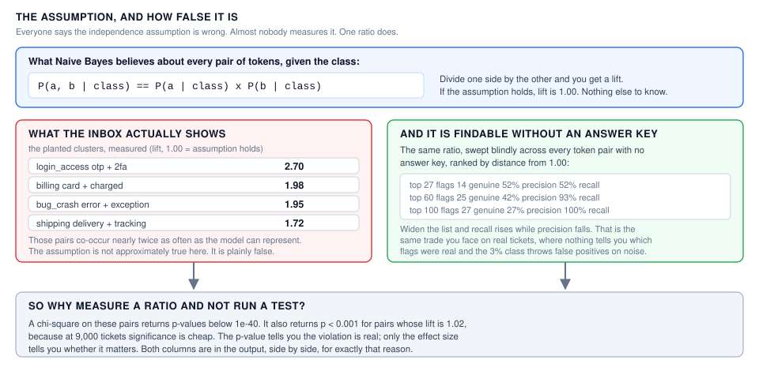
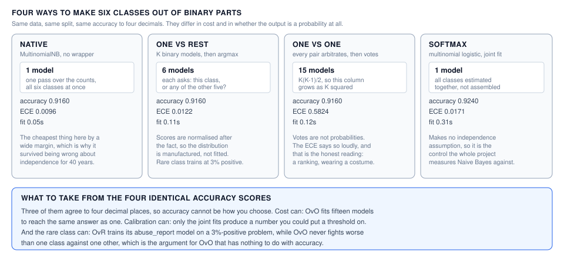
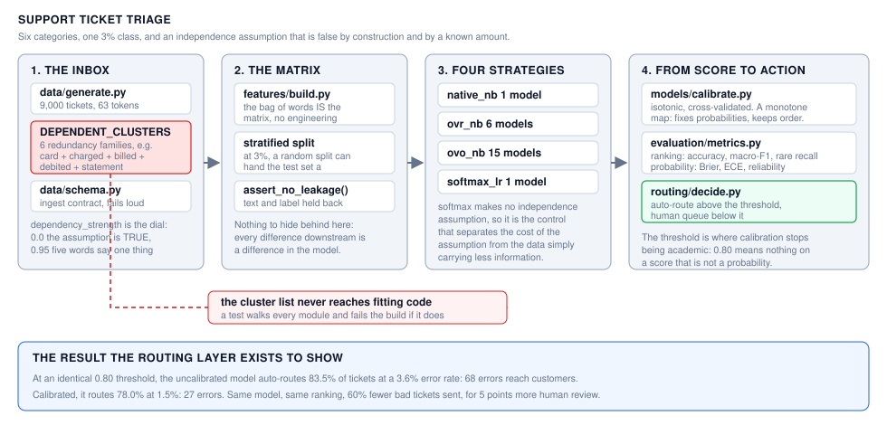

# Support Ticket Triage

> **Learn how to build this project step-by-step on [AI-ML Companion](https://aimlcompanion.ai/)**. Interactive ML learning platform with guided walkthroughs, architecture decisions, and hands-on challenges.


**The independence assumption is provably false, and it works anyway. This
project measures both halves of that sentence.**

---

## 1. The problem

Route incoming support tickets into six categories, automatically where the
model is confident and to a human where it is not. One of the six is 3% of the
inbox.

The obvious first model is Naive Bayes, and the obvious first objection is that
its core assumption is wrong. Tokens in a billing ticket are not independent:
`card`, `charged`, `billed`, `debited` and `statement` all say the same thing.

The usual response is a shrug and "it works anyway." That is true and
unsatisfying, because nobody measures how false the assumption is, or what the
falseness actually costs.

## 2. How false is it, exactly?



Naive Bayes assumes `P(a, b | class) == P(a | class) * P(b | class)`. Divide one
side by the other and you get a **lift**: 1.00 means the assumption holds.

This inbox is generated with six redundancy families wired in deliberately, so
the violation is known in advance and known by how much. The planted pairs come
back at lift 1.66 to 2.70. The assumption is not approximately true here, it is
plainly false.

Then the same measurement is run **blind**, sweeping every token pair with no
answer key and ranking by distance from 1.00. Against the 27 planted pairs:

| flags examined | genuine | precision | recall |
|---|---|---|---|
| top 27 | 14 | 52% | 52% |
| top 60 | 25 | 42% | 93% |
| top 100 | 27 | 27% | **100%** |

Widen the list and recall rises while precision falls. That is the same trade
you face on real tickets, where nothing tells you which flags were real, and
where the 3% class throws false positives on small-sample noise alone.

**Why a ratio and not a test.** A chi-square on these pairs returns p-values
below 1e-40. It also returns p < 0.001 for pairs whose lift is 1.02, because at
9,000 tickets significance is cheap. The p-value says the violation is real; only
the effect size says whether it matters. Both are in the output.

## 3. So what does the assumption cost?

Here is where most treatments of this go wrong. Watch Naive Bayes get worse as
dependence rises and you will conclude the assumption is expensive. **That
conclusion does not follow.** Redundant tokens carry less total information than
independent ones: five words that always co-occur are one signal wearing five
hats. Any model degrades on that data, including models that assume nothing.

So the measurement has to be a difference. Fit Naive Bayes next to multinomial
logistic regression, which makes no independence assumption, on identical data:

| dependency | planted lift | softmax LR | Naive Bayes | **cost of the assumption** |
|---|---|---|---|---|
| 0.00 | 1.00 | 0.9596 | 0.9573 | **0.0023** |
| 0.40 | 1.51 | 0.9347 | 0.9320 | **0.0027** |
| 0.60 | 1.68 | 0.9244 | 0.9191 | **0.0053** |
| 0.80 | 1.80 | 0.9053 | 0.8916 | **0.0137** |
| 0.95 | 1.87 | 0.8960 | 0.8729 | **0.0231** |

Both models lose about 6.4 accuracy points across that sweep. That shared
decline is the data getting harder and is nobody's fault. The gap between them
is the only part attributable to the assumption, and at its worst it is **2.3
points** while the assumption is off by a factor of 1.87.

That is the honest version of "it works anyway": provably false, and it costs
you about two points against a model that does not make the mistake.

## 4. Four ways to make six classes



Three of the four agree on accuracy to four decimal places, so accuracy cannot
be how you choose between them. What separates them:

- **Cost.** OvO fits 15 models to reach the same answer OvR reaches with 6 and
  native reaches with 1. That gap grows as K squared.
- **Whether the output is a probability at all.** OvO has only vote counts.
  Normalising them produces something shaped like a distribution that no model
  ever estimated, and its ECE of 0.58 says so.
- **The rare class.** OvR trains its `abuse_report` model on a 3%-positive
  problem. OvO never fights worse than one class against one other.

## 5. Ranking and probability are separate problems

This is the resolution. Naive Bayes here is a good classifier and a worse
probability estimator, and those are separable, because a calibrator is a
**monotone** map: it can move every probability while leaving the order alone.

| | accuracy | ECE | mean confidence |
|---|---|---|---|
| `native_nb` | 0.8858 | 0.0255 | 0.9069 |
| `calibrated_nb` | 0.8880 | **0.0097** | 0.8846 |

Calibration cut ECE by 62% and **kept 95.4% of top-1 decisions identical**. It
did not make the assumption true and it did not build a different classifier. It
repaired the half that was broken.

## 6. Where that stops being academic

The routing rule is one line: auto-route above a confidence threshold, escalate
below it. At an identical 0.80 threshold:

| model | auto-routed | error rate there | **errors reaching customers** |
|---|---|---|---|
| `native_nb` | 83.5% | 3.6% | **68** |
| `calibrated_nb` | 78.0% | 1.5% | **27** |

Same model, same ranking, **60% fewer bad tickets sent**, bought with 5 points
more human review. On an uncalibrated score, 0.80 is not a probability and the
threshold does not mean what the runbook says it means.



---

## 7. Run it

### Clone

```bash
git clone https://github.com/genieincodebottle/aiml-companion.git
cd aiml-companion/projects/machine-learning/support-ticket-triage
```

### Set up with uv

[uv](https://docs.astral.sh/uv/) resolves and installs in seconds and keeps the
environment inside the project.

```bash
pip install uv

uv venv
source .venv/bin/activate      # Linux / macOS
# .venv\Scripts\activate       # Windows PowerShell or cmd

uv pip install -r requirements.txt
```

Plain `pip install -r requirements.txt` works identically. Python 3.10+.

### The argument, in order

```bash
python run.py data           # generate and cache the inbox        (~3s)
python run.py independence   # how false the assumption is, measured
python run.py strategies     # native vs ovr vs ovo vs softmax
python run.py calibrate      # repair the probabilities, keep the ranking
python run.py sweep          # what the assumption costs           (~30s)
python run.py route          # the operating curve ops would use
```

`run.py` needs **no install of this project**. It puts `src/` on the path
itself. Optionally `uv pip install -e .` also gives you a `triage` command.

Try `python run.py data --dependency 0.0` to switch the assumption **on** and
rerun anything: at strength 0, Naive Bayes is exactly the right model for this
data, and every gap in the tables closes.

### Run the tests

```bash
pytest -p no:warnings          # 33 tests, no install needed
```

## 8. The notebook

`notebooks/support_ticket_triage_standalone.ipynb` is **standalone**. It
generates its own data, defines every function it uses, imports nothing from
`src/`, and writes nothing to disk. About 3 minutes top to bottom, 4 charts.

**This is the recommended starting point if you are new to the topic.** It walks
the whole argument: the imbalance drawn, the lift measurement, the blind survey
with its precision and recall trade, why a p-value is the wrong tool at this
sample size, the four strategies, the controlled sweep plotted as shared decline
against real cost, the reliability diagram, and the routing threshold.

Every code cell carries a header naming what it consumes and what it leaves
behind, so you can land in the middle and still know where you are.

**Locally**, after the setup above:

```bash
jupyter lab notebooks/support_ticket_triage_standalone.ipynb
```

**On Google Colab**, no install at all:

[](https://colab.research.google.com/github/genieincodebottle/aiml-companion/blob/main/projects/machine-learning/support-ticket-triage/notebooks/support_ticket_triage_standalone.ipynb)

**On Kaggle**, published as a notebook you can copy and edit:

[](https://www.kaggle.com/code/genieincodebottle/support-ticket-triage)

Both runtimes ship everything it imports (numpy, pandas, scikit-learn,
matplotlib, scipy), so it runs as-is with the internet toggle off.

`notebooks/_build_notebook.py` regenerates it. The notebook is authored as a
plain-text script so it reviews and diffs like code instead of JSON.

Because it is standalone the notebook deliberately duplicates logic that also
lives in `src/`, with slightly smaller redundancy clusters, so its numbers land
close to but not identical to the CLI's. The notebook is for reading, `src/` is
what runs. Change `src/` first.

## 9. If something goes wrong

| symptom | cause | fix |
|---|---|---|
| `triage: command not found` | console script not on PATH | use `python run.py <cmd>` |
| `uv: command not found` after `pip install uv` | scripts dir not on PATH | `python -m uv venv`, or plain `pip` |
| `pip install -e .` gives `OSError ... .exe.deleteme` | stale entry point, common on Windows | skip it, `python run.py` needs no install |
| `SchemaError: vocabulary columns are missing` | you edited the generator, the cache is older | it auto-regenerates now; `python run.py data --refresh` forces it |
| numbers differ from this README | a cache built at another `--dependency` | it detects this and regenerates itself; `--refresh` forces it |
| `sweep` takes ~30s | it regenerates and refits at six strengths | expected, it is six experiments |

## 10. Layout

```
conf/config.yaml                  every threshold and knob
docs/img/                         the three diagrams above
run.py                            zero-install entry point
src/support_ticket_triage/
├── cli.py                        triage data|independence|strategies|calibrate|sweep|route
├── data/generate.py              the inbox and THE PLANTED CLUSTERS
├── data/{io,schema}.py           caching seam, ingest contract
├── features/build.py             bag of words, stratified split, leakage guard
├── models/strategies.py          native / OvR / OvO / softmax behind one interface
├── models/calibrate.py           isotonic, plus the ranking-preserved check
├── evaluation/independence.py    the lift measurement, planted and blind
├── evaluation/metrics.py         ranking metrics and probability metrics, kept apart
├── routing/decide.py             threshold, queue, operating curve
└── pipelines/compare.py          the four experiments end to end
tests/                            33 tests
```

## 11. Track modules this covers

`naiveBayes` · `multiclassClassification` · `modelEval` · `crossVal` ·
`imbalancedData` · `logReg` · `featureImportance` · `mlIntro`

## 12. Honest limitations

**The inbox is generated, and its dependence structure is the one thing this
project cares about**, so it is planted at a size you can actually detect. Real
ticket text has messier dependence, a much larger vocabulary, and word order,
none of which a bag of words sees at all.

**The 2.3-point figure is specific to this setup.** With a bigger vocabulary and
longer documents, redundancy compounds and Naive Bayes gives up more. The
transferable claim is the method, which is: measure the lift, then measure the
gap to a model that makes no such assumption, and never confuse the two.

**Calibration is measured on the same distribution it was fitted on.** Real
inboxes drift, categories get renamed, and a calibrator fitted in March is not
automatically valid in September. There is no drift monitoring here.

**No text preprocessing is modelled.** Tokenisation, stemming and the handling
of negation are real decisions in a real triage system and are entirely absent.
