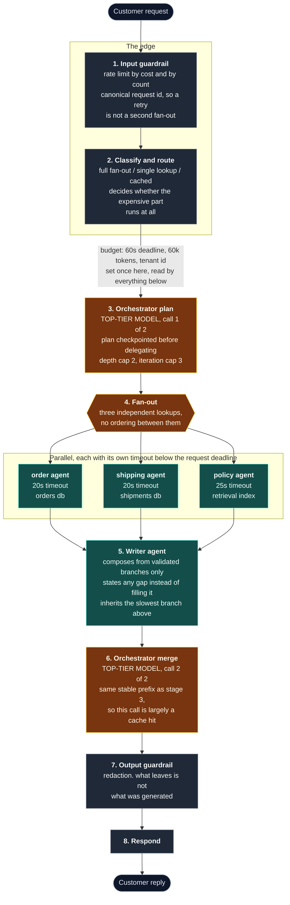

# Multi-Agent Anatomy

[](LICENSE)
[](https://www.python.org/)
[](https://nodejs.org/)
[](#no-framework-on-purpose)

A runnable companion to the post
[Inside a Production Multi-Agent GenAI System](https://aimlcompanion.ai/blog/production-multi-agent-genai-architecture-2026).

An order-support assistant for an ecommerce platform: **8 stages, 5 agents**.

It answers questions correctly, which is the least interesting thing about it.
**What you are here for is breaking it and watching what happens.** Every
multi-agent tutorial ships the happy path. The parts that are hard in production
are partial failure, budget propagation, saga undos, per-agent timeouts,
cache-aware prompt ordering, and observability that stays green while the answer
is wrong. Those are the features here.

The main view is a **trace waterfall**, not a chat window. Chat sits to the side.

---

## Quickstart, no API key needed

```bash
git clone https://github.com/genieincodebottle/aiml-companion.git
cd aiml-companion/projects/multi-agent-anatomy
```

Then two terminals, both starting from that directory. Backend:

```bash
cd backend
uv sync
uv run uvicorn app.main:app --reload
```

Frontend:

```bash
cd frontend
npm install
npm run dev
```

`uv sync` creates the virtualenv and installs everything from
[pyproject.toml](backend/pyproject.toml). No `pip`, no `activate`. If you do not
have uv: `pip install uv`, or see [the install guide](https://docs.astral.sh/uv/getting-started/installation/).

Open http://localhost:5173. Seven recorded traces are already there. No key, no
account, no signup. Start with **5. Every span green, the answer wrong**.

The frontend pins rollup to its WebAssembly build, via an `overrides` entry in
[package.json](frontend/package.json). Rollup normally ships a per-platform
native binary, and [npm skips it often enough](https://github.com/npm/cli/issues/4828)
that `npm run dev` fails with `MODULE_NOT_FOUND` on `rollup/dist/native.js`. The
wasm build has no platform binary, so there is nothing for npm to skip. It costs
a fraction of a second on a build this size.

To regenerate the recorded set: `cd backend && uv run python record_replays.py`.

---

## The eight stages



**Five agents:** the three lookups, the writer, and the orchestrator, which is
itself an agent and not a scheduler. The orchestrator is the only one on the
top-tier model, and it is called exactly twice per request. That budget is what
keeps a top-tier model affordable at this shape.

**A dead branch does not fail the request.** Stage 5 composes from whatever
returned and declares the rest. That path is the second failure toggle below.

Those stage numbers appear in the span names, the log lines and the UI labels.
If you renumber one, renumber all three.

---

## Reading this alongside the post

The post is organised as five sections, and it refers to stages 1 to 6 in
passing rather than as a numbered list. **This project's 1 to 8 is our
numbering**, not a quotation: it makes the two guardrails their own stages so
they get their own spans, and splits the final response out from the merge.
Two places where the numbers do not line up:

- the post's informal stage 2 is semantic caching; ours is classify and route,
  which is where a cache lookup would sit
- the post stops at 6, where the orchestrator decides the work is done; ours
  continues into the output guardrail and the response

Read a section, then open the file next to it.

| Post section | Stages | Where it lives in the code |
|---|---|---|
| The edge | 1, 2 | [guardrails.py](backend/app/guardrails.py), stage 2 in [pipeline.py](backend/app/pipeline.py) |
| The orchestrator | 3, 4, 6 | [agents/orchestrator.py](backend/app/agents/orchestrator.py), fan-out in [pipeline.py](backend/app/pipeline.py) |
| Why more than one agent at all | 4 | [agents/workers.py](backend/app/agents/workers.py), one prompt prefix and one toolset per agent |
| The half of retrieval that nobody draws | 4 | [tools/policy_index.py](backend/app/tools/policy_index.py), chunking, tenant scoping, index age |
| The handoff is the contract | 4, 5 | Per-agent schemas in [prompts.py](backend/app/prompts.py), validation in [agents/base.py](backend/app/agents/base.py) |
| Tools and the outside world | 4 | [tools/catalog.py](backend/app/tools/catalog.py) and [tools/saga.py](backend/app/tools/saga.py) |
| The framework sections | all | [No framework, on purpose](#no-framework-on-purpose) below |

The post's central claim, that a well-formed answer can pass every check and
still be wrong, is not a section. It runs through all of them. In this project
it is one toggle: **Serve a stale policy passage**.

---

## The failure panel

Six toggles. Five map to a failure mode the post names; the caching one does
not, because the post leaves caching to a separate piece.

| Toggle | Stage | What you watch |
|---|---|---|
| Kill the shipping agent | 4 | One red branch, two green. Stage 5 declares the gap. The reply still goes out and contains no invented tracking number. |
| Add 12s latency to `get_shipment` | 4 | The tool is cut at its 8s derived budget, inside the agent's 20s slice and the 60s request deadline. The agent survives to report the gap. |
| Fail step 3 of the booking saga | 4 | `book_courier`, `charge_fee`, `update_order`. Step 3 fails, then `undo:charge_fee` and `undo:book_courier` in reverse. |
| **Serve a stale policy passage** | 4 | **Nothing turns red.** The citation is real, latency is normal, cost is normal, and the refund window in the answer is 14 days instead of 30. |
| Turn prompt caching off | all | Cached tokens fall to zero across every span and the running total rises. |
| Attempt a cross-tenant retrieval | 4 | Zero passages from the other retailer. Nothing was fetched and then discarded. |

The fourth one is why this project exists. It is the observability section made
tangible: the retrieval succeeded, the trace is green, and the answer is wrong.
There is no status code for wrong. Index age is the only signal, and it is
carried as a **warning on a green span**, not an error, because the request
genuinely did succeed.

```bash
cd backend  && uv run pytest -q       # 23 tests, all six toggles asserted
cd frontend && npm run smoke          # renders every component against every recorded trace
```

The tests force replay mode even when a key is present, so they are
deterministic and cost nothing.

The two that are load-bearing:

- `test_corrupt_passage_leaves_every_span_green_and_the_answer_wrong`
- `test_no_cross_tenant_passage_is_ever_retrieved`

The second is parameterized over queries that ask for the other tenant's data by
name, including the exact text of its private note. There is also a test that
fails if anyone adds a parameter to `search()` that would let a caller widen the
scope.

---

## No framework, on purpose

No LangGraph, no CrewAI, no agent SDK. The post's argument is that they hide
both the bill and the failure modes, and those are the two things this project
is for. So the fan-out is `asyncio.gather` over three functions
([pipeline.py](backend/app/pipeline.py)), a delegation is an argument, and the
orchestrator loop is a loop.

If the plumbing looks small, that is the argument. The hard parts of a
multi-agent system are not the loop.

---

## What is in the code, and where

| The post says | The code | Where |
|---|---|---|
| A deadline and token budget decided at the edge and carried down | `RequestBudget` / `Delegation`, a view rather than a copy, so three parallel agents draw down one pool | [budget.py](backend/app/budget.py) |
| Pass the remaining deadline into every delegation | Spans record `deadline_remaining_s` and `tokens_remaining` at entry, so you can watch the remainder shrink down the waterfall | [trace.py](backend/app/trace.py) |
| Each tool gets its own budget, derived from the time the request has left | `Delegation.tool_timeout()` | [budget.py](backend/app/budget.py) |
| Order prompts least changing to most changing | Four bands with the cache boundary marked in the source | [prompts.py](backend/app/prompts.py) |
| Put the tenant id inside the search query | `search()` scopes candidates before it ranks, and takes no argument that widens it | [tools/policy_index.py](backend/app/tools/policy_index.py) |
| Every step paired with its own undo | `Step` cannot be constructed without a compensator | [tools/saga.py](backend/app/tools/saga.py) |
| Validate at every boundary, carry provenance | Schema per agent, `confidence` and `source` in every handoff | [prompts.py](backend/app/prompts.py) |
| Compress on the way out | `compress_for_return`, full output stays on the span | [agents/base.py](backend/app/agents/base.py) |
| Index age is the metric nobody has on a dashboard | `index_age_days` per chunk, warning above 90 days | [tools/policy_index.py](backend/app/tools/policy_index.py) |
| Hard caps on depth and iterations | `max_delegation_depth`, `max_orchestrator_iterations` | [config.py](backend/app/config.py) |
| Limit by cost, not only by count | Two limiters, requests per minute and USD per minute | [guardrails.py](backend/app/guardrails.py) |
| Canonical request ids stop retry storms | `canonical_request_id`, and the trace says when a request is a repeat | [guardrails.py](backend/app/guardrails.py) |

**Out of scope, deliberately:** the security material beyond tenant scoping and
output redaction, the governance section, and the interview questions. They do
not get clearer by being runnable.

---

## Cost

All model names and per-token prices live in exactly one file,
[backend/app/config.py](backend/app/config.py), because they go stale. Change
them there and the cost panel, the trace and the tests all follow.

Prices verified against the
[Gemini API pricing page](https://ai.google.dev/gemini-api/docs/pricing) on
2026-08-04, standard tier. One request costs about **$0.007** with the cache
warm and **$0.010** with caching off.

Gemini 3.1 Pro is tiered on prompt size, and the rates in config are the
"prompts up to 200k tokens" ones. Above that line, input and output prices
roughly double. This project's whole token budget is 60k so it never crosses it,
but a supervisor that accumulates worker output unbounded would double its input
price with no code change at all.

The cost panel shows the same request costed with prompt caching on and off. The
saving is real but it is not free: a cache is empty until something fills it, so
the first request of a process pays full price for every stable prefix. The
recorded traces run each scenario twice and record the second, because recording
the cold run would overstate every scenario's bill.

Note on the caching threshold: real providers only cache a prefix above roughly
1024 to 2048 tokens. The prefixes in this project are shorter than that, so
`CACHE.min_prefix_tokens` is lowered to keep the mechanism visible. Read that
number as this demo's threshold, not the provider's. It is commented as such in
the config.

---

## Running it live, with a key

Everything above runs with no key. To use a real model instead of the
deterministic replay client:

```bash
cp .env.example .env       # then put your key in .env, never in .env.example
cd backend && uv run uvicorn app.main:app --reload
```

Either `GOOGLE_API_KEY` or `GEMINI_API_KEY` works. `.env` is read from the
project root and from `backend/`, in that order.

`GET /api/health` reports which mode you are in. Live mode changes three things
and nothing else:

1. Model calls go to Gemini rather than to the deterministic composer.
2. Token counts come from the provider's own usage metadata where available.
3. If the top-tier model id has been renamed, the call falls back to the worker
   model and the span says so.

Verified against a real key on 2026-08-04: all seven model calls succeed, no
fallbacks, and the stale-passage toggle behaves the same as in replay. Gemini
reads the corrupted passage and reports a 14 day return window while every span
stays green.

Two things force replay regardless of the key: `record_replays.py`, so a
recorded set is never nondeterministic or billed, and the test suite via
`tests/conftest.py`.

The failure toggles, the budgets, the saga, the tenant scoping and the trace are
identical in both modes, because the replay client composes its answer from the
structured input it is handed. Corrupt a passage and the replayed answer changes
exactly as the live one does. A mock returning a canned reply would show a green
trace and a *correct* answer, teaching the opposite lesson.

---

## How this differs from the other agent projects here

`aiml-companion` already has four agent projects. This one earns its place by
studying failure rather than adding a fifth topology.

| Project | Its argument |
|---|---|
| [multi-agents-app-on-aws](../multi-agents-app-on-aws/) | Deploy a supervisor and three specialists on Bedrock AgentCore |
| [ai-agents-project](../ai-agents-project/) | Quality-gated routing and iterative refinement with LangGraph |
| [due-diligence-agent](../due-diligence-agent/) | Fact-checking and contradiction resolution across parallel agents |
| [smart-claims-processor](../smart-claims-processor/) | Human-in-the-loop pause and resume with durable checkpointing |
| **multi-agent-anatomy** | **How it fails.** One request, eight stages, broken on demand |

The closest neighbour is `smart-claims-processor`, which also has cost caps,
token limits and a per-agent trace panel. The difference is what the trace is
for. There it explains a decision that went well, and the pipeline is built on
LangGraph. Here the trace is the main view, the loop is hand-written so the
failure modes stay visible, and the interesting runs are the ones where
something breaks.

`multi-agents-app-on-aws` runs the same supervisor-plus-specialists shape, with
four agents to this project's five. Repeating the shape is intentional: the
topology is the part that matters least in either project, and keeping it
familiar means the diagrams can be read against each other.
