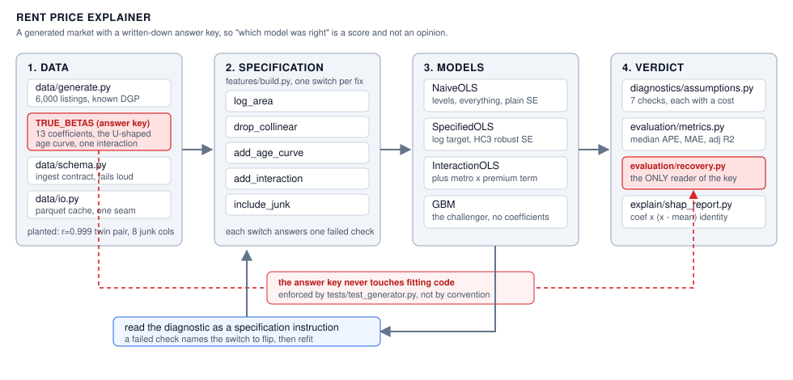
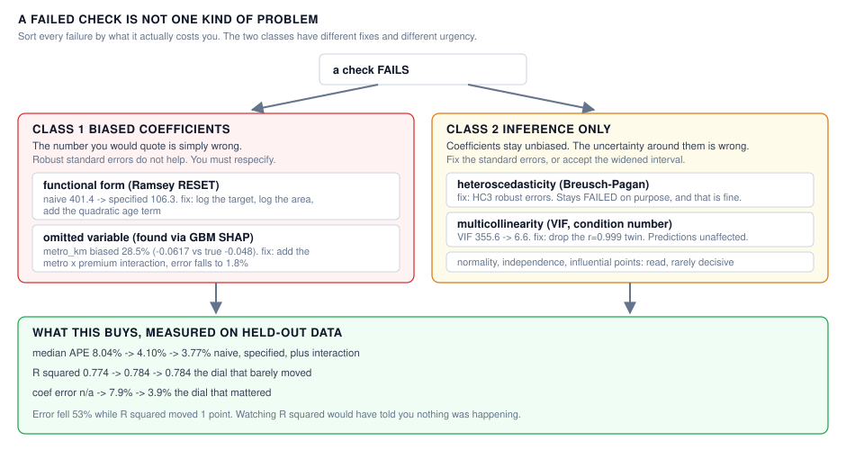
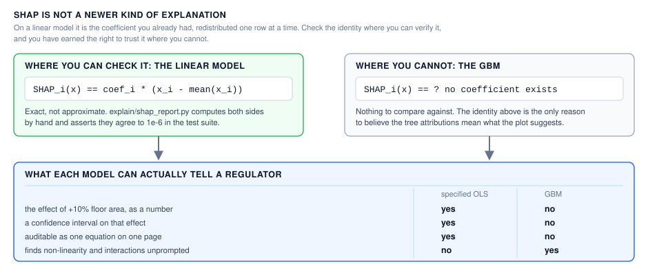

# Rent Price Explainer

> **Learn how to build this project step-by-step on [AI-ML Companion](https://aimlcompanion.ai/)**. Interactive ML learning platform with guided walkthroughs, architecture decisions, and hands-on challenges.


**Your untested assumptions are the weak part, not the linear model.**

---

## 1. The problem

You fit a regression on rental listings. R squared comes back 0.774. The
reflex is "only 0.77, let us try XGBoost."

That reflex skips a step, and the step it skips is the one that actually
matters. This project measures what you get by taking it: the *same* linear
model, once its diagnostics are read and acted on, cuts prediction error
nearly in half and still hands you an elasticity with a confidence interval.

## 2. Why it needs a generated market

Real listing data can tell you which model **predicts** better. It can never
tell you which model **recovered the true relationship**, because on real data
nobody knows what the true relationship was.

So this project generates its market from a data-generating process whose 13
coefficients are written down in `data/generate.py` as `TRUE_BETAS`. Nothing in
the fitting path is allowed to read them, and a test enforces that. Vague
advice ("check your assumptions") becomes a number you can put on a scoreboard:
*how far off was each coefficient, and did its confidence interval cover the
truth?*

The market is built to be hostile on purpose. It contains a log-linear
functional form, size-dependent error variance, a near-duplicate feature pair
at r = 0.999, a U-shaped age effect, an influential penthouse cluster, one
metro-by-locality interaction, and 8 columns of pure noise.

## 3. When you would reach for this

**Use this workflow when the coefficient is the deliverable.** Pricing
committees, regulatory filings, elasticity estimates, policy analysis: anywhere
somebody will quote a number from your model and be held to it.

**Skip it when only the prediction ships.** If the model feeds a ranking or a
recommendation and nobody will ever ask "what is the effect of one more
bathroom," reach for the flexible model and tune it.

## 4. How it fits together



The shape to notice: the answer key is routed *around* the fitting path and
reaches only `evaluation/recovery.py`. And every fix is a switch in
`features/build.py`, so a failed check names the switch to flip rather than
suggesting a vibe.

## 5. What the diagnostics catch

The naive model fails **6 of 7** checks. The lesson is not that it fails, it is
that the failures fall into two classes with different costs and different
fixes.



**The fixes do not turn everything green, and that is honest.** Two things are
happening:

- With 4,500 rows these tests reject *trivial* deviations. RESET falling from
  436 to 106 matters more than the flag flipping. Read the effect size, not the
  verdict.
- Heteroscedasticity **stays** failed on purpose. The fix was never to
  transform it away, it is HC3 robust standard errors, which the specified
  model uses. A failed test with the right remedy applied is a solved problem.

## 6. The result

Held-out test set, 1,500 listings, median rent Rs 29,660:

| model | median APE | MAE | R squared | recovers true coefficients? |
|---|---|---|---|---|
| naive OLS | 8.04% | 3,997 | 0.774 | no, wrong units entirely |
| specified OLS | 4.10% | 2,675 | 0.784 | yes, within 7.9% |
| **specified + interaction** | **3.77%** | **2,566** | **0.784** | **yes, within 3.9%** |
| GBM | 4.99% | 3,026 | 0.765 | no coefficients exist |

1. **Specification beat the algorithm.** Naive to specified halved the error.
   Swapping to a GBM did not.
2. **R squared barely moved** (0.774 to 0.784) while error fell 53%. It was the
   wrong dial to watch the whole time.
3. **The GBM was the better detective, not the better model.** Its SHAP plot
   revealed a metro-by-locality interaction. Once the linear model was *told*
   about it, the linear model won again, and could still quote the effect.

### The bias you can only see with an answer key

Omitting that interaction did not just cost accuracy. It **biased the
`metro_km` main effect by 28.5%** (true -0.048, estimated -0.0617). Add the
interaction and the same coefficient lands at -0.0489, a 1.8% error. On real
data you would never have known the first number was wrong.

## 7. The SHAP bridge



`explain/shap_report.py` computes that identity by hand so you can check it,
which is what earns the right to trust SHAP on the GBM, where there is no
coefficient to check against.

---

## 8. Run it

### Clone

```bash
git clone https://github.com/genieincodebottle/aiml-companion.git
cd aiml-companion/projects/rent-price-explainer
```

### Set up with uv

[uv](https://docs.astral.sh/uv/) resolves and installs in seconds and keeps the
environment inside the project, so nothing leaks into your system Python.

```bash
pip install uv

uv venv
source .venv/bin/activate      # Linux / macOS
# .venv\Scripts\activate       # Windows PowerShell or cmd

uv pip install -r requirements.txt
```

Plain `pip install -r requirements.txt` works identically if you would rather
not add a tool. Python 3.10 or newer either way.

### Run the argument end to end

```bash
python run.py data        # generate and cache the market            (~5s)
python run.py diagnose    # the assumption checks on the naive model
python run.py compare     # naive to specified to GBM               (~15s)
python run.py recover     # coefficients scored against the truth
python run.py explain     # SHAP bridge and interpretability ledger
```

`run.py` needs **no install of this project**. It puts `src/` on the path
itself, so it is the path to use if anything else misbehaves.

Optionally `uv pip install -e .` also gives you a `rent` command (`rent
compare`). All forms run identical code.

### Run the tests

```bash
pytest -p no:warnings          # 32 tests, no install needed
```

The suite reads `src/` directly via `pythonpath` in `pyproject.toml`, so it
does not depend on `pip install -e .` succeeding.

## 9. The notebook

`notebooks/rent_price_explainer_standalone.ipynb` is **standalone**. It
generates its own data, defines every function it uses, imports nothing from
`src/`, and writes nothing to disk. About 2 minutes top to bottom, 6 charts.

**This is the recommended starting point if you are new to the topic.** It
walks the whole argument: the four diagnostic plots, a bootstrap showing
collinearity moving a coefficient, the R-squared-rises-on-noise demonstration,
the SHAP identity checked by hand, the tree discovering the interaction, and
the omitted-variable bias made visible against the answer key.

Every code cell carries a header saying what it consumes and what it leaves
behind, so you can land in the middle and still know where you are.

**Locally**, after the setup above:

```bash
jupyter lab notebooks/rent_price_explainer_standalone.ipynb
```

**On Google Colab**, no install at all:

[](https://colab.research.google.com/github/genieincodebottle/aiml-companion/blob/main/projects/rent-price-explainer/notebooks/rent_price_explainer_standalone.ipynb)

Colab ships pandas, numpy, scikit-learn, statsmodels and matplotlib already.
Add SHAP in the first cell if you want the attribution table:

```python
!pip install -q shap
```

**On Kaggle**, it is published as a notebook you can copy and edit:

[](https://www.kaggle.com/code/genieincodebottle/rent-price-explainer)

Click **Copy and Edit** to get your own runnable copy. The Kaggle image already
includes shap, statsmodels and everything else this notebook imports, so it runs
with the internet toggle off.

`notebooks/_build_notebook.py` regenerates the notebook. It is authored as a
plain-text script so it reviews and diffs like code instead of JSON, and it
works from any directory.

Because it is standalone the notebook deliberately duplicates logic that also
lives in `src/`. The notebook is for reading, `src/` is what runs. Change
`src/` first.

## 10. If something goes wrong

| symptom | cause | fix |
|---|---|---|
| `rent: command not found` | console script not on PATH | use `python run.py <cmd>` |
| `uv: command not found` after `pip install uv` | the scripts dir is not on PATH | use `python -m uv venv`, or fall back to plain `pip` |
| `pip install -e .` gives `OSError ... rent.exe.deleteme` | stale entry-point file, common on Windows | skip it entirely, `python run.py` needs no install |
| `ModuleNotFoundError: rent_price_explainer` | running a module directly without install | use `python run.py` from the project root |
| `ModuleNotFoundError: shap` | optional heavy dependency | `uv pip install shap`, or ignore it, only the attribution table is skipped |
| `make: command not found` | Windows has no `make` | use the `python run.py` commands above |
| numbers do not match this README | a stale `data/` cache | it auto-regenerates and warns, `python run.py data --refresh` forces it |
| `python run.py diagnose` reports failures | **expected**, the naive model is meant to fail | continue to `compare`, it exits 0 unless you pass `--strict` |

## 11. Layout

```
conf/config.yaml               every threshold and knob
docs/img/                      the three diagrams in this README
run.py                         zero-install entry point
src/rent_price_explainer/
├── cli.py                     rent data|diagnose|compare|recover|explain
├── data/generate.py           the market plus THE ANSWER KEY
├── data/{io,schema}.py        loading seam, ingest contract
├── features/build.py          design matrix, each fix is a switch
├── diagnostics/assumptions.py the 7 checks, each returning a consequence
├── models/linear.py           naive / specified / plus-interaction OLS
├── models/gbm.py              the challenger
├── evaluation/metrics.py      R squared vs adjusted vs MAE, plus the inflation demo
├── evaluation/recovery.py     scored against the truth, the only reader of the key
└── explain/shap_report.py     the coefficient-to-SHAP identity
tests/                         32 tests
notebooks/                     standalone walkthrough
```

## 12. Track modules this covers

`linReg` · `ols-intuition` · `coefficient-meaning` · `r-squared` ·
`assumptions` · `multivariate` · `practical-workflow` · `shap` ·
`shap-intuition` · `tree-importance` · `permutation-importance` ·
`linear-vs-nonlinear`

## 13. Honest limitations

**This market is generated, and its true form is log-linear plus a quadratic
plus one interaction.** That is *why* the correctly specified OLS wins here.

Do not generalise this to "linear beats trees." On real housing data, with
spatial non-linearity, many interactions and messy categoricals, gradient
boosting usually does win on accuracy, often by more than a few percent.

What **does** generalise is the workflow: diagnose before you switch families,
read the diagnostic as a specification instruction rather than a verdict, and
use the flexible model to find structure before deciding whether you want that
structure as an explicit, quotable term. That sequence is right regardless of
which model ends up on top.

Two more things this does not do. There is no fairness analysis, because the
synthetic market carries no protected attributes, though a real rental
deployment would need one since locality and crime index can proxy for them.
And residual collinearity survives the fixes: `bedrooms` is derived from area
in the DGP, so it recovers at roughly 19% error and its interval does not cover
the truth. That is genuine rather than a bug, and `model_card.md` says so.
