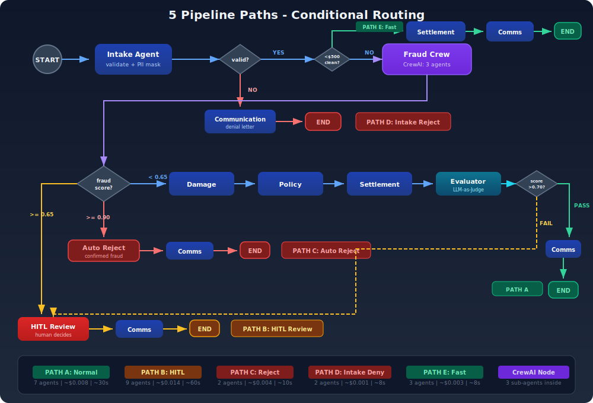

# Smart Claims Processor

An **AI-powered Insurance Claims Processing System** that demonstrates production-grade multi-agent architecture using **LangGraph** (main orchestration) and **CrewAI** (fraud detection sub-crew).

> **Who is this for?** Anyone learning to build production-grade multi-agent AI systems. If you know basic Python and want to understand how LangGraph, CrewAI, guardrails, human-in-the-loop, and LLM evaluation work together in a real use case - this project is for you.

---

## Get Started in 3 Minutes

```bash
# 1. Check Python version (need 3.11+)
python --version

# 2. Clone and enter project
git clone https://github.com/genieincodebottle/aiml-companion.git
cd aiml-companion/projects/smart-claims-processor

# 3. Create virtual environment
python -m venv .venv
source .venv/bin/activate          # Linux/Mac
# .venv\Scripts\activate           # Windows (use this instead)

# 4. Install dependencies
pip install -r requirements.txt

# 5. Set up API key (free - takes 30 seconds)
cp .env.example .env               # Linux/Mac
# copy .env.example .env           # Windows (use this instead)
# Edit .env and paste your GOOGLE_API_KEY (see "Get Your API Key" below)

# 6. Verify setup (no API key needed)
pytest tests/ -q
# Expected: 47 passed

# 7. Run the demo (processes 4 sample insurance claims)
python main.py --demo
```

### Get Your API Key (Free, 30 Seconds)

1. Go to [https://aistudio.google.com/app/apikey](https://aistudio.google.com/app/apikey)
2. Sign in with your Google account
3. Click **"Create API key"**
4. Click **"Copy"** to copy the key
5. Open the `.env` file in your editor and replace `your_gemini_api_key_here` with your key:
   ```
   GOOGLE_API_KEY=AIzaSy...your_key_here
   ```
6. Save the file

> **Free tier:** Google Gemini 2.0 Flash is free for development. The entire demo costs < $0.05.

### Verify API Key Works

```bash
python -c "from src.llm import get_llm; llm = get_llm(); print('API key works!' if llm else 'Failed')"
```

---

## What Success Looks Like

When you run `python main.py --demo`, you should see output like this for each of the 4 sample claims:

```
============================================================
  SMART CLAIMS PROCESSOR - RESULT
============================================================
  Claim ID:    CLM-2024-001234
  Decision:    APPROVED PARTIAL
  Settlement:  $2,659.73
  Fraud Risk:  LOW (score: 0.18)
  HITL:        No
  Agents Used: 7
  Cost:        $0.0000
  Tokens:      0

------------------------------------------------------------
  CLAIMANT NOTIFICATION:
------------------------------------------------------------
  Subject: Update on Your Auto Claim (CLM-2024-001234)

  Dear [CLAIMANT],

  We've completed the review of your claim...
============================================================
```

**The 4 demo scenarios and expected results:**

| # | Claim File | What It Tests | Expected Decision | Expected Settlement |
|---|-----------|--------------|-------------------|-------------------|
| 1 | `auto_accident.json` | Normal $8.5K auto collision | APPROVED or APPROVED_PARTIAL | $1,000 - $7,000 |
| 2 | `fraud_suspicious.json` | $45K property fire with fraud flags | APPROVED (with elevated fraud score) | $30,000 - $40,000 |
| 3 | `high_value_hitl.json` | $28K vehicle theft (triggers HITL) | APPROVED (with evaluation) | $5,000 - $15,000 |
| 4 | `lapsed_policy.json` | $2.2K claim on expired policy | DENIED | $0.00 |

> **Note:** Exact amounts vary between runs because the LLM makes independent assessments each time. The decision direction (approved vs denied) should be consistent.

---

## Table of Contents

- [Get Started in 3 Minutes](#get-started-in-3-minutes)
- [What Success Looks Like](#what-success-looks-like)
- [How It Works (Simple Explanation)](#how-it-works-simple-explanation)
- [Full System Architecture](#full-system-architecture)
- [The 7 Agents](#the-7-agents)
- [5 Pipeline Paths](#5-pipeline-paths)
- [Launch the Dashboard](#launch-the-dashboard)
- [HITL Review System](#hitl-review-system)
- [LLM-as-Judge Evaluation](#llm-as-judge-evaluation)
- [Production Features](#production-features)
- [All Commands Reference](#all-commands-reference)
- [Project Structure](#project-structure)
- [Configuration](#configuration)
- [Testing](#testing)
- [Cost Profile](#cost-profile)
- [Troubleshooting](#troubleshooting)
- [What You Will Learn](#what-you-will-learn)
- [Deep Dive Architecture](#deep-dive-architecture)

---

## How It Works (Simple Explanation)

Insurance claims processing is the perfect multi-agent use case because it needs:
- **Multiple expert perspectives** (fraud detection, damage assessment, policy law)
- **Human oversight** (regulations mandate review above certain amounts)
- **Audit trails** (every decision must be traceable)
- **Safety guardrails** (budget limits, confidence checks, loop detection)

This project uses **two AI frameworks together**:

| Framework | Used For | Think of it as... |
|-----------|---------|-------------------|
| **LangGraph** | Main pipeline orchestration | A **flowchart** with IF/ELSE branches. "If fraud score > 0.90, reject. If amount > $10K, send to human." |
| **CrewAI** | Fraud detection crew (3 agents) | A **panel of 3 experts** debating. Pattern Analyst + Anomaly Detector + Story Validator each give their opinion, then synthesize a verdict. |

**Why both?** LangGraph alone would make the 3-expert fraud analysis awkward. CrewAI alone can't handle the complex 5-path conditional routing of the full pipeline. Together, they play to each other's strengths.

---

## Full System Architecture

<p align="center">
  
</p>

**Three layers run on every claim:**
1. **Security Layer** - PII masked before any LLM call. Audit log records every action with SHA-256 hash.
2. **Guardrails Layer** - Before each agent: check budget (tokens, cost, calls). After each agent: check confidence, detect hallucination.
3. **Pipeline Layer** - 7 agents in sequence with conditional routing (5 possible paths).

---

## The 7 Agents

| # | Agent | Framework | What It Does (One Sentence) |
|---|-------|-----------|---------------------------|
| 1 | **Intake Agent** | LangGraph | Validates the claim, looks up the policy, masks PII, and decides if the claim should proceed. |
| 2 | **Fraud Detection Crew** | CrewAI (3 agents) | Three experts (Pattern Analyst, Anomaly Detector, Story Validator) independently analyze the claim for fraud and synthesize a risk score. |
| 3 | **Damage Assessor** | LangGraph | Independently assesses the damage amount (may differ from what the claimant estimated), calculates vehicle value, and recommends repair vs. replace vs. total loss. |
| 4 | **Policy Checker** | LangGraph | Reads the insurance policy to determine what's covered, what's excluded, and calculates the deductible and coverage limits. |
| 5 | **Settlement Calculator** | LangGraph | Does the math: assessed damage - depreciation - deductible = settlement amount. Caps at policy limits. |
| 6 | **LLM-as-Judge Evaluator** | LangGraph | A separate LLM call that scores the entire decision on 5 dimensions (accuracy, completeness, fairness, safety, transparency). Quality gate at 0.70. |
| 7 | **Communication Agent** | LangGraph | Writes the claimant notification email and internal adjuster notes. Never mentions fraud to the claimant. |

---

## 5 Pipeline Paths

The pipeline doesn't always run all 7 agents. Based on claim characteristics, it takes one of 5 paths:

<p align="center">
  
</p>

---

## Launch the Dashboard

The Streamlit dashboard gives you a visual interface with 3 tabs:

```bash
streamlit run app.py
# Opens at http://localhost:8501
```

**Tab 1 - Process Claim:** Fill in a form and submit a claim. See results with fraud scores, settlement breakdown, and claimant notification.

**Tab 2 - HITL Review Queue:** See claims waiting for human review. Submit decisions (approve, deny, override AI).

**Tab 3 - Analytics:** Cost estimates, architecture overview, configuration details.

**Quick test scenarios:** The dashboard has 4 buttons at the top that pre-fill the form with test data:
- ✅ Normal Claim ($8.5K) - should be approved
- ⚠️ HITL Review ($28K) - triggers human review
- 🚨 Fraud Flags ($45K) - elevated fraud score
- 🚫 Lapsed Policy ($2.2K) - should be denied

> **Note:** The dashboard handles HITL reviews directly through its built-in queue interface. You do NOT need to start a separate HITL server for the dashboard to work.

---

## HITL Review System

### When Does a Claim Need Human Review?

| Trigger | Threshold | Why |
|---------|-----------|-----|
| Claim amount | >= $10,000 | Legal requirement for large claims |
| Fraud score | >= 0.65 | High enough to warrant human judgment |
| Agent confidence | < 0.65 | AI is uncertain, human should decide |
| First-time + high value | >= $5,000 | New claimant with big claim |
| Repeat claimant | > 2 claims/year | Potential abuse pattern |
| Appeal | Always | Appeals always get human review |
| Evaluation score | < 0.70 | LLM-as-Judge quality gate failed |

### How HITL Works (Step by Step)

```
1. Pipeline detects HITL trigger (e.g., amount >= $10K)
        │
2. Priority score calculated (0-100)
   Weighted: amount(30%) + fraud(35%) + confidence(20%) + repeat(15%)
        │
3. Ticket created in SQLite queue
   Priority: CRITICAL (>= 80, 4h SLA) | HIGH (60-79, 24h SLA) | NORMAL (< 60, 72h SLA)
        │
4. Pipeline pauses, marks claim as "ESCALATED_HUMAN_REVIEW"
        │
5. Human reviewer opens Streamlit dashboard, Tab 2
   Sees: review brief, fraud analysis, AI recommendation
        │
6. Human submits decision (approve/deny/override AI)
   Decision recorded in audit log
        │
7. Pipeline resumes, communication agent generates notification
```

### HITL REST API (Optional, for Custom Integrations)

If you want to build your own review interface instead of using Streamlit:

```bash
# Start the HITL API server (separate terminal)
uvicorn src.hitl.queue:router --host 0.0.0.0 --port 8001

# Or use make:
make serve-hitl
```

| Method | Endpoint | Description |
|--------|----------|-------------|
| `GET` | `/hitl/queue` | List pending reviews by priority |
| `GET` | `/hitl/ticket/{id}` | Get full review brief and state |
| `POST` | `/hitl/decide/{id}` | Submit human decision |
| `GET` | `/hitl/stats` | Queue statistics |

---

## LLM-as-Judge Evaluation

A **separate LLM call** (not the same one that made the decision) evaluates every high-stakes decision:

| Dimension | Weight | What It Measures |
|-----------|--------|-----------------|
| **Accuracy** | 25% | Is the settlement math correct? |
| **Completeness** | 20% | Were all policy clauses checked? |
| **Fairness** | 20% | Would a human adjuster agree? |
| **Safety** | 20% | Were fraud signals handled properly? |
| **Transparency** | 15% | Is the reasoning traceable? |

- **Pass threshold:** 0.70 overall score
- **If failed:** Claim is automatically routed to HITL for human review
- **Always evaluated:** Claims > $10K, HITL claims, human overrides
- **Sampled:** 10% of routine auto-processed claims (saves cost)

---

## Production Features

| Feature | What It Does |
|---------|-------------|
| **PII Masking** | Regex + field-level masking. Email, phone, SSN, DOB, names are replaced with `[EMAIL]`, `[PHONE]`, `[REDACTED]` etc. before any LLM call. Original data never leaves your machine. |
| **Audit Logs** | SHA-256 hashed NDJSON files. Every agent action, HITL event, and final decision recorded. 7-year retention for insurance compliance. Tamper-detectable. |
| **Guardrails (Pre)** | Before each agent: check token budget (50K), cost ceiling ($0.50), agent call limit (25), loop detection, timeout (300s). Hard stop if breached. |
| **Guardrails (Post)** | After each agent: verify output confidence meets threshold, check reasoning fields aren't empty (hallucination proxy). |
| **HITL Queue** | SQLite-backed priority queue. REST API for custom integrations. SLA tracking (4h/24h/72h). Human override audit trail. |
| **LLM-as-Judge** | Separate evaluation call. 5-dimension scoring. Quality gate at 0.70. Failed claims auto-escalate to HITL. |
| **Structured Output** | Pydantic v2 schemas for all 11 agent outputs. Zero parsing errors via `.with_structured_output()`. |
| **Graceful Degradation** | Every agent has a fallback: LLM error -> rule-based calculation -> HITL escalation. Pipeline never crashes silently. |
| **Rule-Based Grounding** | Fraud patterns and damage calculators run BEFORE the LLM, providing factual grounding that reduces hallucination. |

---

## All Commands Reference

### Python Commands

```bash
python main.py --demo                              # Run all 4 sample claims
python main.py --claim data/sample_claims/auto_accident.json  # Single claim
python main.py --claim data/sample_claims/auto_accident.json --verbose  # With trace
streamlit run app.py                                # Launch dashboard (port 8501)
pytest tests/ -v                                    # Run all 47 tests
pytest tests/ -v --cov=src --cov-report=term-missing  # Tests with coverage
python evaluation/run_eval.py                       # Batch evaluation
```

### Makefile Commands (Optional Shortcuts)

If you have `make` installed (comes with most Linux/Mac, install via `choco install make` on Windows):

| Command | What It Does |
|---------|-------------|
| `make setup` | Copies .env, installs deps, creates data directories |
| `make install` | Just installs pip dependencies |
| `make demo` | Runs `python main.py --demo` |
| `make test-claim` | Runs single auto_accident claim with verbose output |
| `make test` | Runs pytest |
| `make test-cov` | Runs pytest with coverage report |
| `make dashboard` | Launches Streamlit on port 8501 |
| `make serve-hitl` | Starts HITL REST API on port 8001 |
| `make eval` | Runs batch evaluation |
| `make lint` | Runs ruff code linter |
| `make clean` | Deletes generated files (audit logs, DB files, pycache) |
| `make queue-stats` | Prints HITL queue statistics as JSON |

---

## Project Structure

```
smart-claims-processor/
├── .streamlit/config.toml          # Streamlit theme (dark mode)
├── configs/base.yaml               # Master configuration (agents, HITL, guardrails, security)
├── data/
│   ├── sample_claims/              # 4 test scenarios (auto, fraud, HITL, lapsed)
│   └── fraud_patterns/             # Known fraud pattern database
├── docs/architecture.md            # Architecture deep-dive
├── evaluation/
│   ├── run_eval.py                 # Batch evaluation runner
│   └── judge_prompt.py             # LLM-as-judge prompt templates with rubrics
├── notebooks/
│   └── Smart_Claims_Processor.ipynb  # Step-by-step walkthrough (run each agent individually)
├── scripts/run_pipeline.sh         # Shell runner (demo, claim, test, dashboard, eval)
├── src/
│   ├── agents/
│   │   ├── graph.py                # LangGraph workflow (5 conditional paths)
│   │   ├── intake_agent.py         # Claim validation + PII masking
│   │   ├── fraud_crew.py           # CrewAI fraud crew (3 role-based agents)
│   │   ├── damage_assessor.py      # Independent damage assessment
│   │   ├── policy_checker.py       # Coverage + exclusion analysis
│   │   ├── settlement_calculator.py # Payout computation with safety caps
│   │   └── communication_agent.py  # Notification generation
│   ├── guardrails/manager.py       # Pre/post execution safety checks
│   ├── hitl/
│   │   ├── checkpoint.py           # HITL trigger logic + priority scoring
│   │   └── queue.py                # SQLite queue + FastAPI endpoints
│   ├── models/
│   │   ├── schemas.py              # 11 Pydantic v2 output schemas
│   │   └── state.py                # LangGraph state definition (TypedDict)
│   ├── security/
│   │   ├── pii_masker.py           # PII detection + masking
│   │   └── audit_log.py            # Immutable SHA-256 audit trail
│   ├── tools/
│   │   ├── policy_lookup.py        # Mock policy database (SQLite)
│   │   ├── fraud_patterns.py       # Rule-based fraud pattern matching
│   │   └── damage_calculator.py    # Depreciation, ACV, total-loss calculations
│   ├── evaluation/evaluator.py     # LLM-as-judge 5-dimension scoring
│   ├── config.py                   # YAML + env variable config loader
│   └── llm.py                      # Gemini LLM factory with fallback
├── tests/                          # 47 tests (all run without API key)
├── app.py                          # Streamlit dashboard (3 tabs, custom CSS)
├── main.py                         # CLI entry point
├── END_TO_END_ARCHITECTURE.md      # Complete architecture document
├── requirements.txt
├── Makefile
├── .env.example
└── .gitignore
```

---

## Configuration

All configuration lives in `configs/base.yaml`. Environment variables override YAML values.

**Precedence:** Environment variable > YAML value > default

### Key Configuration Sections

| Section | What It Controls | Key Settings |
|---------|-----------------|-------------|
| `llm` | Model, temperature, timeout | `model: gemini-2.0-flash`, `temperature: 0.1` |
| `agents.fraud_crew` | CrewAI roles, goals, backstories | 3 agent definitions with expertise framing |
| `hitl.triggers` | When human review is required | `min_amount_usd: 10000`, `fraud_score: 0.65` |
| `hitl.sla_hours` | Response deadlines | `critical: 4h`, `high: 24h`, `normal: 72h` |
| `guardrails` | Budget limits | `max_tokens: 50000`, `max_cost: $0.50`, `max_calls: 25` |
| `security` | PII fields, audit retention | `retention_days: 2555` (7 years), `hash: sha256` |
| `evaluation` | Judge model, pass threshold | `min_score: 0.70`, `sample_rate: 0.10` |
| `pipeline.fast_mode` | Skip agents for tiny claims | `max_amount: 500`, skip fraud + damage |

### Environment Variable Overrides

```bash
# Override HITL thresholds without editing YAML
HITL_MIN_AMOUNT=25000        # Raise review threshold to $25K
HITL_FRAUD_THRESHOLD=0.80    # Only flag very high fraud scores
MAX_TOKENS_PER_CLAIM=100000  # Double the token budget
```

See `configs/base.yaml` for all settings with inline comments.

---

## Testing

```bash
# Run all tests (no API key needed - tests use mock data)
pytest tests/ -v

# Expected output: 47 passed
```

| Test File | Tests | What's Verified |
|-----------|-------|----------------|
| `test_pii_masker.py` | 8 | Email/phone/SSN masking, name redaction, nested objects, structure preservation |
| `test_guardrails.py` | 8 | Budget limits, loop detection, timeout, confidence thresholds, hallucination check |
| `test_fraud_patterns.py` | 8 | Pattern matching, anomaly detection, score bounds, clean vs suspicious claims |
| `test_hitl_checkpoint.py` | 6 | HITL triggers, priority scoring, appeal handling, low confidence detection |
| `test_policy_lookup.py` | 8 | Policy lookup, active/lapsed detection, coverage mapping, net payout calculation |
| `test_damage_calculator.py` | 9 | Vehicle ACV, total loss, depreciation, age-based rates, max depreciation cap |

> **Why no API-dependent tests?** Tests that call the LLM are flaky (network, rate limits, non-deterministic output). All 47 tests verify the deterministic logic (tools, guardrails, routing, security) that doesn't need an API call.

---

## Cost Profile

| Claim Path | Agents | Tokens | Cost | Time |
|-----------|--------|--------|------|------|
| Fast mode (<$500) | 3 | ~8K | ~$0.003 | ~8s |
| Standard auto | 7 | ~22K | ~$0.008 | ~30s |
| Complex + HITL | 9 | ~38K | ~$0.014 | ~60s |
| Fraud flagged | 7 | ~28K | ~$0.010 | ~40s |
| Intake reject (lapsed) | 2 | ~4K | ~$0.001 | ~8s |
| **Full demo (4 claims)** | - | ~80K | **~$0.03** | ~2min |

> All costs with Google Gemini 2.0 Flash. Free tier is more than enough for development and testing.

---

## Troubleshooting

### Setup Issues

| Problem | Solution |
|---------|---------|
| `python: command not found` | Install Python 3.11+: [python.org/downloads](https://python.org/downloads). On Mac: `brew install python@3.11` |
| `python --version` shows 3.10 or older | Install 3.11+. Use `python3.11` or `python3` if multiple versions installed |
| `cp: command not found` (Windows) | Use `copy .env.example .env` instead. Or use Git Bash / WSL |
| `pip install` fails with version conflict | Try: `pip install --upgrade pip` then retry. Or create a fresh venv |
| `ModuleNotFoundError: No module named 'crewai'` | `pip install -r requirements.txt` in your activated virtual environment |
| CrewAI version conflict | `pip install --upgrade crewai crewai-tools` (need >= 0.80.0) |

### API Key Issues

| Problem | Solution |
|---------|---------|
| `GOOGLE_API_KEY not set` | Check `.env` file exists and contains the key. Must be in project root. |
| `API key invalid` or `403` | Verify key at [aistudio.google.com/app/apikey](https://aistudio.google.com/app/apikey). Regenerate if needed. |
| `429 rate limit exceeded` | Wait 60 seconds and retry. Free tier has rate limits. |
| `Connection timeout` | Check internet connection. Try: `curl https://generativelanguage.googleapis.com` |
| Key works in browser but not here | Check for extra spaces or quotes in `.env`. Should be: `GOOGLE_API_KEY=AIzaSy...` (no quotes) |

### Runtime Issues

| Problem | Solution |
|---------|---------|
| `Audit log permission error` | Create directory: `mkdir -p data/audit_logs` (Linux/Mac) or `mkdir data\audit_logs` (Windows) |
| HITL queue empty in dashboard | Process a high-value ($10K+) or fraud-flagged claim first |
| Streamlit won't start | Check port: `lsof -i :8501` (Mac/Linux) or `netstat -an | findstr 8501` (Windows). Kill existing process or use `--server.port 8502` |
| Tests fail with import error | Run from project root: `cd smart-claims-processor && pytest tests/` |
| Pipeline hangs / takes > 2 min | Check network. Gemini API may be slow. Timeout is 300s by default. |

---

## What You Will Learn

After studying this project, you will understand:

1. **Dual-framework orchestration** - When to use LangGraph vs CrewAI and how to combine them
2. **CrewAI role-based agents** - Analyst, Validator, Manager patterns with delegation and synthesis
3. **LangGraph conditional routing** - Complex multi-path workflows with 5 branching conditions
4. **Production HITL** - Priority queues, SLA tracking, REST APIs, human override audit trails
5. **Guardrail layers** - Pre/post execution safety with budget enforcement and loop detection
6. **LLM-as-judge evaluation** - Automated 5-dimension quality scoring that gates decision release
7. **Security in AI pipelines** - PII masking, immutable audit trails, tamper detection
8. **Structured state management** - Pydantic v2 + TypedDict for zero-error multi-agent communication
9. **Graceful degradation** - Every agent has a fallback path (LLM error -> rule-based -> HITL)
10. **Rule-based grounding** - Running deterministic checks BEFORE LLM to reduce hallucination and cost

### Next Steps After the Demo

| Step | What To Do | Why |
|------|-----------|-----|
| 1 | Run `streamlit run app.py` | See the visual dashboard, try the 4 scenarios |
| 2 | Open `notebooks/Smart_Claims_Processor.ipynb` | Walk through each agent step-by-step, see intermediate outputs |
| 3 | Read `src/agents/graph.py` | Understand the LangGraph routing logic |
| 4 | Read `src/agents/fraud_crew.py` | Understand how CrewAI agents are defined and orchestrated |
| 5 | Read `src/guardrails/manager.py` | See the pre/post execution safety checks |
| 6 | Modify `configs/base.yaml` | Change thresholds and see how behavior changes |
| 7 | Add a new agent | Try adding a "document verification agent" to the pipeline |

---

## Deep Dive Architecture

For a comprehensive technical architecture document covering data flow, database schemas, security details, guardrails architecture, and HITL implementation, see:

**[END_TO_END_ARCHITECTURE.md](END_TO_END_ARCHITECTURE.md)**

---

## Tech Stack

| Component | Technology |
|-----------|-----------|
| Orchestration | LangGraph 0.2+ |
| Fraud Crew | CrewAI 0.80+ |
| LLM | Google Gemini 2.0 Flash (free tier) |
| Structured Output | Pydantic v2 + `.with_structured_output()` |
| HITL Queue | SQLite + FastAPI |
| Dashboard | Streamlit 1.40+ with custom CSS (dark theme) |
| Configuration | YAML + python-dotenv (env overrides) |
| Audit Logging | NDJSON + SHA-256 hashing |
| Testing | pytest 8.0+ (47 tests, no API key needed) |
